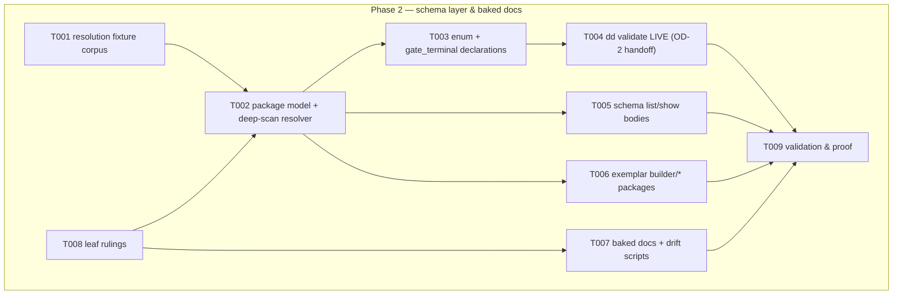

# Phase 2: Schema layer & baked docs — Tasks

**Plan**: [deterministic-documents-plan.md](../../deterministic-documents-plan.md) § Phase 2 (v1.1.1)
**Freeze basis**: [dd-surface.md](../phase-1-dd-core-foundations/dd-surface.md) — P2 fills the five Phase-2-owned command bodies verbatim; no frozen signature, positional, option, or E-code changes (renegotiation only, via PM)
**Contracts**: workshops/001 (grammar, severity table) · 002 (shapes, enum, gate-terminal) · OD-1/OD-2 (ruled) · P1 `SchemaResolver`/`DocLoader` interfaces (the designed seams)
**Testing approach**: Hybrid TDD (fixtures first — T001 is the floor)

## Architecture Map



### Open Decisions

| # | Decision | Ruling | Status |
|---|----------|--------|--------|
| OD-3 | **Root `package.json` script entries** (`gen:dd-docs`, `check:dd-docs` — plan 2.5) sit outside the seat fence (root-tree) | **GRANTED** (prime, ruling amendment 2, 2026-08-03): add exactly `gen:dd-docs` + `check:dd-docs` to the `scripts` block, nothing else — no dependency blocks, no `package-lock.json`, no existing key, ESPECIALLY not the `prepare` lifecycle hook (supply-chain fence). Merge-time textual conflict with dependabot PRs #74–#82 is expected, not a mystery | ✅ GRANTED (narrow) |
| OD-4 | **`<gitroot>/.dd/schemas/` is a new repo-root directory** (D14 convention home for exemplar packages) | Prime accepted after verifying `git check-ignore`: the path is NOT gitignored, namespace clean — the tree will actually commit. Only `.dd/schemas/builder/**` is written | ✅ ACCEPTED (verified) |

### Tasks

| Status | ID | Task | Domain | Path(s) | Done When | Notes |
|--------|-----|------|--------|---------|-----------|-------|
| [x] | T001 | Resolution fixture corpus: fake-fs multi-root layouts covering every schema-layer failure class — duplicate-in-one-root (E412) · shadowed lower-precedence duplicate (E413, WARN-class: resolution still succeeds, shadow reported) · malformed package (E411) · unsupported version (E414) · invalid enum/`gate_terminal` declaration (E415) · scan failure (E416) · path escape (E417) — plus good twins: precedence chain across all four roots (doc-folder → `<gitroot>/.dd` → `.harness/.dd` → `~/.dd`), deep-nested package found by scan, custom-enum + `gate_terminal[]` declaration | harness-cli | `harness/cli/test/services/dd/schema/fixtures/**` | Corpus enumerable (README maps fixture → class → twin); every E411–E417 class has ≥1 bad + 1 good; precedence chain fixture proves first-hit-wins order exactly | TDD floor; AC-02 subject; mirrors T001-P1 discipline |
| [x] | T002 | Schema package model + deep-scan resolution (`services/dd/schema/`): qualified `pkg/schema` names; folder convention `schemas/<pkg>/<schema>/`; deep scan until found in each root; precedence doc-folder → `<gitroot>/.dd/schemas` → `.harness/.dd/schemas` → `~/.dd/schemas`; first-hit-wins with ALL hits recorded (shadow detection); same-root duplicate = hard E412; resolved absolute path always carried on the result; implements P1's `SchemaResolver` interface exactly | harness-cli | `harness/cli/src/services/dd/schema/{model,scan,resolve}.ts` | `npx vitest run test/services/dd/schema` green vs T001 corpus; substituting the real resolver (fixture-backed roots) into P1's validate suite keeps it green — the interface seam proven both sides | D14; the P2 contract P1 designed for |
| [x] | T003 | Declarations: parse + validate field-level custom enums and per-schema `gate_terminal[]` sets (bad ⇒ E415); default completion enum + terminal set remain the P1 constants; resolved declarations flow into the validate engine (enum checks) and `deriveState` (injected terminal set) | harness-cli | `services/dd/schema/declarations.ts` (+ engine wiring) | Custom-enum fixture validates end-to-end; a `gate_terminal` override changes `deriveState` completeness in an integration test; malformed declaration fails E415 with location | workshop-002 § custom enums; consumed by P6 gate |
| [x] | T004 | **Flip `dd validate` live** (the OD-2 handoff): act body wires real resolver + P1 engine + depth walk (`--depth`, default 3) + OD-1 exclusion (direct invocation NEVER skips; sweep mode is the doctor's, not this verb's); exit mapping is a T008 leaf ruling (record it); envelope carries issues[] with class + severity + owner file | harness-cli | `harness/cli/src/acts/dd/validate.ts` | `dd validate <fixture-on-disk> --json` live end-to-end: good doc ⇒ ok/exit 0, ERROR-class doc ⇒ chosen mapping, depth 2 vs 3 differ on the 3-hop corpus via CLI; `dd-surface.test.ts` untouched and green (no signature drift) | OD-1/OD-2 ruled; AC-01 CLI half |
| [x] | T005 | `dd schema list` / `dd schema show <name>` bodies: list every resolved schema with qualified name, in-file description, resolved path, and any shadowed duplicates (with their paths); show one qualified name incl. its full shadow chain and declaration summary | harness-cli | `harness/cli/src/acts/dd/schema.ts` | AC-02 output contract green: both verbs show paths always; shadowing visible in both; unknown name ⇒ E410 envelope | paths-always is Jordan's ruling |
| [x] | T006 | Exemplar schema packages `<gitroot>/.dd/schemas/builder/{plan,backpressure,execution-log}`: workshop-002 shapes (plan: phases with brief + tasks + evidence section keyed by task id; **D2 AC-table link columns `pressure` → backpressure row, `proven_by` → log entry**); execution-log per workshop-003 entry shape; descriptions in-file | substrate | `.dd/schemas/builder/**` | Packages resolve via real deep scan from repo root; a sample `plan.dd.json` against `builder/plan` validates live through T004's verb; D2 columns declared as typed link columns | OD-4; the P5 exemplar corpus consumes these |
| [x] | T007 | Baked docs (D15): docs manifest + baked content (dd overview · how-to-add-a-schema-and-adapter with a worked sample incl. the `human-skipped` receipt convention) compiled into the CLI; `dd docs list` / `dd docs get <id>` bodies (unknown id ⇒ E419); `scripts/gen-dd-docs.mjs` + `scripts/check-dd-docs.mjs` (drift = regenerate-and-diff, mirroring `check:docs`); npm script entries per OD-3 (grant or fallback) | harness-cli | `harness/cli/src/services/dd/docs/**` · `harness/cli/src/acts/dd/docs.ts` · `scripts/{gen,check}-dd-docs.mjs` | AC-08 green: list shows both docs with descriptions; get emits content; `node scripts/check-dd-docs.mjs` exits 0 clean and 1 on injected drift; E419 fixture | D15; wiring into build/checks stays P5's (single-writer) |
| [x] | T008 | Leaf rulings (T009-P1 style, recorded in execution.log.md with one-line rationale each): (a) in-package file layout (schema definition + description file names inside `schemas/<pkg>/<schema>/`); (b) declaration syntax for custom enums/`gate_terminal[]`; (c) `dd validate` exit mapping (ERROR-class present ⇒ ?, WARN-only ⇒ ?) | harness-cli | `harness/cli/src/services/dd/schema/*` (constants as needed) | All three rulings recorded before their consumers land; consumed by T002/T003/T004/T007 | leaf decisions are the coder's, constrained by workshops; renegotiating frozen surface is not |
| [x] | T009 | Validation & proof: full slice + integration + recorded live run | harness-cli | `harness/cli/test/services/dd/{schema,docs}/**` | **Proof lines all green and recorded in execution.log.md**: `npx vitest run test/services/dd/schema test/services/dd/docs` (green with P3/P4 absent) · full `just test` · `harness arch-check` at baseline 2 · recorded `node harness/cli/bin/harness.js dd validate .dd/schemas/../<sample> --json` transcript | fence proof per backpressure-coverage § Phase 2 |

### Context Brief

**Environment-first posture**: friction is work — capture it the moment it bites with `harness observe "<what>" --kind difficulty|confusion|magic-wand|win` (real captures; they drain into the phase retro).

**Key findings from plan** (full table in plan § Key Findings):
- 02: no JSON-Schema lib — hand-roll in `flow-schema.ts` style (`string[]`/issues, never throws). Applies to schema-package validation too.
- 04: P1 coded against the injected `SchemaResolver` interface — **your T002 must implement that interface exactly**; if it can't, that's a renegotiation with the PM, not a local edit to P1 files.
- 07: the freeze — `dd-surface.md` + E400–E449 are FROZEN. You fill bodies. `dd-surface.test.ts` red = you changed surface = stop and renegotiate.
- DL-002 (P1 retro): P2 adds no commands and no E-codes, so the three enumeration tests (`app/index/error-codes .test.ts`) must NOT change; if one reddens you changed something frozen.

**Domain constraints**: acts → services → ports; `services/dd/core/**` stays untouchable except via its interfaces (transitive isolation is now machine-enforced — `reachable: true` rules); `services/dd/schema/**` may import `dd/core` types but NOT vice-versa; every act terminal path via `exitWithEnvelope`; fakes-only testing (no `vi.mock`); real fs allowed only under `test/services/dd/schema/fixtures/` roots or temp dirs.

**Reusable now**: P1's `SchemaResolver`/`DocLoader` fakes show the interface shape; `flow-schema.ts:220` validator idiom; envelope constructors `output/envelope.ts:72-129`; P1 fixture README pattern.

**Fence & proof (backpressure-coverage.md § Phase 2)**: slice proof `npx vitest run test/services/dd/schema test/services/dd/docs` green **with P3/P4 absent**; full `just test`; commit by explicit pathspec inside the fence; `just fix` before handoff; baselines arch-check 2, md-lint 199.

### Discoveries & Learnings

_Populated during implementation by the implement verb._

| Date | Task | Type | Discovery | Resolution | References |
|------|------|------|-----------|------------|------------|
| 2026-08-03 | T004/T006 | Noteworthy | Modelling the per-task evidence list as an array entry whose `id` IS the owning task id fails `E404 duplicate-id` — ids are unique per FILE across all sections, and the task row already owns that id | Workshop-002's ASCII shows `tk-9f2a:` as a **key**, so `evidence` is an object keyed by task id. Address `#evidence/tk-1a2b` unchanged, ownership intact, minted list ids still rejected. PM-ratified | live `dd validate` run; workshop-002 § Ruling 3 |
| 2026-08-03 | T006 | Noteworthy | `DdShape` has `fields`/`items` but no "every value of this map has shape X", so dd-core cannot validate INSIDE the evidence map — dw entry states are not enum-checked (`deriveState` still walks them, so the gate is unaffected) | Additive `DdShape.valuesShape` would close it; P1's file, so parked as residual A3 for P5 adjudication. `harness observe --kind magic-wand` | `services/dd/core/model.ts`; residuals A3 |
| 2026-08-03 | T003 | Noteworthy | The first declaration validator silently accepted `"fields": 3` on a string shape — structural keys were only checked on the type that could carry them | Every structural key is now validated wherever it appears, and refused on a type that cannot carry it. The corpus caught it, not review | `declarations.test.ts`; `malformed-package/builder/notes` |
| 2026-08-03 | T009 | Deferred | Full `just test` is 3354/3355 — `test/integration/docs.test.ts` times out at vitest's default 5000 ms | **Every harness CLI invocation costs ~4 s, and it is telemetry capture** (3.93 s vs 0.09 s with `HARNESS_NO_TELEMETRY=1`; `--version` 0.26 s). Pre-existing, non-dd, outside this fence; PM escalated the one-line timeout to prime as a separate commit | `harness observe --kind difficulty`; sibling test already carries `}, 120_000)` |
| 2026-08-03 | T001 | Noteworthy | The P2 fence listed `src/` paths but not `test/acts/dd.test.ts`, whose stub-enumeration table necessarily reddens when a stub goes live | PM fence amendment 1 (five rows replaced with live assertions) before any edit. **DL-002 recurring** — stub-filling fences must name the tests asserting the stub behaviour | `harness observe --kind difficulty` |
| 2026-08-03 | T009 | Noteworthy | `GIT_CONFIG_COUNT`/`KEY_*`/`VALUE_*` in the agent shell make `exec-remote-telemetry-git.int.test.ts` fail `beforeAll` with `fatal: not in a git directory` | 91/91 green under `env -u …`. **DL-003 recurring verbatim** — the fix belongs in a vitest setup that neutralises `GIT_CONFIG_*`, not in each coder's memory | `harness observe --kind difficulty` |
| 2026-08-03 | T004 | Noteworthy | `DdActDeps` carries only a `Clock`, and both it and the registration site are P1 files outside the fence | The act constructs its own Node adapters, per the `acts/doctor.ts` precedent; logic stays in the injected, fake-tested schema service. P3/P4 will hit this same wall for `dd build`/`dd doctor` | `acts/dd/shared.ts`; `acts/doctor.ts:40-43` |
```

docs/plans/065-deterministic-documents/
  └── tasks/phase-2-schema-layer-and-docs/
      ├── tasks.md
      └── execution.log.md   # created by the implement verb
```
