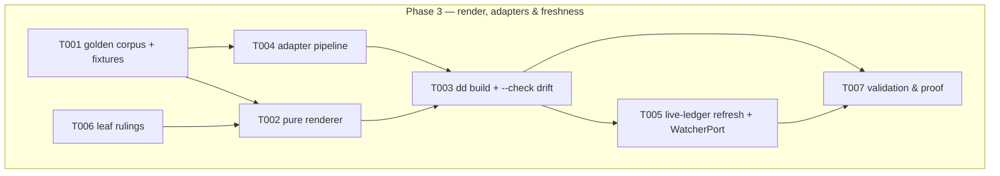

# Phase 3: Render, adapters & freshness — Tasks

**Plan**: [deterministic-documents-plan.md](../../deterministic-documents-plan.md) § Phase 3 (v1.1.1)
**Freeze basis**: [dd-surface.md](../phase-1-dd-core-foundations/dd-surface.md) — P3 fills exactly ONE frozen command body: `dd build <path> [--check] [--json]`; no signature/option/E-code changes (renegotiation only, via PM). E42x render/adapter sub-range is P3's to name within the frozen block.
**Contracts**: workshops/001 (severity table) · 003 (W1 adapter `(value, ctx) => string`, jiti-loaded, honest fallback, loud at build; W3 log-entry shape) · P2 schema resolver (adapter discovery rides schema packages) · P1 derive/walk engines
**Runs in parallel with Phase 4** — see § Shared-surface custody. Slice proof must be green with P4 absent.
**Testing approach**: Hybrid TDD (fixtures/golden corpus first — T001 is the floor)

## Architecture Map

### Tasks

| Status | ID | Task | Domain | Path(s) | Done When | Notes |
|--------|-----|------|--------|---------|-----------|-------|
| [x] | T001 | Golden/fixture corpus: docs exercising every render feature — banner, all section shapes incl. tables and the task-id-keyed evidence MAP (A3: interiors render even though unvalidated), heading-only anchors, visible ids, derived-state row summaries (`◐ 3/5`); adapter fixtures (good, throwing, missing, wrong-signature); hand-edit drift fixture; transclusion chain for refresh | harness-cli | `harness/cli/test/services/dd/render/fixtures/**` | Corpus enumerable (README maps fixture → feature/failure class); every adapter failure class has a fixture; golden files are real expected outputs, not snapshots-of-whatever-ran | TDD floor; plan 3.1/3.3 subjects; every invented limit gets a fixture that CROSSES it (P2 DL-006) |
| [~] | T002 | Pure renderer `services/dd/render/renderer.ts`: `renderDd(doc, resolved) => string` — precomputed inputs only, consumes P1 `deriveState`; banner, sections, tables, anchors, ids, derived summaries | harness-cli | `harness/cli/src/services/dd/render/**` | Golden files green; purity machine-enforced: renderer imports no fs/acts/output (extend the existing depcruise/arch-test pattern — reachable rules) | plan 3.1 |
| [ ] | T003 | `dd build` body (the ONE frozen P3 command): render one doc, write sibling `.dd.md`, `--check` = byte-drift detection (E42x, name it) without writing; auto-regen sibling after every mutating dd verb (best-effort, warn-on-fail, never blocks the verb) | harness-cli | `harness/cli/src/acts/dd/build.ts` | AC-03 green incl. hand-edit fixture: hand-edited sibling detected by `--check`, regenerated by `build`; envelope carries adapter warnings; exit mapping recorded as T006 ruling | plan 3.2; F-05 pattern (check:docs) |
| [ ] | T004 | Adapter pipeline: jiti-load `(value, ctx) => string` from schema package `adapters/`; honest fallback rendering on missing/throwing/mis-shaped adapter; EVERY adapter issue in the build envelope; expose the WARN-aggregation interface P4's doctor will consume (interface only — doctor wiring is P4/P5's) | harness-cli | `harness/cli/src/services/dd/render/adapters.ts` | AC-04 green incl. throwing-adapter fixture (renders with fallback + envelope warning, never crashes); interface exported + fake-tested | workshop-003 W1; plan 3.3 |
| [ ] | T005 | Live-ledger refresh at render: mode `live` recompute + dependents' md regen via CLI path; watcher LIBRARY only (subscribe via injected `WatcherPort`, content-hash contract) — NO daemon/sensor wiring (P5's) | harness-cli | `harness/cli/src/services/dd/render/refresh.ts` (+ port type) | Editing a transcluded source regenerates consumer md via CLI path; fake-watcher test proves the subscription contract; depth-1 revalidate-on-save stays deferred (W7) | plan 3.4; D9 |
| [x] | T006 | Leaf rulings (recorded in execution.log.md, one-line rationale each): (a) E42x code names/allocation within the frozen block; (b) `dd build`/`--check` exit mapping; (c) golden-file update procedure (regen script vs hand-edit) | harness-cli | — | All three recorded before their consumers land | leaf decisions are the coder's, constrained by the freeze |
| [ ] | T007 | Validation & proof: `npx vitest run test/services/dd/render` green WITH P4 ABSENT; P1+P2 suites still green; full `just test`; arch-check 2; both-cwds proof for any test spawning the CLI; recorded live `dd build` transcript | harness-cli | `harness/cli/test/services/dd/render/**` | Proof lines recorded in execution.log.md | fence proof per backpressure-coverage § Phase 3 |

### Shared-surface custody (P3 ∥ P4 — MANDATORY protocol)

Phase 4 runs concurrently in THIS SAME worktree. Disjoint fences except:

1. **`test/acts/dd.test.ts`** — P3 owns exactly ONE stub row (`dd build`); P4 owns seven. NEVER edit this file without a custody window: `pij send pij-related-koala "REQUEST dd.test.ts window"` → wait for GRANT → edit + `git commit --only` → report → PM releases. Row-freeze ≠ file-freeze: replace only your row's assertions; everything else byte-identical.
2. **The git index** — `git commit --only <pathspec>` for EVERY commit (atomic stage+commit; a bare `git commit` sweeps the other coder's staged work). Never `git add` + separate commit. On index.lock contention wait 5s, retry once, then report.
3. Never run `just fix` repo-wide (touches the other phase's files mid-flight) — biome-check only your own paths.

### Context Brief

**Friction capture (standing, mandatory)**: `harness observe "<what>" --kind difficulty|confusion|magic-wand|win` the moment it bites; drains into the phase retro.

**Key findings** (plan § Key Findings + P1/P2 retros):
- F-05: `dd build --check` mirrors the check:docs regenerate-and-diff pattern — precedented, don't invent.
- P2 DL-007/F002 lesson: never reason from a port's CONTRACT without reading its IMPLEMENTATION — if you consume fs, use/extend the dd-owned `NodeSchemaFs` (acts/dd/schema-fs.ts) semantics, never bare `NodeFs` whose readdir swallows errors to [].
- P2 DL-006: a semantic decision shipped as a bare constant is invisible — any limit you invent needs a ruling note AND a fixture crossing it.
- Tests spawning the CLI or resolving fixture paths MUST pin cwd (describe-level beforeEach, CLI_ROOT off import.meta.url — idiom in dd-live.test.ts) and be proven from BOTH repo root and harness/cli.

**Domain constraints**: acts → services → ports; renderer is PURE (no fs, no process); every act terminal path via `exitWithEnvelope`; fakes-only testing (no `vi.mock`); real fs only under fixtures/temp dirs; `services/dd/render` may import `dd/core` + `dd/schema` types, never vice-versa, and never from acts/output.

**Reusable now**: P1 `deriveState`/walk; P2 resolver + `NodeSchemaFs`; jiti already a dependency (extension loading precedent); golden-file patterns in existing render-ish tests; envelope constructors `output/envelope.ts`.

**Fence & proof (backpressure-coverage.md § Phase 3)**: slice `npx vitest run test/services/dd/render` green with P4 absent; full `just test`; commit via `--only` inside the fence; baselines arch-check 2, md-lint 199.

### Discoveries & Learnings

_Populated during implementation by the implement verb._

| Date | Task | Type | Discovery | Resolution | References |
|------|------|------|-----------|------------|------------|
