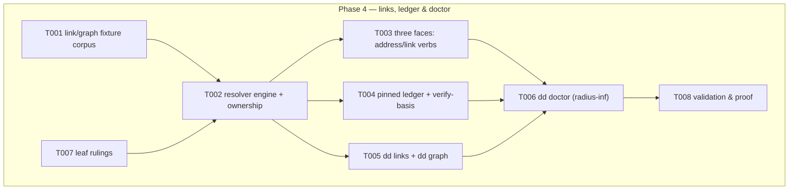

# Phase 4: Links, ledger & doctor — Tasks

**Plan**: [deterministic-documents-plan.md](../../deterministic-documents-plan.md) § Phase 4 (v1.1.1)
**Freeze basis**: [dd-surface.md](../phase-1-dd-core-foundations/dd-surface.md) — P4 fills SEVEN frozen command bodies: `dd address generate|validate`, `dd link resolve|verify-basis`, `dd links`, `dd graph`, `dd doctor`. Four RESERVED rows are P4's to exercise (doctor scope/options; graph emit/scope; verify-basis re-verify mutation semantics; address validate `--resolve` segment classification) — options ADDITIVE only via one-line PM renegotiation per the RESERVED contract; command names and frozen positionals never change. E43x links/doctor + E44x flow-gate-adjacent codes: P4 names within sub-ranges.
**Contracts**: workshops/001 (address grammar — closed spec; severity table) · P1 walk/parse (address parser `kind` values are positional hints only) · P2 resolver (clash/shadow diagnostics, schema-aware target checks)
**Runs in parallel with Phase 3** — see § Shared-surface custody. Slice proof must be green with P3 absent; `dd graph` emits mermaid strings DIRECTLY (no renderer dependency — keeps P3 ∥ P4 true).
**Testing approach**: Hybrid TDD (fixture corpus first — T001 is the floor; loop breakers tested on the cyclic fixture are the hard requirement)

## Architecture Map

### Tasks

| Status | ID | Task | Domain | Path(s) | Done When | Notes |
|--------|-----|------|--------|---------|-----------|-------|
| [x] | T001 | Fixture corpus: multi-doc graphs covering every workshop-001 severity class + finding-ownership cases (broken neighbour), CYCLIC graph (the loop-breaker subject), pinned-basis fresh/stale pairs, inbound/outbound scan layouts, sweep-exclusion (`sweep_exclude`, OD-1) fixtures, schema-aware target-check cases riding P2 resolution | harness-cli | `harness/cli/test/services/dd/links/fixtures/**` | Corpus enumerable (README maps fixture → class); cycle fixture actually cycles (≥2 loops incl. self-reference); every severity class has bad + good twin | TDD floor; every invented limit gets a crossing fixture (P2 DL-006) |
| [x] | T002 | Resolver engine `services/dd/links/resolver.ts`: address → target over parsed docs; finding-ownership rule (a finding is owned by the file that must change to fix it — broken neighbour surfaces on my run, fails only its own doc); visited-set loop breakers; severity per workshop-001 | harness-cli | `harness/cli/src/services/dd/links/**` | Severity-table + ownership fixtures green; cyclic fixture terminates with correct findings (mutation-proof: removing the visited-set must hang/redden a bounded test, not pass) | plan 4.1; Opus F17 |
| [x] | T003 | Three faces over the ONE engine: `dd address generate <interior>` / `dd address validate <address> [--resolve]` / `dd link resolve <address>` — thin act bodies | harness-cli | `harness/cli/src/acts/dd/{address,link}.ts` | AC-05 round-trip green: generate → validate → resolve on the corpus; `--resolve` segment classification recorded as RESERVED-row exercise (T007) | plan 4.2; D16 |
| [x] | T004 | Pinned ledger + `verify-basis(address, sha) → fresh|stale` SDK export (typed, importable — P6's gate consumes it); explicit re-verify verb semantics = T007 leaf ruling recorded like P1's 1.7 | harness-cli | `harness/cli/src/services/dd/links/basis.ts` + act wiring | AC-06 pinned half green: pinned ref + upstream edit ⇒ stale; re-verify updates per ruled semantics; SDK export fake-tested | plan 4.3; consumer-facing |
| [x] | T005 | `dd links <target>` (inbound/outbound local scan, D11) + standalone `dd graph` — DIRECT mermaid string emission, zero renderer imports (arch-test enforced) | harness-cli | `harness/cli/src/acts/dd/{links,graph}.ts` | AC-14 green on corpus; depcruise/arch proves no `dd/render` reachability from links/graph paths | plan 4.4; Opus F1b |
| [x] | T006 | `dd doctor`: the validate engine at radius ∞ (same engine, W8) — all severity classes, loop breakers on the cyclic fixture, exclusion contract honoured (sweep mode skips `sweep_exclude`; direct invocation NEVER skips — OD-1), envelope mapping WARN-class ⇒ `degraded`/exit 0, ERROR-class ⇒ `error` (this IS the checks-gate severity); adapter-gap aggregation CONSUMES P3's exported interface — code against the interface TYPE only; if P3's export isn't landed when you need it, define the consuming seam against the declared shape and fake it (never import P3 implementation files) | harness-cli | `harness/cli/src/acts/dd/doctor.ts` | AC-07 doctor half + AC-15 sweep half green with P3 ABSENT (fake the adapter-gap source) | plan 4.5; Opus F3/F4/F7 |
| [x] | T007 | Leaf rulings (execution.log.md, one-line rationale each): (a) re-verify verb name + mutation semantics (RESERVED row); (b) doctor scope/options exercised (RESERVED); (c) graph emit/scope options (RESERVED); (d) `--resolve` segment classification (RESERVED); (e) E43x/E44x code names | harness-cli | — | All recorded before consumers land; RESERVED additions listed for PM's one-line surface-manifest amendment BEFORE landing (message PM, wait for ack) | RESERVED contract: PM renegotiation, never silent |
| [x] | T008 | Validation & proof: `npx vitest run test/services/dd/links` green WITH P3 ABSENT; P1+P2 suites still green; full `just test`; arch-check 2; both-cwds proof for CLI-spawning tests; recorded live transcripts: address round-trip, verify-basis fresh→stale, doctor on the cyclic corpus | harness-cli | `harness/cli/test/services/dd/links/**` | Proof lines recorded in execution.log.md | fence proof per backpressure-coverage § Phase 4 |

### Shared-surface custody (P3 ∥ P4 — MANDATORY protocol)

Phase 3 runs concurrently in THIS SAME worktree. Disjoint fences except:

1. **`test/acts/dd.test.ts`** — P4 owns SEVEN stub rows (its commands); P3 owns one (`dd build`). NEVER edit this file without a custody window: `pij send pij-related-koala "REQUEST dd.test.ts window"` → wait for GRANT → edit + `git commit --only` → report → PM releases. Row-freeze ≠ file-freeze: replace only your rows' assertions; everything else byte-identical.
2. **The git index** — `git commit --only <pathspec>` for EVERY commit. Never bare `git commit` (sweeps the other coder's staged work). On index.lock contention wait 5s, retry once, then report.
3. Never run `just fix` repo-wide — biome-check only your own paths.

### Context Brief

**Friction capture (standing, mandatory)**: `harness observe "<what>" --kind difficulty|confusion|magic-wand|win` the moment it bites; drains into the phase retro.

**Key findings** (plan + P1/P2 retros):
- Unbounded walks are THE phase risk: visited-set loop breakers are a hard requirement, and their tests must be able to see the opposite (a removed breaker must redden a bounded test).
- P2 DL-007/F002: never reason from a port's CONTRACT without its IMPLEMENTATION — for fs access use/extend the dd-owned `NodeSchemaFs` (acts/dd/schema-fs.ts, honest errno split), never bare `NodeFs` (readdir swallows all errors to []).
- P2 DL-006: any invented numeric limit needs a ruling note + a fixture crossing it.
- Tests resolving fixture paths or spawning the CLI must pin cwd (describe-level beforeEach, CLI_ROOT off import.meta.url — idiom in dd-live.test.ts) and be proven from BOTH repo root and harness/cli.
- OD-1 (ruled): `sweep_exclude` skips docs in SWEEP mode only; direct invocation never skips — and P1's walk.ts:126-146 carries a basis-stale comment (residual A1) you may read but not fix (P6's).

**Domain constraints**: acts → services → ports; every act terminal path via `exitWithEnvelope`; fakes-only (no `vi.mock`); real fs only under fixtures/temp; `services/dd/links` may import `dd/core` + `dd/schema` types, never vice-versa, never acts/output; `dd graph` never imports `dd/render`.

**Reusable now**: P1 address parser + walk + visited-set precedent (walk.ts), `deriveState`; P2 resolver + shadow diagnostics + `NodeSchemaFs`; envelope constructors; P1/P2 fixture README pattern.

**Fence & proof (backpressure-coverage.md § Phase 4)**: slice `npx vitest run test/services/dd/links` green with P3 absent; full `just test`; commit via `--only` inside the fence; baselines arch-check 2, md-lint 199.

### Discoveries & Learnings

_Populated during implementation by the implement verb._

| Date | Task | Type | Discovery | Resolution | References |
|------|------|------|-----------|------------|------------|
| 2026-08-03 | T002 | Noteworthy | A bare-`#` address has no meaning without a containing document, and the CLI face has none | Report `no-base-document` with the `<path>#<interior>` next_action; never guess a base. Proven resolvable in context at the service level | execution.log.md § T007 |
| 2026-08-03 | T002 | Noteworthy | A visited set cannot break a *symlink* cycle — each pass mints a genuinely distinct path | Rely on the port failing honestly (`ELOOP`) and report one `link-scan-failed`; asserted with a throwing `SchemaFs` (P2 F002's distinction) | `scan.ts`, `scan.test.ts` |
| 2026-08-03 | T004 | Noteworthy | `--update` first anchored the ADDRESS at the referencing document's folder, resolving `docs/docs/…` | A command-line address always anchors at the repo root; `--update` names whose ledger moves, not the address's base. Caught by the live suite | execution.log.md § T007(a) |
| 2026-08-03 | T006 | Noteworthy | Phase 3's adapter aggregation had not landed | Consuming seam `DdAdapterGapSource` declared inside Phase 4's fence and faked; no Phase 3 module imported; arch-enforced. Phase 5 wires the real one | `links/model.ts`, `doctor.test.ts` |
| 2026-08-03 | T006 | Noteworthy | dd-core's issue-class → E-code map is private to Phase 2's act, which the fence forbids editing | Duplicated in `acts/dd/doctor.ts` with an exhaustive `Record` as the compile-time guard; collapse to one exported map at fan-in | `acts/dd/doctor.ts` |
| 2026-08-03 | T008 | Noteworthy | `just test` fails in this agent environment: ambient `GIT_CONFIG_KEY_0=safe.bareRepository=explicit` makes git refuse implicit bare-repo discovery | Environmental, not the repo's: reproduced in three commands; suite passes 91/91 and the full run 3527/3527 with the vars cleared | execution.log.md § Deferred & Noteworthy |
| 2026-08-03 | T008 | Noteworthy | Two coders running `just test` in one worktree collide on `harness/cli/coverage/.tmp` | Worked around with `--coverage.reportsDirectory`; captured as a difficulty — the custody protocol should cover the coverage dir or give each seat its own | `harness observe` DL-004 |
| 2026-08-03 | T001 | Noteworthy | Fixtures under `test/**/fixtures/**` are skipped by the sweep, so a doctor test rooted there would prove nothing | Corpus mounted at a synthetic `/repo` in unit tests and in a temp dir for live tests, so the exclusion is exercised deliberately | `links/helpers.ts`, `dd-links-live.test.ts` |
