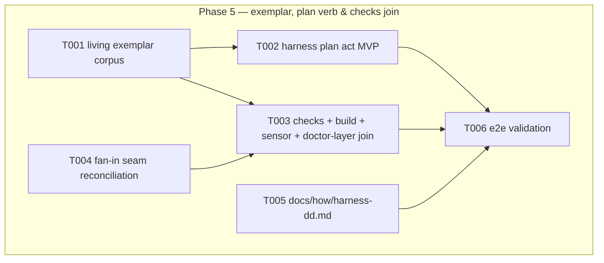

# Phase 5: Exemplar, plan verb & checks join — Tasks

**Plan**: [deterministic-documents-plan.md](../../deterministic-documents-plan.md) § Phase 5 (v1.1.1)
**Freeze basis**: [dd-surface.md](../phase-1-dd-core-foundations/dd-surface.md) — P5 adds the `plan` CORE act (NOT a dd subcommand; `plan` into RESERVED_NAMES + `registerPlanAct` + deviation-ledger row, all pre-recorded in the plan). The dd surface itself gains NOTHING — any dd signature/option/E-code change remains a PM renegotiation.
**Contracts**: workshop-002 (plan/evidence shapes — the *clever* bar) · P2 exemplar packages (`builder/*`) · P3 render/build + adapter-gap interface · P4 links/doctor + `DdAdapterGapSource` + `verify-basis` SDK
**Fan-in, single-writer**: ONE coder owns every shared integration file this phase. No custody windows needed — but three surfaces await prime grants (§ Open Decisions).
**Testing approach**: exemplar-first (5.2 corpus is the floor; 5.1 scaffolds against it)

## Architecture Map

### Open Decisions

| # | Decision | Ruling | Status |
|---|----------|--------|--------|
| OD-5 | package.json `build` script gains `npm run gen:dd-docs` (modifies an EXISTING key — outside OD-3) | **GRANTED** (prime amendment 5, 2026-08-03) on "precedented and equivalent" grounds — NOT "no lifecycle": `prepare = npm run build`, so build IS install-time-reachable; the grant holds because gen:docs/gen:flows already run there (same generator class). **HARD CONDITION (proven live by PM)**: gen-dd-docs.mjs exits 0 silently-on-stdout with `.dd/` absent, no dev-only state — it reads only its manifest + source .md | ✅ GRANTED (conditioned) |
| OD-6 | `.harness/extensions/checks/extension.ts` additive dd gates; `.harness/extensions/repo-sensors/extension.ts` additive `.dd` watch-glob | **GRANTED** (amendment 5). Rider extended: report `harness checks` before/after alongside arch-check — the new gate changes the prime's standing warn-launch baseline | ✅ GRANTED (rider) |
| OD-7 | `app.ts` + RESERVED_NAMES gain `plan` act | **GRANTED** (amendment 5) on **Jordan's cited authority** (initial-brief.md:23: "Harness to have a first class plan verb (which uses dd under the hood)") — the PM's dd-surface-covers-it reading was REJECTED as principle (it would give the envelope no edge). Scope: minimal registration lines for dd-owned acts only; anything else in app.ts stays out | ✅ GRANTED (cited) |
| OD-8 | **A3 adjudication — `DdShape.valuesShape`** (P2 residual): additive shape kind so dd-core can validate dynamic-key map interiors (evidence maps). P3's renderer already renders interiors; the exemplar's evidence map is the live subject | **RATIFIED** (PM, this session) as proposed: `DdShape.valuesShape?: DdShape` — declared `fields` win per key, `valuesShape` shapes unmatched keys, `allowAdditional:false` keeps its meaning only in its absence, no-valuesShape regression pin REQUIRED. Landed files: `core/model.ts`, `core/validate.ts`, **`schema/declarations.ts`** (parser allow-list would have silently dropped the key — separately approved), `.dd/schemas/builder/plan/schema.json`, and **`links/resolver.ts`** (companion grant — a dynamic-key map was unsteppable, which broke workshop-002 Ruling 3 outright) | ✅ RATIFIED + landed |

### Tasks

| Status | ID | Task | Domain | Path(s) | Done When | Notes |
|--------|-----|------|--------|---------|-----------|-------|
| [x] | T001 | Living exemplar corpus at `docs/plans/065-deterministic-documents/exemplar/`: real `plan.dd.json` against `builder/plan` + `tasks/phase-2/tasks.dd.json` with the evidence section keyed by task ids and AC rows carrying `pressure`/`proven_by` link columns (workshop-002 shapes, D2) + rendered `.dd.md` siblings. This corpus is dd's own raison d'être made real: the AC-to-coverage linkage that P1 retro DL-001 recorded as hand-maintained prose becomes typed, addressable, jq-queryable | substrate | `docs/plans/065-deterministic-documents/exemplar/**` | AC-09 green: validates (depth 3), renders byte-stable (`dd build --check`), jq recipes work; **flag for HUMAN review before ship — Jordan's 'clever use of primitives' bar is a human call, note it Deferred/Noteworthy** | the P5 floor; consumes P2's builder/* packages |
| [x] | T002 | `harness plan` core act MVP: `plan new <slug>` scaffolds `plan.dd.json` from `builder/plan` + per-phase task-file wiring; `plan render`/`plan validate` delegate to dd build/validate; `plan` into RESERVED_NAMES; `registerPlanAct` in app.ts; deviation-ledger row (pre-recorded in plan) | harness-cli | `harness/cli/src/acts/plan/**` + app.ts + RESERVED_NAMES (OD-7) | Scaffolded plan validates + renders OOTB in a temp dir (live transcript); enumeration tests updated ADDITIVELY (app/index — the P1-retro fence lesson, pre-granted here: additive rows for the new act only) | Opus F10 |
| [x] | T003 | Integration join (single-writer): checks extension gains the dd-doctor verb-gate line (severity from doctor's OWN envelope: WARN⇒degraded/pass, ERROR⇒fail) + `runCmdGate('check:dd-docs', warn)`; `gen:dd-docs` appended to root build script (OD-5); shipped `checkDd` doctor-service layer (consumer-repo path); `.dd` watch-glob sensor declaration (OD-6) | substrate + harness-cli | `.harness/extensions/{checks,repo-sensors}/extension.ts` · package.json build · `harness/cli/src/services/doctor/**` | AC-07 checks half + AC-08 drift half + AC-15 green: `harness checks` green on the clean tree AND fails/degrades correctly with a known-bad fixture present (build one, prove it, remove it — controls must be TESTED not demonstrated); arch-check AND `harness checks` both recorded before/after (prime rider: the new gate changes the standing warn-launch baseline — any shift called out explicitly); gen-dd-docs.mjs no-.dd/-tree exit-0 behavior must stay true (OD-5 hard condition — add a test or a recorded probe) | Opus F2/F3/F11/F12 |
| [x] | T004 | Fan-in seam reconciliation (the P3↔P4 meet): adapt P3's real adapter-gap export onto P4's `DdAdapterGapSource` (or agree one shared type — smallest diff wins); wire `autoRegenerateSibling` its first call site (P4's `verify-basis --update` mutates a doc ⇒ regen its sibling, warn-on-fail); collapse the doctor's duplicated issue-class→E-code map to one exported map (P4 Deferred) | harness-cli | `services/dd/**` seam files (narrow: only the three named seams) | Doctor consumes REAL P3 adapter gaps end-to-end (a throwing-adapter fixture surfaces in `dd doctor` output); `--update` regenerates the touched doc's sibling; one E-code map, both consumers import it; no other P1-P4 file touched | the three flagged fan-in debts, nothing more (R-elegance) |
| [x] | T005 | `docs/how/harness-dd.md`: grammar, schema convention, states/gating incl. the `human-skipped` receipt convention, adapter guide pointer, jq recipes. Plain-first: every term introduced with its meaning in the same breath; no insider compression | substrate | `docs/how/harness-dd.md` | Exists, markdown-lint stays 199 baseline (or additions accounted), linked from the baked dd docs (regen via gen:dd-docs) | plain-first rule (write for outsiders) |
| [ ] | T006 | End-to-end validation: full `just test` + `harness checks` + ONE recorded exemplar run in the execution log: `dd validate exemplar/plan.dd.json --depth 3 && dd build --check && dd doctor --path docs/plans/065-deterministic-documents/exemplar` + a jq demo over the .dd.json | harness-cli | execution.log.md | All green in one recorded transcript; arch-check 2 before/after (or shift explicitly called out per prime rider); both-cwds proof for any new CLI-spawning test | evidence for review |

### Retro follow-ins (from P1–P4 drains — address or explicitly defer in the log)

- **GIT_CONFIG_* env injection** broke full-suite proof in EVERY phase (P1 DL-003, P2 DL-004, P3/4 DL-004). Third strike ⇒ promote: make the git integration fixture self-skip or neutralize injected env in its setup. IN P5 SCOPE if ≤ ~20 lines in that test's setup (it is a test file outside the dd fence — PM grant pre-approved for exec-remote-telemetry-git.int.test.ts setup ONLY, additive env-neutralization); else record the deferral.
- **Proof ceiling** (P3/4 DL-005-class): root `vitest.config.ts` sanctions repo-root invocation but nothing runs it — EITHER add a root-invocation smoke line to checks OR delete the root config. Decide with a one-line rationale in the log (T003 territory).
- **Per-row fixture roots** (CONF-001): if any P5 test drives multi-root corpora, chdir per-row into the fixture root; describe-level pin alone is insufficient.

### Context Brief

**Friction capture (standing, mandatory)**: `harness observe "<what>" --kind difficulty|confusion|magic-wand|win` the moment it bites.

**Key lessons now binding** (P1–P4 retros):
- Port contract ≠ implementation: fs via the dd-owned honest-errno adapters, never bare NodeFs.
- Any invented limit: named constant + ruling note + fixture crossing it.
- Controls are TESTED, not demonstrated: the checks gate must be proven against a known-bad fixture, not only a green tree.
- Tests spawning the CLI: cwd pinned AND proven from both sanctioned invocations.
- Provenance claims: per-file truth, never universals; label reconstructions RECONSTRUCTED.
- New untracked files: `git add -N <paths>` then `git commit --only <paths>` (the --only untracked gap).

**Domain constraints**: acts → services → ports; exitWithEnvelope terminal paths; fakes-only; the four dd depcruise boundary rule-sets stay green; `plan` act may import dd services via their public seams only.

**Fence & proof (backpressure-coverage.md § Phase 5)**: full `just test` + `harness checks` green; commit via `add -N` + `--only`; baselines arch-check 2 (before/after per rider), md-lint 199 + accounted additions.

### Discoveries & Learnings

_Populated during implementation by the implement verb._

| Date | Task | Type | Discovery | Resolution | References |
|------|------|------|-----------|------------|------------|
