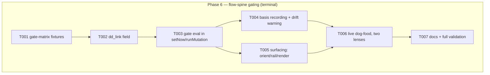

# Phase 6: Flow-spine gating (terminal) — Tasks

**Plan**: [deterministic-documents-plan.md](../../deterministic-documents-plan.md) § Phase 6 (v1.1.1)
**Freeze basis**: [dd-surface.md](../phase-1-dd-core-foundations/dd-surface.md) — the dd CLI surface is COMPLETE and gains nothing. P6 consumes dd through its SDK (`verify-basis`, validate/derive engines) from the FLOW side. E440–E449 is the one open sub-range: the flow-gate refusal codes are P6's to name within it (frozen block rules apply — names JSDoc'd, enumerated, final).
**Contracts**: workshop-002 (gate refuses; `--force` = defended override, agents never on own judgment; `gate_terminal` default `checked ∪ human-skipped ∪ na`) · workshop-001 (basis/drift) · P4 `verify-basis` SDK · P5 exemplar (the gate's live subject) · P1 `deriveState`
**Single pair, terminal phase.** The flow spine is the subject — extra care: the flow trio files of THIS plan are still PM-owned live state (never write them; all tests in temp dirs).
**Testing approach**: gate-matrix first (T001 fixtures), dog-food last (T006 is the phase's own acceptance bar)

## Architecture Map

### Tasks

| Status | ID | Task | Domain | Path(s) | Done When | Notes |
|--------|-----|------|--------|---------|-----------|-------|
| [x] | T001 | Gate-matrix fixture corpus (temp-dir factories, never tracked flows): dd docs in every gate-relevant state — all-terminal (each of checked/human-skipped/na singly and mixed), one-unchecked, blocked, custom `gate_terminal` override narrowing AND widening the default set, missing target doc, unresolvable address, stale basis | flow spine | `harness/cli/test/services/flow/gate-fixtures/**` (builders, not committed flow files) | Every AC-10 matrix row has a fixture; the custom-terminal override rows prove the SCHEMA'S declaration drives the set (P2 T003 wiring consumed end-to-end) | TDD floor |
| [x] | T002 | `dd_link` node field: type in `flow-events.ts` `{ address, gate, basis_sha }`; documentary optional[] entry in `flow.schema.json` + `gen:flows` regen; writable via `apply --ops`; ABSENT field = zero behavior change (the opt-in contract, regression-pinned) | flow spine | `harness/cli/src/services/flow/flow-events.ts` + schema + gen | Field round-trips through apply/render; schema check green; a flow WITHOUT dd_link byte-identical behavior (pin it) | F-09; plan risk mitigation is this pin |
| [x] | T003 | Gate evaluation in `setNow`/`runMutation` (flow-mutations.ts:62): resolve via dd SDK, compute over the SCHEMA-DECLARED `gate_terminal` set via P1 derive; REFUSE with an E44x (name it) listing every incomplete item (`d5Refuse` shape); `--force` proceeds AND records a defended-override event in the log + agent-etiquette next_action ("the human's decision, never yours"); gate lives in the MUTATION pipeline only, never schema validation (the silent-skip hole the plan names) | flow spine | `flow-mutations.ts` + the E44x allocation | AC-10 full matrix green: refuse lists items; --force recorded; terminal sets honored incl. overrides; no-dd_link flows untouched | Opus F9; workshop-002 --force semantics are RULED — pin the refusal envelope BY VALUE (ruled-values-need-pinning, P5 DL-003) |
| [x] | T004 | Basis recording + drift: store target-doc sha in `dd_link.basis_sha` at gate evaluation; orient warns via P4's `verify-basis` on drift (WARN, never a refusal — drift is information) | flow spine | flow-mutations + orient path | AC-11 drift half green: edit upstream doc in temp dir ⇒ orient surfaces the drift warning with the address + both shas | workshop-001 |
| [x] | T005 | Surfacing: orient dd-gate block (all items with per-item pips), rail `⚑` gate callout, renderer node badge from state STORED ON THE NODE (renderer stays pure — no dd resolution at render time) | flow spine | orient/rail/render paths | AC-11 surfacing green: orient shows the gate block, rail flags the gated node, rendered md carries the badge; renderer purity rules stay green | F-12 |
| [ ] | T006 | **Live dog-food, two lenses** (Jordan, 2026-08-03 — the phase's own acceptance bar): (a) DETERMINISTIC — integration suite driving the REAL CLIs in a temp sandbox: scaffold flow + dd docs (via `harness plan new` where apt) → wire `dd_link` via apply --ops → gate REFUSES naming items → complete items / `--force` records → upstream edit → `verify-basis` flags drift → orient/rail surface it — green inside `just test`; (b) INFERENCE — you OPERATE what you built as a user: walk orient/rail/gate/force/drift end-to-end in a fresh temp flow and write a findings note (confusions, sharp edges, anything a test can't see) into execution.log.md, each friction ALSO `harness observe`d; ≥1 real observation or an explicit defended "none found" | flow spine | `harness/cli/test/integration/dd-flow-gate.int.test.ts` (temp dirs ONLY — never a tracked fixture flow) + execution.log.md findings note | Suite green in full `just test`; findings note present with real observations | task 6.6 verbatim; temp dirs only |
| [ ] | T007 | `docs/how/harness-flow.md` gate section (plain-first) + full validation: gate-matrix suite + `npx vitest run test/services/flow test/acts/flow` + full `just test` + `harness checks` (both baselines per prime rider — the doctor gate now sweeps a repo whose flows may carry dd_link) + both-cwds for new CLI-spawning tests + recorded live transcript of the whole 6.6(a) journey run by hand once | flow spine | All green; transcripts + before/after baselines in execution.log.md | fence proof |

### Rulings already binding on this phase

- **Ruled-values-need-pinning (P5 DL-003, PM-adopted)**: every ruled value this phase lands (the E44x codes, the refusal envelope shape, the default terminal set, the --force event shape) ships WITH an assertion pinning it by value — a log row alone is drift bait.
- **Gate refuses with `--force` as defended override** (workshop-002, Jordan-ruled): agents never force on their own judgment; the recorded event + next_action must say so.
- **Opt-in only**: a node without `dd_link` must be byte-identical in behavior — regression-pinned, since this phase touches the live flow machinery every existing repo flow runs on.
- **A1 residual (P1 review)**: walk.ts:126-146 carries a basis-stale comment scheduled for THIS phase — read it, fold its intent into T004, and remove/correct the comment (cite this dossier row).

### Context Brief

**Friction capture (standing, mandatory)**: `harness observe "<what>" --kind difficulty|confusion|magic-wand|win`. The 6.6(b) lens makes this a DELIVERABLE, not just hygiene.

**Key lessons binding** (P1–P5 retros): port implementation over contract (read what runMutation actually does before wiring); fs via honest-errno adapters; invented limits need crossing fixtures; controls TESTED not demonstrated (the refusal path must be proven to refuse, the --force path to record); cwd-pinned + both-cwds for CLI-spawning tests; per-row fixture roots for multi-root corpora; provenance claims per-file, reconstructions labeled; `git add -N` before `commit --only` for new files.

**Domain constraints**: the flow trio of THIS plan (docs/plans/065-deterministic-documents/the-flow.*) is LIVE PM STATE — read-only forever; all flow fixtures are temp-dir scaffolds. acts → services → ports; exitWithEnvelope; fakes-only unit layer, real-CLI integration layer in temp dirs; dd consumed via SDK seams only (no reaching into dd internals from flow code — arch rule it if depcruise doesn't already).

**Fence & proof (backpressure-coverage.md § Phase 6)**: flow suites + full `just test` + checks green; commit `add -N` + `--only`; baselines arch 2, md-lint 199+accounted, checks warn-trio reported before/after.

### Discoveries & Learnings

_Populated during implementation by the implement verb._

| Date | Task | Type | Discovery | Resolution | References |
|------|------|------|-----------|------------|------------|
