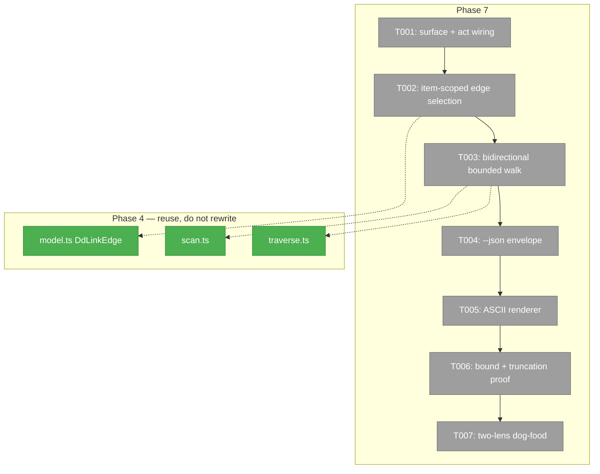

# Phase 7 — `dd graph map`: what points here, and where does this go?

**Plan**: `docs/plans/065-deterministic-documents/deterministic-documents-plan.md`
**Phase**: Phase 7: Graph map
**Complexity**: CS 3

---

## Executive Briefing

**Purpose.** Give a reader one command that answers "what does this row reach,
and what reaches it?" for any addressable part of the corpus — transitively,
in both directions, and readable in a terminal.

**What we're building.** `harness dd graph map <address>`: seed at one address,
walk the link graph outward (following outbound links) and inward (following
inbound links), and render an ASCII tree of both — or `--json` for machines.
Bounded, so a dense corpus cannot hang or flood the terminal.

**The use case, in Jordan's words:** *"given an ac row i can see links out on
where its linking to tasks, and where they link to back-pressure, also perhaps
we have a link coming in to the ac row from somewhere else"*. Note the shape:
AC → tasks → backpressure is **two hops out**, and the inbound arm is a
different direction entirely. One hop in one direction does not answer it.

**Goals**

- ✅ Seed at a **section** address *or* an **item** address (a list row by id).
- ✅ Walk **both directions**, transitively, past the first hop.
- ✅ Bound the walk hard — never hang, never flood.
- ✅ `--json` for tools; a readable ASCII tree by default.
- ✅ Say what was **cut off**, rather than silently truncating.

**Non-Goals**

- ❌ Replacing `dd links` (one hop, document-scoped) or `dd graph` (whole-corpus
  mermaid). Both keep byte-identical behaviour.
- ❌ Any new E-code. E430–E439 is full and the existing codes already fit.
- ❌ Fixing FU-4. See § Fence.

---

## Prior Phase Context

Phase 4 built the whole traversal layer this phase consumes. Read it before
writing anything:

| What | Where | Why it matters here |
|---|---|---|
| Edge model | `services/dd/links/model.ts` | `DdLinkEdge` already carries `from`, `to`, `address`, `location`, `sameDocument`, `target` |
| Corpus traversal | `services/dd/links/traverse.ts` — `traverseCorpus`, `reachableFrom` | Bounded walking already exists; **extend or reuse, do not re-implement** |
| Inbound/outbound scan | `services/dd/links/scan.ts` | How `dd links` finds both directions today |
| Graph assembly | `services/dd/links/graph.ts` | Node/edge assembly for the mermaid view |
| The act | `acts/dd/graph.ts` (70 lines) | Where the new subcommand registers |

**Two P4 defects worth knowing, because they are the same class this phase can
re-introduce** (from `.harness/records/retro/2026-08-03/003-065-dd-phases-3-4.md`):

- **F001** — a traversal tripwire was denominated on *loaded* nodes rather than
  *scheduled* ones, so the bound did not bind. Your `--max-nodes` must count the
  thing that actually grows.
- **F002** — a `--path` scope leaked into an interior pass, widening what was
  reached. Your `--depth`/`--direction` must hold on every pass, not just the
  first.

---

## The gap this phase closes — verified, not assumed

`dd links` does **not** scope to an item. Run today on a real AC row:

```bash
harness dd links "docs/plans/065-deterministic-documents/exemplar/plan.dd.json#acceptance_criteria/ac-0201"
```

It returns edges for the **whole document**, including
`"location": "$.sections[meta].value.backpressure"` — the `meta` section's own
link, which has nothing to do with `ac-0201`. The address names an item; the
answer describes the file.

So this phase has two jobs, and **item scoping is the harder and more important
one**:

1. **Scope edges to the addressed item** — an edge belongs to `ac-0201` when its
   `location` falls inside that row (e.g. `$.sections[acceptance_criteria].value[0].*`).
   The mapping from an item id to its `location` prefix must be **derived from
   the document**, never guessed from the id's text.
2. **Walk transitively, both ways**, bounded.

---

## Architecture Map



---

## Tasks

| Status | ID | Task | Domain | Path(s) | Done When | Notes |
|--------|-----|------|--------|---------|-----------|-------|
| [x] | T001 | Register `dd graph map <address>` as a **named subcommand** under the existing `graph` act, with `--depth <n>` (default 3), `--max-nodes <n>` (default 20), `--direction in\|out\|both` (default both). Bare `dd graph` must stay byte-identical. | harness-cli | `harness/cli/src/acts/dd/graph.ts` | `dd graph map --help` lists all three options; a golden/assertion proves bare `dd graph` output is unchanged | Surface grant recorded in `dd-surface.md` (P7 T001). **No new E-codes**: bad seed → `E430`, traversal failure → `E436` |
| [x] | T002 | **Item-scoped edge selection.** Given an address naming an item (`…#acceptance_criteria/ac-0201`), select only edges whose `location` lies within that item. Derive the item's `location` prefix from the parsed document; never infer it from the id string. A section address keeps today's section-wide behaviour. | harness-cli | `harness/cli/src/services/dd/links/**` | Seeding at `#acceptance_criteria/ac-0201` returns ONLY that row's edges — `$.sections[meta].*` is absent — proven against the real exemplar | **The core of this phase.** Fixture must include a document where two items in the same section have different outbound targets, so a section-wide answer cannot pass |
| [x] | T003 | **Bidirectional transitive walk.** From the seed, follow outbound edges to depth N and inbound edges to depth N, recording each node's distance and direction. Reuse `traverseCorpus`/`reachableFrom`; extend them rather than writing a second walker. Cycles terminate. | harness-cli | `harness/cli/src/services/dd/links/traverse.ts` | AC → tasks → backpressure appears as a **2-hop outbound chain**, and an inbound edge from another document appears on the inbound arm, in one invocation | P4 F001: bound on SCHEDULED nodes, not loaded ones. A self-referential cycle must not loop |
| [x] | T004 | `--json` envelope: seed, nodes (address, direction, distance), edges, and an explicit `truncated` block naming what was cut and why (`depth` or `max-nodes`). | harness-cli | `harness/cli/src/acts/dd/graph.ts` | `--json` output parses and round-trips; `truncated` is present and honest in both a bounded and an unbounded run | An omitted `truncated` key reads as "complete" — it must always be present, `false`/empty when nothing was cut |
| [x] | T005 | **The showcase renderer.** Incoming above, outgoing below, seed in the middle, indented by distance, each line carrying the address and its state mark. Readable in 80 columns. **This is a demo surface — see § T005 below; it must genuinely pop.** | harness-cli | `harness/cli/src/services/dd/links/report.ts` (or a sibling), `harness/cli/src/output/style.ts` | A golden fixture pins the exact PLAIN ASCII (no ANSI) for the exemplar AC row, wrapping within 80 cols; a second test proves colour appears when enabled and is absent under `NO_COLOR` | Reuse the `[x]/[ ]/[-]/[~]` marks — do not invent a second vocabulary. **Zero new dependencies** |
| [x] | T006 | **Prove the bounds bind.** A fixture corpus larger than `--max-nodes` and deeper than `--depth`; assert the walk stops, reports `truncated`, and does not hang. Then MUTATE each bound and show the test fails. | harness-cli | `harness/cli/test/services/dd/links/**` | Raising `--max-nodes` past the corpus size changes the result; removing the bound check fails a test | A cap only ever run against a small corpus has been demonstrated, not tested — build the corpus that exceeds it |
| [x] | T007 | **Two-lens dog-food.** (a) deterministic: drive the real CLI in a temp sandbox. (b) inference: operate the command as a user against the live exemplar and write a short findings note — what was confusing, what you expected and did not get. | harness-cli | `harness/cli/test/integration/**`, `docs/plans/065-deterministic-documents/tasks/phase-7-graph-map/findings.md` | Both lenses run; the findings note contains at least one real `harness observe` capture | Phase 6's inference lens found 5 defects a fully-green suite could not see. This is not ceremony |

---

## T005 in detail — this is the demo surface

Jordan's steer: *"this feature should look real nice in human mode… make it
really pop as a UX based demo for folks to see power of the DD system"*.

Treat the human render as a **showcase**, not a debug dump. It is the artifact
someone is shown when asked why deterministic documents are worth having: one
command, and the whole web of claims → proof → pressure around a single row
appears, in colour, in a terminal.

### Do NOT add chalk, picocolors, kleur, or any colour dependency

This CLI ships **`commander` + `jiti` and nothing else**, deliberately.
`harness/cli/src/output/style.ts` says so in its own header: pulling in a colour
library "would bloat the published install + supply-chain surface … against the
lean-prod-dep posture". That decision stands.

**Extend `output/style.ts` instead.** It already hand-rolls SGR wrappers —
`bold`, `dim`, `cyan`, `green` — from a two-line `sgr(open, close)` helper. Add
the handful you need the same way. This costs nothing and keeps one styling
vocabulary across the CLI.

### Colour gating is already solved — use it, do not re-invent it

`resolveUseColor({ mode, isTty, env })` in the same file already implements the
full precedence: `NO_COLOR` (any non-empty) and `FORCE_COLOR=0|false` force off;
truthy `FORCE_COLOR` / any `CLICOLOR_FORCE` force on; otherwise colour is on
only for `mode === 'human' && isTty`. It deliberately mirrors commander's own
`useColor()` so every surface agrees.

Three hard rules fall out of it:

1. **`--json` is never styled.** Not one escape byte.
2. **Piped output is plain.** `harness dd graph map … | cat` must be clean ASCII.
3. **The golden fixture pins the PLAIN form.** Never pin ANSI escapes into a
   golden — pin the plain render, and test colour separately by asserting
   escapes appear when enabled and are absent under `NO_COLOR`.

### What "pops" means here — carry meaning, not decoration

Colour must encode something a reader can act on. Suggested treatment; refine it
if you can do better, but every choice must mean something:

- **the seed row** — bold, visually unmistakable as the centre;
- **direction** — inbound and outbound distinguished at a glance (they are
  genuinely different questions, so they should not look alike);
- **state marks** — `[x]` passing green, `[ ]` holding plain/dim, `[-]` blocked
  red, `[~]` partial yellow. This is the one place colour is doing real work:
  a chain of proof that is green to its leaves reads instantly as sound;
- **distance** — dimmer as it gets further from the seed, so the eye lands on
  what is near;
- **ids** — accented so `ac-0201` / `bp-0201` / `tk-0201` are scannable;
- **truncation** — the "cut off here" line must be impossible to miss. A
  silently truncated graph that looks complete is the worst possible outcome.

Box-drawing characters (`├─`, `└─`, `│`) for the tree structure are welcome and
need no dependency.

**The honesty rule still wins over the pretty rule.** If a node could not be
resolved, or the walk hit a bound, or an edge is dangling — say so, visibly. A
beautiful render that hides a broken link is worse than an ugly one that shows
it.

### Prove it by looking at it

T007's inference lens covers this: actually run it against the exemplar AC row
and look. If it does not make you want to show someone, it is not done.

---

## Context Brief

**Environment-first posture.** Environment friction is work, not an apology. Fix
small reversible things; otherwise `harness observe "<what>" --kind
difficulty|confusion|magic-wand` the moment it bites.

### Fence — read before touching anything

**STOOD OFF, do not edit — another owner, unresolved:**

- `harness/cli/src/acts/dd/build.ts`
- `harness/cli/src/acts/dd/shared.ts`

You may **call** `createLinkContext` from `shared.ts` — reading and using it is
expected. You may not **modify** either file. If the work seems to require an
edit there, stop and report it; do not route around it.

**Do not touch:** `docs/plans/065-deterministic-documents/the-flow.json` / `.md`
(live PM state), `.the-flow-state.json`, or any git write (no commit, no push,
no branch). The PM commits.

**Known open defect, do not fix, do not work around:** FU-4 — `repoRoot` comes
from `process.cwd()`, so run commands **from the repository root**. Full
write-up in `docs/plans/065-deterministic-documents/follow-ups.md`. If your
feature appears broken from a subdirectory, that is FU-4, not your bug — say so
rather than compensating for it.

### Test corpora available

- `docs/plans/065-deterministic-documents/exemplar/` — the real four-document
  corpus with AC → backpressure/log links. **The primary target of the use case.**
- `exemplar/custom-render/` — self-contained, own schema and adapters. Note it
  deliberately reproduces FU-4; leave it alone.
- `harness/cli/test/services/dd/render/fixtures/chain/` — a transclusion chain,
  useful for multi-hop.

### Standing quality bar for this phase

These are not style preferences; each one is a defect this plan already shipped
and had to fix:

1. **A probe must be able to see the opposite.** A test that cannot fail when
   the behaviour is wrong proves nothing. Prefer stored expected values over
   recomputation — `expect(f(x)).toBe(f(x))` is a null test.
2. **If a change moves no test, that is a coverage finding**, not a pass. It
   happened twice in this plan.
3. **Mutation-test every claim.** Break the code deliberately; if the suite
   stays green, the test is decorative.
4. **Reuse the seam, don't fork it.** Two things that must agree should be
   projections of one source.

### Verification

```bash
cd harness/cli && npx vitest run test/services/dd/ test/acts/
cd <repo root> && just checks     # exit 0; warn trio 2/199/6 is baseline, do not move it
harness dd doctor                  # 0 errors
```

Quote lint fully qualified: **"197 markdownlint over 121 files examined; 199
total across markdownlint + links + mermaid"** — never the bare number.

---

## Discoveries & Learnings

_Populated during implementation._

| Date | Task | Type | Discovery | Resolution | References |
|------|------|------|-----------|------------|------------|
| 2026-08-04 | T002 | Discovery | The links layer could turn an address into a document, and an edge into a location, but had no mapping BETWEEN the two — which is the whole reason `dd links` answers about a file when handed a row. | Added `indexDocument`: one shape-directed walk producing every addressable interior paired with the location an edge would carry, so the mapping runs both ways from one source. | `services/dd/links/map.ts`, `DL-007` |
| 2026-08-04 | T003 | Decision | Two walkers were available to fork: `traverseCorpus` (documents) and a new address-level walk. | Neither. `boundedWalk` was extracted as one bounded breadth-first core; `reachableFrom` became a projection of it and the map walk is another. Two things that must agree are now one thing. | `services/dd/links/traverse.ts` |
| 2026-08-04 | T005 | Decision | The showcase render needs colour, but `services/dd/links/**` must never import `output/` (arch-enforced, `isolation.test.ts`). | The renderer takes an injected `DdMapPalette`; the act composes it from `output/style.ts`. One render path, plain golden and coloured run identical modulo the palette, and `--json` never builds the string at all. Zero new dependencies. | `report.ts`, `acts/dd/graph.ts`, `MW-001` |
| 2026-08-04 | T006 | Defect (own) | The "textual-prefix trap" probe aimed at the wrong trap: `]` already terminates an array index, so removing `isWithinLocation`'s boundary check left the suite green. | Re-aimed at the real shape — a sibling field whose name extends another (`pressure` vs `pressure_note`). Mutant now dies. | `test/services/dd/links/map.test.ts`, `DL-008` |
| 2026-08-04 | T006 | Coverage | Gutting `reachableFrom` to `return new Set([seed])` left all 690 tests green — the doctor's component-skip had no observable test. | Added direct coverage for the function this phase refactored. The doctor-level consequence is still unobserved: reported, not expanded into. | `test/services/dd/links/traverse.test.ts`, `DL-008` |
| 2026-08-04 | T007 | Discovery | A seed address missing its `#` reports "address target is missing: <path>" and sends the reader to `dd links`, which fails the same way. | Not fixed: the next action comes from `nextActionFor` in the stood-off `acts/dd/shared.ts`. Proposed as a `no-boundary` reason instead. | `findings.md` F1, `CONF-002` |
| 2026-08-04 | T007 | Environment | FU-4 is one `cd` from ordinary use: from `docs/`, schema discovery roots move with `process.cwd()` and a good corpus becomes unresolvable. | Reported, not compensated for, per the fence. | `findings.md` F3 |
