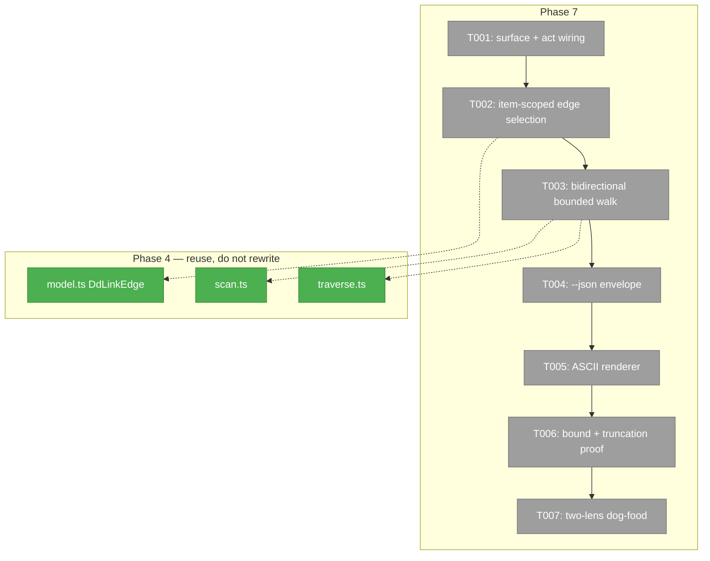

# Phase 7 — `dd graph map`: what points here, and where does this go?

**Plan**: `docs/plans/065-deterministic-documents/deterministic-documents-plan.md`
**Phase**: Phase 7: Graph map
**Complexity**: CS 3

---

## Executive Briefing

**Purpose.** Give a reader one command that answers "what does this row reach,
and what reaches it?" for any addressable part of the corpus — transitively,
in both directions, and readable in a terminal.

**What we're building.** `harness dd graph map <address>`: seed at one address,
walk the link graph outward (following outbound links) and inward (following
inbound links), and render an ASCII tree of both — or `--json` for machines.
Bounded, so a dense corpus cannot hang or flood the terminal.

**The use case, in Jordan's words:** *"given an ac row i can see links out on
where its linking to tasks, and where they link to back-pressure, also perhaps
we have a link coming in to the ac row from somewhere else"*. Note the shape:
AC → tasks → backpressure is **two hops out**, and the inbound arm is a
different direction entirely. One hop in one direction does not answer it.

**Goals**

- ✅ Seed at a **section** address *or* an **item** address (a list row by id).
- ✅ Walk **both directions**, transitively, past the first hop.
- ✅ Bound the walk hard — never hang, never flood.
- ✅ `--json` for tools; a readable ASCII tree by default.
- ✅ Say what was **cut off**, rather than silently truncating.

**Non-Goals**

- ❌ Replacing `dd links` (one hop, document-scoped) or `dd graph` (whole-corpus
  mermaid). Both keep byte-identical behaviour.
- ❌ Any new E-code. E430–E439 is full and the existing codes already fit.
- ❌ Fixing FU-4. See § Fence.

---

## Prior Phase Context

Phase 4 built the whole traversal layer this phase consumes. Read it before
writing anything:

| What | Where | Why it matters here |
|---|---|---|
| Edge model | `services/dd/links/model.ts` | `DdLinkEdge` already carries `from`, `to`, `address`, `location`, `sameDocument`, `target` |
| Corpus traversal | `services/dd/links/traverse.ts` — `traverseCorpus`, `reachableFrom` | Bounded walking already exists; **extend or reuse, do not re-implement** |
| Inbound/outbound scan | `services/dd/links/scan.ts` | How `dd links` finds both directions today |
| Graph assembly | `services/dd/links/graph.ts` | Node/edge assembly for the mermaid view |
| The act | `acts/dd/graph.ts` (70 lines) | Where the new subcommand registers |

**Two P4 defects worth knowing, because they are the same class this phase can
re-introduce** (from `.harness/records/retro/2026-08-03/003-065-dd-phases-3-4.md`):

- **F001** — a traversal tripwire was denominated on *loaded* nodes rather than
  *scheduled* ones, so the bound did not bind. Your `--max-nodes` must count the
  thing that actually grows.
- **F002** — a `--path` scope leaked into an interior pass, widening what was
  reached. Your `--depth`/`--direction` must hold on every pass, not just the
  first.

---

## The gap this phase closes — verified, not assumed

`dd links` does **not** scope to an item. Run today on a real AC row:

```bash
harness dd links "docs/plans/065-deterministic-documents/exemplar/plan.dd.json#acceptance_criteria/ac-0201"
```

It returns edges for the **whole document**, including
`"location": "$.sections[meta].value.backpressure"` — the `meta` section's own
link, which has nothing to do with `ac-0201`. The address names an item; the
answer describes the file.

So this phase has two jobs, and **item scoping is the harder and more important
one**:

1. **Scope edges to the addressed item** — an edge belongs to `ac-0201` when its
   `location` falls inside that row (e.g. `$.sections[acceptance_criteria].value[0].*`).
   The mapping from an item id to its `location` prefix must be **derived from
   the document**, never guessed from the id's text.
2. **Walk transitively, both ways**, bounded.

---

## Architecture Map



---

## Tasks

| Status | ID | Task | Domain | Path(s) | Done When | Notes |
|--------|-----|------|--------|---------|-----------|-------|
| [ ] | T001 | Register `dd graph map <address>` as a **named subcommand** under the existing `graph` act, with `--depth <n>` (default 3), `--max-nodes <n>` (default 20), `--direction in\|out\|both` (default both). Bare `dd graph` must stay byte-identical. | harness-cli | `harness/cli/src/acts/dd/graph.ts` | `dd graph map --help` lists all three options; a golden/assertion proves bare `dd graph` output is unchanged | Surface grant recorded in `dd-surface.md` (P7 T001). **No new E-codes**: bad seed → `E430`, traversal failure → `E436` |
| [ ] | T002 | **Item-scoped edge selection.** Given an address naming an item (`…#acceptance_criteria/ac-0201`), select only edges whose `location` lies within that item. Derive the item's `location` prefix from the parsed document; never infer it from the id string. A section address keeps today's section-wide behaviour. | harness-cli | `harness/cli/src/services/dd/links/**` | Seeding at `#acceptance_criteria/ac-0201` returns ONLY that row's edges — `$.sections[meta].*` is absent — proven against the real exemplar | **The core of this phase.** Fixture must include a document where two items in the same section have different outbound targets, so a section-wide answer cannot pass |
| [ ] | T003 | **Bidirectional transitive walk.** From the seed, follow outbound edges to depth N and inbound edges to depth N, recording each node's distance and direction. Reuse `traverseCorpus`/`reachableFrom`; extend them rather than writing a second walker. Cycles terminate. | harness-cli | `harness/cli/src/services/dd/links/traverse.ts` | AC → tasks → backpressure appears as a **2-hop outbound chain**, and an inbound edge from another document appears on the inbound arm, in one invocation | P4 F001: bound on SCHEDULED nodes, not loaded ones. A self-referential cycle must not loop |
| [ ] | T004 | `--json` envelope: seed, nodes (address, direction, distance), edges, and an explicit `truncated` block naming what was cut and why (`depth` or `max-nodes`). | harness-cli | `harness/cli/src/acts/dd/graph.ts` | `--json` output parses and round-trips; `truncated` is present and honest in both a bounded and an unbounded run | An omitted `truncated` key reads as "complete" — it must always be present, `false`/empty when nothing was cut |
| [ ] | T005 | ASCII renderer: incoming above, outgoing below, seed in the middle, indented by distance, each line carrying the address and its state mark. Readable in 80 columns. | harness-cli | `harness/cli/src/services/dd/links/report.ts` (or a sibling) | A golden fixture pins the exact ASCII for the exemplar AC row; it wraps within 80 cols | Reuse the `[x]/[ ]/[-]/[~]` marks the renderer already uses — do not invent a second vocabulary |
| [ ] | T006 | **Prove the bounds bind.** A fixture corpus larger than `--max-nodes` and deeper than `--depth`; assert the walk stops, reports `truncated`, and does not hang. Then MUTATE each bound and show the test fails. | harness-cli | `harness/cli/test/services/dd/links/**` | Raising `--max-nodes` past the corpus size changes the result; removing the bound check fails a test | A cap only ever run against a small corpus has been demonstrated, not tested — build the corpus that exceeds it |
| [ ] | T007 | **Two-lens dog-food.** (a) deterministic: drive the real CLI in a temp sandbox. (b) inference: operate the command as a user against the live exemplar and write a short findings note — what was confusing, what you expected and did not get. | harness-cli | `harness/cli/test/integration/**`, `docs/plans/065-deterministic-documents/tasks/phase-7-graph-map/findings.md` | Both lenses run; the findings note contains at least one real `harness observe` capture | Phase 6's inference lens found 5 defects a fully-green suite could not see. This is not ceremony |

---

## Context Brief

**Environment-first posture.** Environment friction is work, not an apology. Fix
small reversible things; otherwise `harness observe "<what>" --kind
difficulty|confusion|magic-wand` the moment it bites.

### Fence — read before touching anything

**STOOD OFF, do not edit — another owner, unresolved:**

- `harness/cli/src/acts/dd/build.ts`
- `harness/cli/src/acts/dd/shared.ts`

You may **call** `createLinkContext` from `shared.ts` — reading and using it is
expected. You may not **modify** either file. If the work seems to require an
edit there, stop and report it; do not route around it.

**Do not touch:** `docs/plans/065-deterministic-documents/the-flow.json` / `.md`
(live PM state), `.the-flow-state.json`, or any git write (no commit, no push,
no branch). The PM commits.

**Known open defect, do not fix, do not work around:** FU-4 — `repoRoot` comes
from `process.cwd()`, so run commands **from the repository root**. Full
write-up in `docs/plans/065-deterministic-documents/follow-ups.md`. If your
feature appears broken from a subdirectory, that is FU-4, not your bug — say so
rather than compensating for it.

### Test corpora available

- `docs/plans/065-deterministic-documents/exemplar/` — the real four-document
  corpus with AC → backpressure/log links. **The primary target of the use case.**
- `exemplar/custom-render/` — self-contained, own schema and adapters. Note it
  deliberately reproduces FU-4; leave it alone.
- `harness/cli/test/services/dd/render/fixtures/chain/` — a transclusion chain,
  useful for multi-hop.

### Standing quality bar for this phase

These are not style preferences; each one is a defect this plan already shipped
and had to fix:

1. **A probe must be able to see the opposite.** A test that cannot fail when
   the behaviour is wrong proves nothing. Prefer stored expected values over
   recomputation — `expect(f(x)).toBe(f(x))` is a null test.
2. **If a change moves no test, that is a coverage finding**, not a pass. It
   happened twice in this plan.
3. **Mutation-test every claim.** Break the code deliberately; if the suite
   stays green, the test is decorative.
4. **Reuse the seam, don't fork it.** Two things that must agree should be
   projections of one source.

### Verification

```bash
cd harness/cli && npx vitest run test/services/dd/ test/acts/
cd <repo root> && just checks     # exit 0; warn trio 2/199/6 is baseline, do not move it
harness dd doctor                  # 0 errors
```

Quote lint fully qualified: **"197 markdownlint over 121 files examined; 199
total across markdownlint + links + mermaid"** — never the bare number.

---

## Discoveries & Learnings

_Populated during implementation._

| Date | Task | Type | Discovery | Resolution | References |
|------|------|------|-----------|------------|------------|
