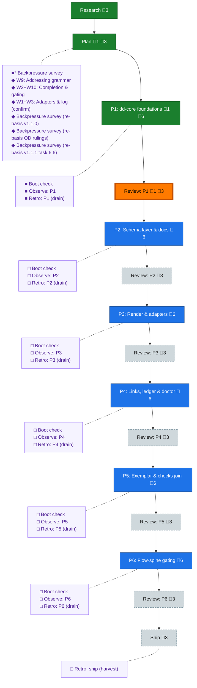

<!-- GENERATED by `harness flow render` — do not hand-edit; regenerate from the flow JSON. -->
# Flow · deterministic-documents

**Kind**: flight-plan · **Now**: review-1 · **Intent**: start new flow, get flow spine in please, then proceed to explore phase. then we go to workshops — Deterministic Documents (dd) per initial-brief.md · **Nodes**: 41 · **Events**: 66

**Rail**: ◆─◆─[ ◆─◆─◇─◇─◇─◇─◇─◇─◇─◇─◇─◇─◇ ]  ◆ Research · ◆ Plan · [ ◆ P1: dd-core foundations · ◆ Review: P1 · ◇ P2: Schema layer & docs · ◇ Review: P2 · ◇ P3: Render & adapters · ◇ Review: P3 · ◇ P4: Links, ledger & doctor · ◇ Review: P4 · ◇ P5: Exemplar & checks join · ◇ Review: P5 · ◇ P6: Flow-spine gating · ◇ Review: P6 · ◇ Ship ]

**Legend** — colour = type/status: 🟩 done · 🟢 in-progress · 🟥 blocked · 🟦 known · ⬜ assumed · 🔶 decision · 🗣 user input · 🟪 harness chore (faded = not yet done) · 🤖 companion · 🛠 worker · 🟧 current (you are here). Badges: 💬 comments · 📄 artifacts · 📝 instructions · 🧰 chore (° optional / recommended / ‼ strongly-recommended; ✓ done · ✕ skipped).

## Node log

### plan · Plan
- `2026-08-03T08:43:00.759Z` · user · decision — Phase-design directive (Jordan): multi-phase, designed for fan-out/fan-in — some phases run parallel via multiple /pij worker coders in this repo (koala PMs them + their reviewers), converge for a join phase, fan back out as the dependency graph allows. Plan must state per-phase parallelizability + file-surface fences explicitly.

### phase-1 · P1: dd-core foundations
- `2026-08-03T10:46:53.754Z` · agent · validation — phase complete: commits 93a985ee + 35ec1f57 (fix round), all T001-T010 met, slice 53/full suite green, arch baseline 2, freeze manifest dd-surface.md ratified+test-pinned; chores boot-1/observe-1/retro-1 all receipted

### review-1 · Review: P1
- `2026-08-03T10:46:54.597Z` · agent · validation — verdict:APPROVE (after 1 FIX round: 12 findings, 2 HIGH enforcement bypasses closed + re-proven by reviewer probes) mutations:10/10 caught reviewer:pij-modest-louse (claude-opus-5 medium) report:.harness/temp/pair-p1/review-p1.md time:2026-08-03T10:47Z

### backpressure · Backpressure survey
- `2026-08-03T09:18:31.764Z` · agent · validation — verdict:Partial counts:1RUN/13EXTEND/0BUILD/0ABSENT next-move:extensions-already-in-plan-tasks artifact:backpressure-coverage.md basis_sha256:d61b05502cee5d5eda79c9ff2f416b2723ea15e34b0da225c9ff58aac03bfc6d time:2026-08-03T17:20+10:00

### boot-1 · Boot check
- `2026-08-03T09:47:33.695Z` · agent · validation — verdict:HEALTHY boot:just-test 3189/3189 green ~24s interact:CLI envelopes ok observe:doctor 9/10 layers ok (known telemetry-hook gap, fenced) time:2026-08-03T18:55+10:00

### observe-1 · Observe: P1
- `2026-08-03T10:45:27.703Z` · agent · validation — decision:done reason:real capture present — DL-002 (fence-drafting missed enumeration tests; new-core-verb fences must include app/index/error-codes tests additively) record:.harness/temp/agent/session-buffer.md time:2026-08-03T10:44Z

### retro-1 · Retro: P1 (drain)
- `2026-08-03T10:46:38.533Z` · agent · validation — decision:done reason:real drain via /eng-harness-flow post-coding — 3 entries (DL-001 AC/coverage prose linkage-&gt;P5 exemplar; DL-002 fence missed enumeration tests; DL-003 coder GIT_CONFIG_COUNT collision) saved to .harness/records/retro/2026-08-03/001-065-dd-phase-1.md, buffer cleared time:2026-08-03T10:47Z

### workshop-w9-addressing · W9: Addressing grammar
- `2026-08-03T08:01:20.709Z` · user · decision — W9 locked in session: #-grammar, alternating name/id descent, minted per-kind ids, per-doc references ledger (live\|pinned), WARN posture, heading-only anchors, no rename machinery (D8 superseded), address tooling, checks OOTB. Record: workshops/001-w9-addressing.md

### workshop-w2-w10-gating · W2+W10: Completion & gating
- `2026-08-03T08:37:18.396Z` · user · decision — Locked: gate REFUSES with --force (defended override, agents never on own judgment); enum unchecked/checked/blocked/human-skipped/na, terminal=checked\|human-skipped\|na; W10 evidence-section design (per-task lists keyed by task id); multi-phase file split; bare-# same-doc + explicit id override addenda; builder-flow integration = LAST plan phase. Record: workshops/002-w2-w10-completion-and-gating.md

### workshop-w1-w3-confirm · W1+W3: Adapters & log (confirm)
- `2026-08-03T08:41:48.400Z` · user · decision — W1: (value,ctx)=&gt;string adapter in schema package /adapters, jiti-loaded, honest fallback, loud at build. W3: {lg- id, at, text, links[]}; append-only convention only (revises D3). Record: workshops/003-w1-w3-adapters-and-log.md. Workshop backlog CLOSED.

### backpressure-ff67c2cc6391 · Backpressure survey (re-basis v1.1.0)
- `2026-08-03T09:26:27.192Z` · agent · validation — verdict:Partial counts:1RUN/16EXTEND/0BUILD/0ABSENT re-selected against plan v1.1.0 post-Opus-validation (graph P1→P2→(P3∥P4)→P5→P6; +AC-13/14/15 rows) artifact:backpressure-coverage.md basis_sha256:ff67c2cc63914c3c5d329e070918c7960499533839f698423de5c7cef0aceb6c time:2026-08-03T17:55+10:00

### backpressure-f3d888a460f1 · Backpressure survey (re-basis OD rulings)
- `2026-08-03T09:42:37.663Z` · agent · validation — verdict:Partial unchanged (proof plan identical; OD-1/OD-2 rulings shift AC-01 CLI proof from P1 to P2, engine proof stays P1) artifact:backpressure-coverage.md basis_sha256:f3d888a460f157cad901780cb3b7a0c3684bc268e4038fc5439855b35d8e878f time:2026-08-03T18:40+10:00

### backpressure-e1318b51944a · Backpressure survey (re-basis v1.1.1 task 6.6)
- `2026-08-03T09:57:52.930Z` · agent · validation — decision:re-receipt reason:plan v1.1.1 adds 6.6 dog-food task; coverage rows added (deterministic e2e in just test + inference findings note) basis_sha256:e1318b51944ac6f51fd2a5ac49cbbd05b5d2f047cde07f5d925277b356f98c0a time:2026-08-03T09:58Z
