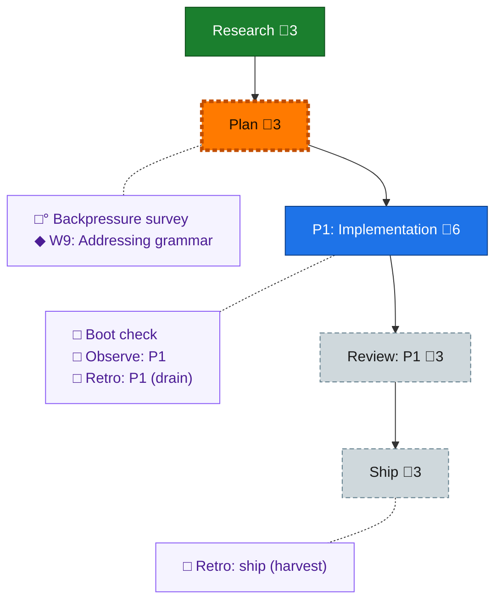

<!-- GENERATED by `harness flow render` — do not hand-edit; regenerate from the flow JSON. -->
# Flow · deterministic-documents

**Kind**: flight-plan · **Now**: plan · **Next**: plan · **Intent**: start new flow, get flow spine in please, then proceed to explore phase. then we go to workshops — Deterministic Documents (dd) per initial-brief.md · **Nodes**: 11 · **Events**: 6

**Rail**: ◆─◇─[ ◇─◇─◇ ]  ◆ Research · ◇ Plan · [ ◇ P1: Implementation · ◇ Review: P1 · ◇ Ship ]

**Legend** — colour = type/status: 🟩 done · 🟢 in-progress · 🟥 blocked · 🟦 known · ⬜ assumed · 🔶 decision · 🗣 user input · 🟪 harness chore (faded = not yet done) · 🤖 companion · 🛠 worker · 🟧 current (you are here). Badges: 💬 comments · 📄 artifacts · 📝 instructions · 🧰 chore (° optional / recommended / ‼ strongly-recommended; ✓ done · ✕ skipped).

## Node log

### workshop-w9-addressing · W9: Addressing grammar
- `2026-08-03T08:01:20.709Z` · user · decision — W9 locked in session: #-grammar, alternating name/id descent, minted per-kind ids, per-doc references ledger (live\|pinned), WARN posture, heading-only anchors, no rename machinery (D8 superseded), address tooling, checks OOTB. Record: workshops/001-w9-addressing.md
