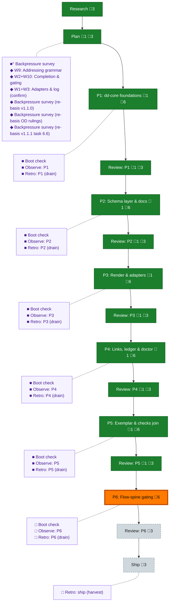

<!-- GENERATED by `harness flow render` — do not hand-edit; regenerate from the flow JSON. -->
# Flow · deterministic-documents

**Kind**: flight-plan · **Now**: phase-6 · **Intent**: start new flow, get flow spine in please, then proceed to explore phase. then we go to workshops — Deterministic Documents (dd) per initial-brief.md · **Nodes**: 41 · **Events**: 112

**Rail**: ◆─◆─[ ◆─◆─◆─◆─◆─◆─◆─◆─◆─◆─◇─◇─◇ ]  ◆ Research · ◆ Plan · [ ◆ P1: dd-core foundations · ◆ Review: P1 · ◆ P2: Schema layer & docs · ◆ Review: P2 · ◆ P3: Render & adapters · ◆ Review: P3 · ◆ P4: Links, ledger & doctor · ◆ Review: P4 · ◆ P5: Exemplar & checks join · ◆ Review: P5 · ◇ P6: Flow-spine gating · ◇ Review: P6 · ◇ Ship ]

**Legend** — colour = type/status: 🟩 done · 🟢 in-progress · 🟥 blocked · 🟦 known · ⬜ assumed · 🔶 decision · 🗣 user input · 🟪 harness chore (faded = not yet done) · 🤖 companion · 🛠 worker · 🟧 current (you are here). Badges: 💬 comments · 📄 artifacts · 📝 instructions · 🧰 chore (° optional / recommended / ‼ strongly-recommended; ✓ done · ✕ skipped).

## Node log

### plan · Plan
- `2026-08-03T08:43:00.759Z` · user · decision — Phase-design directive (Jordan): multi-phase, designed for fan-out/fan-in — some phases run parallel via multiple /pij worker coders in this repo (koala PMs them + their reviewers), converge for a join phase, fan back out as the dependency graph allows. Plan must state per-phase parallelizability + file-surface fences explicitly.

### phase-1 · P1: dd-core foundations
- `2026-08-03T10:46:53.754Z` · agent · validation — phase complete: commits 93a985ee + 35ec1f57 (fix round), all T001-T010 met, slice 53/full suite green, arch baseline 2, freeze manifest dd-surface.md ratified+test-pinned; chores boot-1/observe-1/retro-1 all receipted

### review-1 · Review: P1
- `2026-08-03T10:46:54.597Z` · agent · validation — verdict:APPROVE (after 1 FIX round: 12 findings, 2 HIGH enforcement bypasses closed + re-proven by reviewer probes) mutations:10/10 caught reviewer:pij-modest-louse (claude-opus-5 medium) report:.harness/temp/pair-p1/review-p1.md time:2026-08-03T10:47Z

### backpressure · Backpressure survey
- `2026-08-03T09:18:31.764Z` · agent · validation — verdict:Partial counts:1RUN/13EXTEND/0BUILD/0ABSENT next-move:extensions-already-in-plan-tasks artifact:backpressure-coverage.md basis_sha256:d61b05502cee5d5eda79c9ff2f416b2723ea15e34b0da225c9ff58aac03bfc6d time:2026-08-03T17:20+10:00

### boot-1 · Boot check
- `2026-08-03T09:47:33.695Z` · agent · validation — verdict:HEALTHY boot:just-test 3189/3189 green ~24s interact:CLI envelopes ok observe:doctor 9/10 layers ok (known telemetry-hook gap, fenced) time:2026-08-03T18:55+10:00

### observe-1 · Observe: P1
- `2026-08-03T10:45:27.703Z` · agent · validation — decision:done reason:real capture present — DL-002 (fence-drafting missed enumeration tests; new-core-verb fences must include app/index/error-codes tests additively) record:.harness/temp/agent/session-buffer.md time:2026-08-03T10:44Z

### retro-1 · Retro: P1 (drain)
- `2026-08-03T10:46:38.533Z` · agent · validation — decision:done reason:real drain via /eng-harness-flow post-coding — 3 entries (DL-001 AC/coverage prose linkage-&gt;P5 exemplar; DL-002 fence missed enumeration tests; DL-003 coder GIT_CONFIG_COUNT collision) saved to .harness/records/retro/2026-08-03/001-065-dd-phase-1.md, buffer cleared time:2026-08-03T10:47Z

### workshop-w9-addressing · W9: Addressing grammar
- `2026-08-03T08:01:20.709Z` · user · decision — W9 locked in session: #-grammar, alternating name/id descent, minted per-kind ids, per-doc references ledger (live\|pinned), WARN posture, heading-only anchors, no rename machinery (D8 superseded), address tooling, checks OOTB. Record: workshops/001-w9-addressing.md

### workshop-w2-w10-gating · W2+W10: Completion & gating
- `2026-08-03T08:37:18.396Z` · user · decision — Locked: gate REFUSES with --force (defended override, agents never on own judgment); enum unchecked/checked/blocked/human-skipped/na, terminal=checked\|human-skipped\|na; W10 evidence-section design (per-task lists keyed by task id); multi-phase file split; bare-# same-doc + explicit id override addenda; builder-flow integration = LAST plan phase. Record: workshops/002-w2-w10-completion-and-gating.md

### workshop-w1-w3-confirm · W1+W3: Adapters & log (confirm)
- `2026-08-03T08:41:48.400Z` · user · decision — W1: (value,ctx)=&gt;string adapter in schema package /adapters, jiti-loaded, honest fallback, loud at build. W3: {lg- id, at, text, links[]}; append-only convention only (revises D3). Record: workshops/003-w1-w3-adapters-and-log.md. Workshop backlog CLOSED.

### backpressure-ff67c2cc6391 · Backpressure survey (re-basis v1.1.0)
- `2026-08-03T09:26:27.192Z` · agent · validation — verdict:Partial counts:1RUN/16EXTEND/0BUILD/0ABSENT re-selected against plan v1.1.0 post-Opus-validation (graph P1→P2→(P3∥P4)→P5→P6; +AC-13/14/15 rows) artifact:backpressure-coverage.md basis_sha256:ff67c2cc63914c3c5d329e070918c7960499533839f698423de5c7cef0aceb6c time:2026-08-03T17:55+10:00

### phase-2 · P2: Schema layer & docs
- `2026-08-03T12:19:51.114Z` · agent · validation — T001-T009 all [x]. Commits 51997c73+c79ef8d7 (body), 9514a75d (fix1: F001 depth cap removed per D14 + beyond-cap fixture; cwd pin), 4312fd72 (fix2: F002 dd-owned NodeSchemaFs errno-split + symlink-loop tests + act-level wiring row). Proof: slice 53 green P3/P4-absent; dd+acts 153/153 from BOTH sanctioned cwds; sweep 388/388; arch 2=baseline; pkg.json exactly the two granted lines (prime-verified); check:dd-docs drift gate proven both ways

### review-2 · Review: P2
- `2026-08-03T12:19:51.727Z` · agent · validation — verdict:APPROVE (0 findings) by pij-respective-rhinoceros (gpt-5.6-terra xhigh) after 2 FIX rounds; mutations 5/5 caught (precedence inversion, shadow drop, stray-enum skip, error-swallow, NodeFs re-wire/phantom-E412). Both HIGHs real: F001 unruled MAX_SCAN_DEPTH=8 vs D14; F002 error-to-[] adapter defeating loud-failure trade, proven by live symlink-loop probe. Report: .harness/temp/pair-p2/review-p2.md

### boot-2 · Boot check
- `2026-08-03T10:50:26.021Z` · agent · validation — verdict:HEALTHY boot:just-test full suite green 10:46Z (3250+ tests incl. dd 53) doctor:degraded 8/10 (known non-blocking: sensor-watcher heartbeat off, telemetry post-commit hook uninstalled in worktree — both standing gaps, fenced) time:2026-08-03T10:48Z

### observe-2 · Observe: P2
- `2026-08-03T12:19:38.080Z` · agent · validation — decision:satisfied 11 real captures this phase (PM+coder shared buffer), pointers: .harness/temp/agent/session-buffer.md drained 2026-08-03T12:19:22Z (cleared:11); exemplar capture DL-010/fp:77f4275a5c2e (contract-vs-implementation, review F002)

### retro-2 · Retro: P2 (drain)
- `2026-08-03T12:19:38.654Z` · agent · validation — decision:drained time:2026-08-03T12:19:22Z record:.harness/records/retro/2026-08-03/002-065-dd-phase-2.md entries:8 (consolidated from 11) dispositions: 4 fixed-now/encoded, 2 plan (P5: proof-ceiling + valuesShape A3), 2 kept; buffer cleared (11)

### phase-3 · P3: Render & adapters
- `2026-08-03T15:07:31.929Z` · agent · validation — T001-T007 all [x]. Coder pij-artificial-guan (opus5 xhigh). Commits d865563c, 44dc52db, 324df512 (depcruise window), 958f08f4 (dd.test.ts window), 3f84f7fb, 1784a041 + fix 24da7883. Proof: slice 46 green P4-absent-by-reachability; 299 dd tests; both cwds; arch 2 unmoved (before/after recorded per prime rider); goldens caught 4 real renderer bugs pre-review; AC-03 hand-edit path + AC-04 five adapter classes live-proven

### review-3 · Review: P3
- `2026-08-03T15:07:32.525Z` · agent · validation — verdict:PASS (after 1 FIX round — 2 findings, honesty-class: execution-log universal provenance claim vs history + 4 unrecorded golden adjudications; fixed with per-file truth table, RECONSTRUCTED labels, declared unrecoverable, coder self-corrected D4) mutations:3/3 reviewer:pij-neutral-python (gpt-5.6-terra xhigh) report:.harness/temp/pair-p3/review-p3.md

### boot-3 · Boot check
- `2026-08-03T12:22:52.587Z` · agent · validation — verdict:HEALTHY boot:just test full suite green exit 0 (incl. dd 153 + granted docs.test.ts timeout — the P2-era flake path now passes under load) time:2026-08-03T12:28Z; doctor gaps unchanged from boot-2 (sensor-watcher heartbeat, telemetry post-commit hook in worktree — standing, fenced)

### observe-3 · Observe: P3
- `2026-08-03T15:07:18.550Z` · agent · validation — decision:satisfied real captures from both P3 pair seats (guan: CONF-001 per-row fixture roots, DL-002 add -N gap, 4 golden-caught defects D1-D4; PM: spawn-limbo/canary/citation) drained 2026-08-03T15:08Z; buffer race noted (DL-005) — 3 PM entries re-captured before drain

### retro-3 · Retro: P3 (drain)
- `2026-08-03T15:07:19.167Z` · agent · validation — decision:drained time:2026-08-03T15:08Z record:.harness/records/retro/2026-08-03/003-065-dd-phases-3-4.md (combined P3\|\|P4 drain — shared buffer, shared process lessons) entries:10

### phase-4 · P4: Links, ledger & doctor
- `2026-08-03T15:07:58.960Z` · agent · validation — T001-T008 all [x]. Coder pij-interested-albatross (opus5 xhigh, revived mid-fix after a CLI wedge — copilot --resume, zero context loss). Commits c20f643e, 48a45c08 (dd.test.ts window), 6b383f9b (depcruise window), 7f7ec42f + fix bbee25c1. Proof: slice 98 green P3-absent; 303 dd suites; both cwds; arch 2 before/after x2 (prime-verified vs main); four RESERVED rows exercised against manifest dd5e0c3f; live transcripts: address round-trip, fresh-&gt;stale-&gt;--update-&gt;fresh, doctor cyclic 4.4s + OD-1 sweep/direct pairing

### review-4 · Review: P4
- `2026-08-03T15:07:59.532Z` · agent · validation — verdict:APPROVE (after 1 FIX round — 2 HIGH, both real: tripwire denominated on loaded-not-scheduled paths =&gt; false E439; --path root-set scoping leaked into interior+adapter-gap passes =&gt; radius-inf violated) mutations:3/3 + coder self-reversion 2+2 reviewer:pij-clever-tyrannosaurus (gpt-5.6-terra xhigh) report:.harness/temp/pair-p4/review-p4.md

### boot-4 · Boot check
- `2026-08-03T15:07:44.002Z` · agent · validation — verdict:HEALTHY boot:just test 3532/3532 green exit 0 at P3+P4 fan-in tree (post-fix, incl. previously-flaky docs stream + git integration suites) time:2026-08-03T15:06Z; doctor gaps unchanged (standing, fenced)

### observe-4 · Observe: P4
- `2026-08-03T15:07:44.595Z` · agent · validation — decision:satisfied real captures from both P4 pair seats (albatross: DL-003 add -N, DL-004 coverage collision, DL-005 just-test env, WIN-001 shape-directed classification; PM: buffer race, revive win) drained 2026-08-03T15:08Z into the combined record

### retro-4 · Retro: P4 (drain)
- `2026-08-03T15:07:45.200Z` · agent · validation — decision:drained time:2026-08-03T15:08Z record:.harness/records/retro/2026-08-03/003-065-dd-phases-3-4.md (combined P3\|\|P4 drain) entries:10 dispositions: 2 fixed-now/encoded, 2 plan (P5), 6 kept; buffer cleared (10)

### phase-5 · P5: Exemplar & checks join
- `2026-08-03T16:57:27.648Z` · agent · validation — T001-T006 all [x]. Coder pij-easy-octopus (opus5 xhigh). Five commits ending 722a90f1 + fix e7a17746 (60+8 files). OD-8 ratified + 2 dog-food companions (parser drop, resolver map-step: 9 ERRORs-&gt;0); plan act live on Jordan-cited authority; checks gate TESTED (planted-bad control); amendment-5 grants used with true grounds; exemplar validates/renders/doctors clean; ONE human row open by design (bp-0902 taste call). Proof: 3591/3591, checks degraded/0, warn trio 2/199/6 unmoved, both-cwds 56

### review-5 · Review: P5
- `2026-08-03T16:57:28.221Z` · agent · validation — verdict:APPROVE (after 1 FIX round — 5 findings, 3 contract-vs-cited-ruling drift incl. valuesShape precedence + E436 over-move + wrong E-code in evidence record; all fixed with value-pinning assertions, 19 class-&gt;code pairs pinned) mutations:4/4+2/2 reviewer:pij-classical-yime (gpt-5.6-terra xhigh) report:.harness/temp/pair-p5/review-p5.md

### boot-5 · Boot check
- `2026-08-03T16:57:14.505Z` · agent · validation — verdict:HEALTHY boot:just test 3591/3591 green exit 0 at P5 final tree (e7a17746) — FIRST fully-green full suite of the plan (GIT_CONFIG defect fixed at source); harness checks degraded/exit 0, all hard gates ok, warn trio at standing 2/199/6 time:2026-08-03T16:57Z

### observe-5 · Observe: P5
- `2026-08-03T16:57:15.093Z` · agent · validation — decision:satisfied 5 real captures (coder: GIT_CONFIG source-fix, scratch-gate class, ruled-values drift, dog-food win, renderer column-order magic-wand) drained 2026-08-03T16:58Z

### retro-5 · Retro: P5 (drain)
- `2026-08-03T16:57:15.661Z` · agent · validation — decision:drained time:2026-08-03T16:58Z record:.harness/records/retro/2026-08-03/004-065-dd-phase-5.md entries:5 dispositions: 2 fixed-now/encoded, 1 plan (ruled-values-need-pinning -&gt; P6), 1 kept, 1 deferred; buffer cleared (5)

### backpressure-f3d888a460f1 · Backpressure survey (re-basis OD rulings)
- `2026-08-03T09:42:37.663Z` · agent · validation — verdict:Partial unchanged (proof plan identical; OD-1/OD-2 rulings shift AC-01 CLI proof from P1 to P2, engine proof stays P1) artifact:backpressure-coverage.md basis_sha256:f3d888a460f157cad901780cb3b7a0c3684bc268e4038fc5439855b35d8e878f time:2026-08-03T18:40+10:00

### backpressure-e1318b51944a · Backpressure survey (re-basis v1.1.1 task 6.6)
- `2026-08-03T09:57:52.930Z` · agent · validation — decision:re-receipt reason:plan v1.1.1 adds 6.6 dog-food task; coverage rows added (deterministic e2e in just test + inference findings note) basis_sha256:e1318b51944ac6f51fd2a5ac49cbbd05b5d2f047cde07f5d925277b356f98c0a time:2026-08-03T09:58Z
