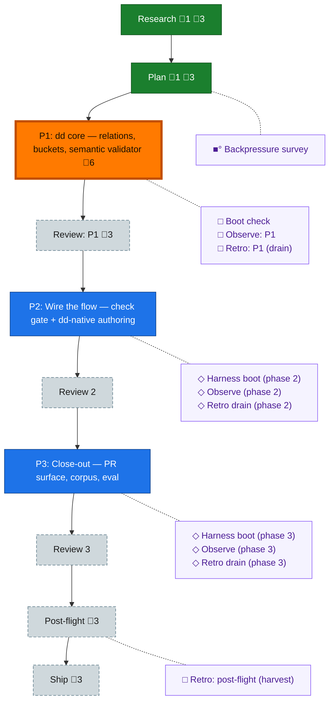

<!-- GENERATED by `harness flow render` — do not hand-edit; regenerate from the flow JSON. -->
# Flow · dd-native-builder

**Kind**: flight-plan · **Now**: phase-1 · **Next**: review-1 · **Intent**: Make the builder pipeline dd-native: plans and task files as .dd.json, flow gates driven by document state, typed rels, semantic validate with strict-zero --complete, PR evidence surface — the flow that delivers this plan is the feature itself · **Nodes**: 21 · **Events**: 29

**Rail**: ◆─◆─[ ◐─◇─◇─◇─◇─◇─◇ ]─◇  ◆ Research · ◆ Plan · [ ◐ P1: dd core — relations, buckets, semantic validator · ◇ Review: P1 · ◇ P2: Wire the flow — check gate + dd-native authoring · ◇ Review 2 · ◇ P3: Close-out — PR surface, corpus, eval · ◇ Review 3 · ◇ Ship ] · ◇ Post-flight

**Legend** — colour = type/status: 🟩 done · 🟢 in-progress · 🟥 blocked · 🟦 known · ⬜ assumed · 🔶 decision · 🗣 user input · 🟪 harness chore (faded = not yet done) · 🤖 companion · 🛠 worker · 🟧 current (you are here). Badges: 💬 comments · 📄 artifacts · 📝 instructions · 🧰 chore (° optional / recommended / ‼ strongly-recommended; ✓ done · ✕ skipped).

## Node log

### research · Research
- `2026-08-04T08:19:02.981Z` · agent · validation — decision:done evidence: builder-tuning notes.md + structural-proof-graph.md (065) + assets/research-flow-eval-history.md — research artifacts exist and are cited by the plan; time:2026-08-04T08:18Z

### plan · Plan
- `2026-08-04T08:19:03.768Z` · agent · validation — decision:done evidence: plan.dd.json (dd-native, 18 ACs/35 tasks/3 phases, validates 0/0, Opus validation folded, zero open questions) at 987e9e76; time:2026-08-04T08:18Z

### backpressure · Backpressure survey
- `2026-08-04T08:42:11.719Z` · agent · validation — decision:done verdict:Partial counts:1-RUN/11-EXTEND/5-BUILD/1-ABSENT basis_sha256:b4814527f6326e385c902742039c830b4c112a3ef46d53bd4e4599b7f42aeb3f artifacts: backpressure.dd.json (18 rows bp-70xx, 7 sensors, validates 0/0) + assets/backpressure-coverage.md signpost; BUILD gaps are already plan tasks (tk-7046/7047/7065/7067/7068/7069) — no separate Phase 0; time:2026-08-04T08:31Z
