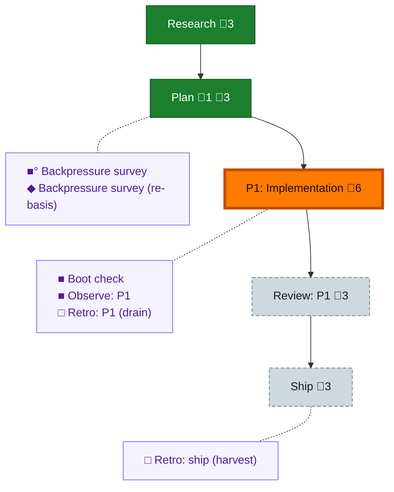

<!-- GENERATED by `harness flow render` — do not hand-edit; regenerate from the flow JSON. -->
# Flow · plan-ready-gate

**Kind**: flight-plan · **Now**: phase-1 · **Next**: review-1 · **Intent**: One command an agent runs at plan setup and at gates that says whether the plan is ready to start work — acceptance criteria claimed by tasks, backpressure done or explicitly declined — and refuses to say ready when there is nothing to check · **Nodes**: 11 · **Events**: 17

**Rail**: ◆─◆─[ ◇─◇─◇ ]  ◆ Research · ◆ Plan · [ ◇ P1: Implementation · ◇ Review: P1 · ◇ Ship ]

**Legend** — colour = type/status: 🟩 done · 🟢 in-progress · 🟥 blocked · 🟦 known · ⬜ assumed · 🔶 decision · 🗣 user input · 🟪 harness chore (faded = not yet done) · 🤖 companion · 🛠 worker · 🟧 current (you are here). Badges: 💬 comments · 📄 artifacts · 📝 instructions · 🧰 chore (° optional / recommended / ‼ strongly-recommended; ✓ done · ✕ skipped).

## Node log

### plan · Plan
- `2026-08-05T08:32:33.409Z` · agent · validation — validate-v2 (gpt-5.6-sol, high): NEEDS ATTENTION — 4 HIGH + 1 MEDIUM, all applied. F1 stale-basis (AC-10), F2 flow-chores surface cannot carry receipts (verified: ChoreRow flow-mutations.ts:425-438 has no comments; T004 now composes readFlowDoc), F3 vacuity fixture could not isolate vacuity (T004 moved before T005; fixture is now ready-except-vacuity), F4 --strict unimplementable as degraded+non-zero (verified: exit.ts:4-13 maps by status; now error/1), F5 threshold selected AND declared open (now decided: AC-11 = &gt;=1 claim row). Pressure exclusion verified clean. New basis: bdde837201b08fe8adcadcf56760a36fa622ea717f24b71ae65de2e375b8c71b

### backpressure · Backpressure survey
- `2026-08-05T08:25:38.868Z` · agent · validation — decision:completed verdict:Partial counts:1 RUN/9 EXTEND/0 BUILD/1 ABSENT artifact:docs/plans/072-plan-ready-gate/backpressure-coverage.md basis_sha256:3fad7869fc9b2340fc4926004aaebe69024e1cf44a0ec1a30bdcf265a322c275 time:2026-08-05T08:10:00Z

### boot-1 · Boot check
- `2026-08-05T08:27:13.448Z` · agent · validation — decision:completed verdict:HEALTHY(qualified) detail:real /eng-harness-flow --hook pre-flight invocation this session; doctor exit 0 but status=degraded (sensor-watcher: 14 sensors registered, watch scanner not running) so the governance doc's own 'ok = healthy' criterion is NOT met; all 3 stages passed. HONESTY NOTE: this is the SESSION-ENTRY firing reused for the phase-1 boundary, not a separate re-fire minutes later — labelled rather than laundered. time:2026-08-05T08:27:30Z

### observe-1 · Observe: P1
- `2026-08-05T11:13:19.841Z` · agent · validation — decision:completed 5 real captures this phase: DL-002 plan-ordinal returns an archived (colliding) ordinal; DL-003 watchdog stale-threshold mis-tuned for long-turn coders; DL-004 alert fires while systemState reads working; DL-005 compact-self reported fired then wedged the peer permanently; DL-006 pij spawn hangs pre-bind on an unresponsive MCP server, invisible to the watchdog. buffer:.harness/temp/agent/session-buffer.md time:2026-08-05T10:40:00Z

### backpressure-752982794591 · Backpressure survey (re-basis)
- `2026-08-05T08:26:56.302Z` · agent · validation — decision:completed verdict:Partial artifact:docs/plans/072-plan-ready-gate/backpressure-coverage.md basis_sha256:752982794591c4c930999187cca20b5ec007dc42912cd7c4c3580acd7e0612ef note:re-basis caused BY the survey itself (AC-09/T010 folded in from its own Recommended Phase 0); the new row is already in the surveyed coverage matrix, so the selection is unchanged time:2026-08-05T08:27:00Z
