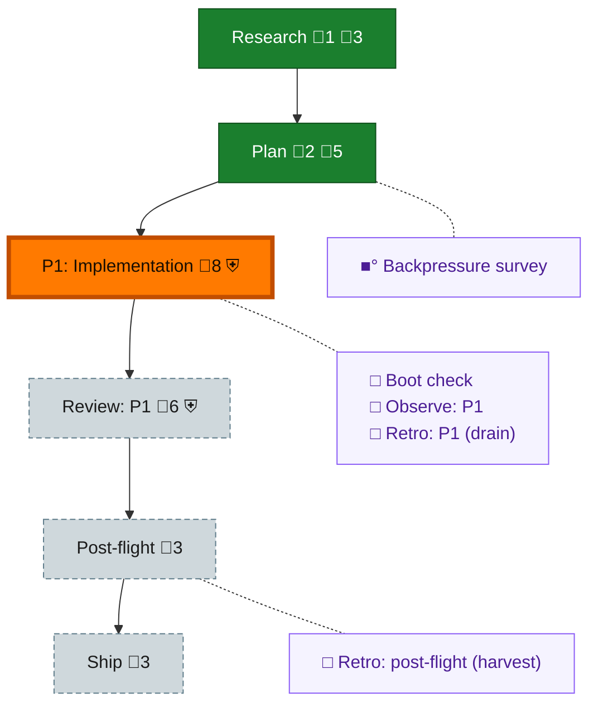

<!-- GENERATED by `harness flow render` — do not hand-edit; regenerate from the flow JSON. -->
# Flow · gitai-collector-v1

**Kind**: flight-plan · **Now**: phase-1 · **Intent**: Git AI becomes the collector. v1: disable harness telemetry capture by default (not remove), harness doctor detects/installs a pinned+SHA-verified git-ai via our own cross-platform download, installs agent hooks, and re-checks later. No semantic/flow work. Fleet lineage dark until v2. · **Nodes**: 11 · **Events**: 9

**Rail**: ◆─◆─[ ◇─◇─◇ ]─◇  ◆ Research · ◆ Plan · [ ◇ P1: Implementation · ◇ Review: P1 · ◇ Ship ] · ◇ Post-flight

**Legend** — colour = type/status: 🟩 done · 🟢 in-progress · 🟥 blocked · 🟦 known · ⬜ assumed · 🔶 decision · 🗣 user input · 🟪 harness chore (faded = not yet done) · 🤖 companion · 🛠 worker · 🟧 current (you are here). Badges: 💬 comments · 📄 artifacts · 📝 instructions · 🧰 chore (° optional / recommended / ‼ strongly-recommended; ✓ done · ✕ skipped) · ⛨ dd gate (terminal/total from the last evaluation; ✓ = open). ⛨✓/⛨✕ = a plan-validate check gate (green / not green).

## Node log

### research · Research
- 📄 artifacts: assets/research-dossier.md

### plan · Plan
- 📄 artifacts: plan.dd.json, assets/backpressure.dd.json

### backpressure · Backpressure survey
- `2026-08-06T08:27:34.801Z` · agent · validation — decision:completed verdict:Partial basis_sha256:a4f8b08f3acbf017c64a52689e63583002cd6db57562dad8816dcaf5a393c6df time:2026-08-06T08:20Z artifact:assets/backpressure.dd.json counts:19-RUN-2-EXTEND-1-BUILD-2-ABSENT
