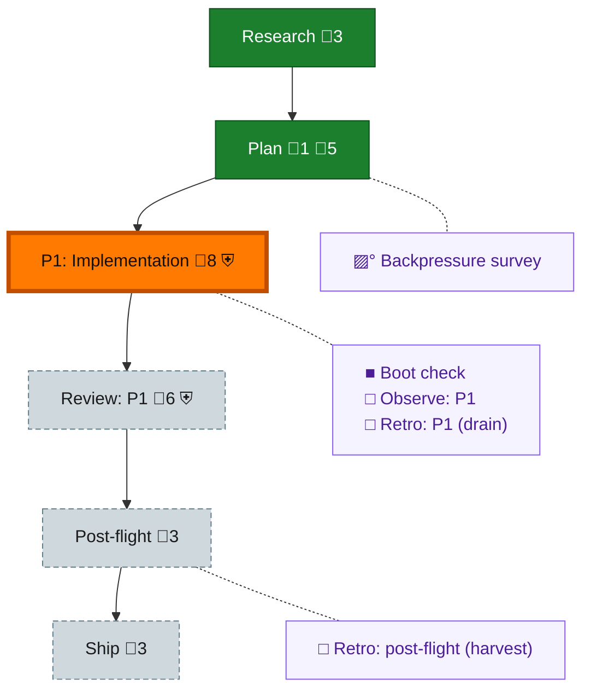

<!-- GENERATED by `harness flow render` — do not hand-edit; regenerate from the flow JSON. -->
# Flow · sandbox-attribution

**Kind**: flight-plan · **Now**: phase-1 · **Intent**: Sandbox attribution: harness commit + doctor ingress probe + at-risk list + telemetry-nudge (dd-native, ships in PR #104) · **Nodes**: 11 · **Events**: 13

**Rail**: ◆─◆─[ ◐─◇─◇ ]─◇  ◆ Research · ◆ Plan · [ ◐ P1: Implementation · ◇ Review: P1 · ◇ Ship ] · ◇ Post-flight

**Legend** — colour = type/status: 🟩 done · 🟢 in-progress · 🟥 blocked · 🟦 known · ⬜ assumed · 🔶 decision · 🗣 user input · 🟪 harness chore (faded = not yet done) · 🤖 companion · 🛠 worker · 🟧 current (you are here). Badges: 💬 comments · 📄 artifacts · 📝 instructions · 🧰 chore (° optional / recommended / ‼ strongly-recommended; ✓ done · ✕ skipped) · ⛨ dd gate (terminal/total from the last evaluation; ✓ = open). ⛨✓/⛨✕ = a plan-validate check gate (green / not green).

## Node log

### plan · Plan
- `2026-08-07T01:45:53.520Z` · agent · validation — Independent adversarial validation by pij-yucky-cattle (copilot gpt-5.6-sol high): 3 rounds, REJECT/REJECT/APPROVE, 14 findings all applied via dd verbs. plan validate 0/0/0/0 after each round. Report: .flow-pair/runs/2026-08-07-plan074/validate-report.md

### backpressure · Backpressure survey
- `2026-08-07T01:33:55.950Z` · user · decision — okay do the plan, validate with /pij once off peer gpt 5.6 sol high, then straight to coding loop please. remember to tell coder and reviewer to use /buidler. coder is copilot harness, opus 5 high coder, terra high revier, iterate until done. i exepct to come back to PR green.

### boot-1 · Boot check
- `2026-08-07T01:45:52.913Z` · agent · validation — decision:done verdict:healthy basis:real 'harness boot' run at flow entry 2026-08-07T01:09:46.877Z (bootMs=52853, checks degraded at recorded warn-launch baseline 2/196/6). Router loaded in-context; routed action executed for real.
