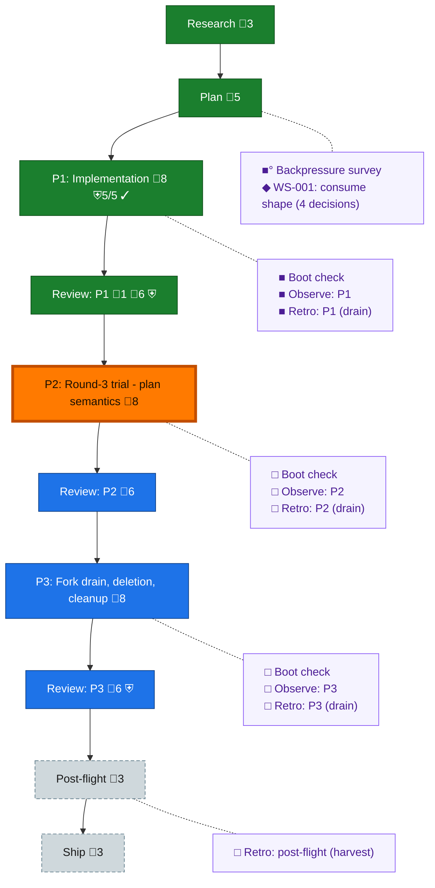

<!-- GENERATED by `harness flow render` — do not hand-edit; regenerate from the flow JSON. -->
# Flow · 080-dd-consume-upgrade

**Kind**: flight-plan · **Now**: phase-2 · **Next**: review-2 · **Intent**: Upgrade harness to consume standalone @ai-substrate/dd (git-sha route) in place of the in-repo dd implementation; round-3 primitive-sufficiency trial decides OQ-2 · **Nodes**: 22 · **Events**: 41

**Rail**: ◆─◆─[ ◆─◆─◐─◇─◇─◇─◇ ]─◇  ◆ Research · ◆ Plan · [ ◆ P1: Implementation · ◆ Review: P1 · ◐ P2: Round-3 trial - plan semantics · ◇ Review: P2 · ◇ P3: Fork drain, deletion, cleanup · ◇ Review: P3 · ◇ Ship ] · ◇ Post-flight

**Legend** — colour = type/status: 🟩 done · 🟢 in-progress · 🟥 blocked · 🟦 known · ⬜ assumed · 🔶 decision · 🗣 user input · 🟪 harness chore (faded = not yet done) · 🤖 companion · 🛠 worker · 🟧 current (you are here). Badges: 💬 comments · 📄 artifacts · 📝 instructions · 🧰 chore (° optional / recommended / ‼ strongly-recommended; ✓ done · ✕ skipped) · ⛨ dd gate (terminal/total from the last evaluation; ✓ = open). ⛨✓/⛨✕ = a plan-validate check gate (green / not green).

## Node log

### review-1 · Review: P1
- `2026-08-09T03:13:15.690Z` · agent · decision — plan-validate gate DISARMED here and ARMED on review-3 per flight-plan-ops 3c (expander moves the whole-plan check to the LAST review; --complete cannot be green mid-plan on a 3-phase flight). Not an override: the doctrine-prescribed relocation, recorded.

### backpressure · Backpressure survey
- `2026-08-09T02:10:41.917Z` · agent · validation — decision:route verdict:survey-complete certainty:Partial modes:7RUN/3EXTEND/1BUILD/3ABSENT artifacts:assets/backpressure-coverage.md+assets/backpressure.dd.json(rows bp-0001..bp-000e; plan meta.backpressure linked) basis_sha256:b37369d36f1646a9b06dd45054d5fcaa358d4e2a19c8cab6795850386c8d6834 time:2026-08-09T02:12Z

### boot-1 · Boot check
- `2026-08-09T02:37:45.348Z` · agent · validation — decision:route verdict:degraded(exit0) - harness boot composed checks: all hard gates green (vitest+coverage, biome, typecheck, docs/flows/telemetry drift, skills-check); degraded only on pre-existing warn-launch findings (markdown-lint authored docs, windows-check 6 hazards in existing extensions - none in the 080 touch set). Baseline sound for phase-1 coding. time:2026-08-09T02:45Z

### observe-1 · Observe: P1
- `2026-08-09T03:11:11.576Z` · agent · validation — decision:route verdict:satisfied-by-real-captures - DL-001 (E450 section-create gap), DL-002 (no scaffold verb for non-plan builder docs), DL-003 (satisfies binary vs multi-phase ACs, coder capture); buffer .harness/temp/agent/session-buffer.md; ledger rows 1/2/4 carry the durable form. time:2026-08-09T03:20Z

### retro-1 · Retro: P1 (drain)
- `2026-08-09T03:12:19.920Z` · agent · validation — decision:route verdict:drained - 3 entries -&gt; .harness/records/retro/2026-08-09/001-080-phase-1.md (dispositions: DL-001 plan, DL-002 kept, DL-003 fixed-now/encoded via satisfies-toward); buffer cleared. time:2026-08-09T03:30Z
