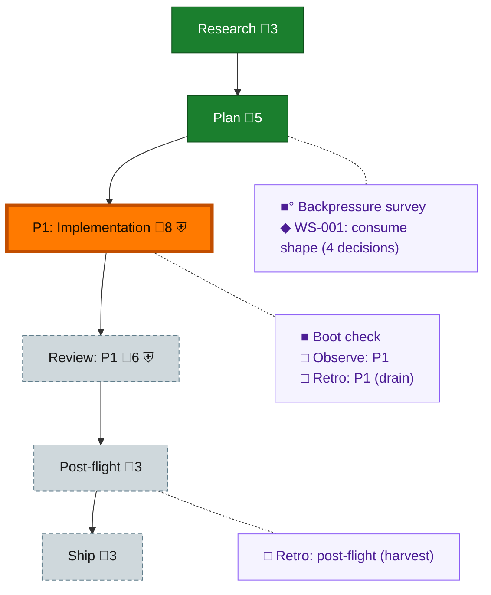

<!-- GENERATED by `harness flow render` — do not hand-edit; regenerate from the flow JSON. -->
# Flow · 080-dd-consume-upgrade

**Kind**: flight-plan · **Now**: phase-1 · **Next**: review-1 · **Intent**: Upgrade harness to consume standalone @ai-substrate/dd (git-sha route) in place of the in-repo dd implementation; round-3 primitive-sufficiency trial decides OQ-2 · **Nodes**: 12 · **Events**: 16

**Rail**: ◆─◆─[ ◐─◇─◇ ]─◇  ◆ Research · ◆ Plan · [ ◐ P1: Implementation · ◇ Review: P1 · ◇ Ship ] · ◇ Post-flight

**Legend** — colour = type/status: 🟩 done · 🟢 in-progress · 🟥 blocked · 🟦 known · ⬜ assumed · 🔶 decision · 🗣 user input · 🟪 harness chore (faded = not yet done) · 🤖 companion · 🛠 worker · 🟧 current (you are here). Badges: 💬 comments · 📄 artifacts · 📝 instructions · 🧰 chore (° optional / recommended / ‼ strongly-recommended; ✓ done · ✕ skipped) · ⛨ dd gate (terminal/total from the last evaluation; ✓ = open). ⛨✓/⛨✕ = a plan-validate check gate (green / not green).

## Node log

### backpressure · Backpressure survey
- `2026-08-09T02:10:41.917Z` · agent · validation — decision:route verdict:survey-complete certainty:Partial modes:7RUN/3EXTEND/1BUILD/3ABSENT artifacts:assets/backpressure-coverage.md+assets/backpressure.dd.json(rows bp-0001..bp-000e; plan meta.backpressure linked) basis_sha256:b37369d36f1646a9b06dd45054d5fcaa358d4e2a19c8cab6795850386c8d6834 time:2026-08-09T02:12Z

### boot-1 · Boot check
- `2026-08-09T02:37:45.348Z` · agent · validation — decision:route verdict:degraded(exit0) - harness boot composed checks: all hard gates green (vitest+coverage, biome, typecheck, docs/flows/telemetry drift, skills-check); degraded only on pre-existing warn-launch findings (markdown-lint authored docs, windows-check 6 hazards in existing extensions - none in the 080 touch set). Baseline sound for phase-1 coding. time:2026-08-09T02:45Z
