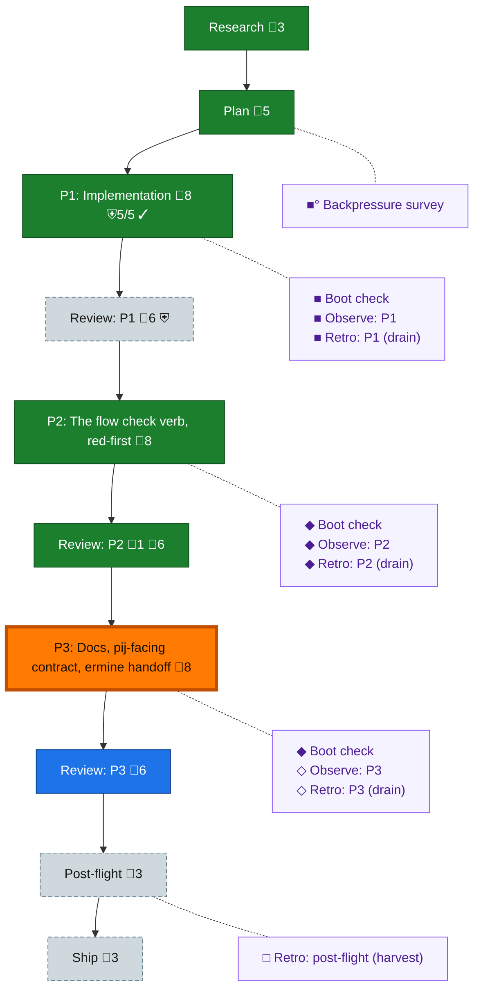

<!-- GENERATED by `harness flow render` — do not hand-edit; regenerate from the flow JSON. -->
# Flow · flow-reachability

**Kind**: flight-plan · **Now**: phase-3 · **Intent**: P3: docs via coder, contract+handoff via PM; P1 retro-review + verb-seam window pending · **Nodes**: 21 · **Events**: 37

**Rail**: ◆─◆─[ ◆─◇─◆─◆─◇─◇─◇ ]─◇  ◆ Research · ◆ Plan · [ ◆ P1: Implementation · ◇ Review: P1 · ◆ P2: The flow check verb, red-first · ◆ Review: P2 · ◇ P3: Docs, pij-facing contract, ermine handoff · ◇ Review: P3 · ◇ Ship ] · ◇ Post-flight

**Legend** — colour = type/status: 🟩 done · 🟢 in-progress · 🟥 blocked · 🟦 known · ⬜ assumed · 🔶 decision · 🗣 user input · 🟪 harness chore (faded = not yet done) · 🤖 companion · 🛠 worker · 🟧 current (you are here). Badges: 💬 comments · 📄 artifacts · 📝 instructions · 🧰 chore (° optional / recommended / ‼ strongly-recommended; ✓ done · ✕ skipped) · ⛨ dd gate (terminal/total from the last evaluation; ✓ = open). ⛨✓/⛨✕ = a plan-validate check gate (green / not green).

## Node log

### backpressure · Backpressure survey
- `2026-08-09T02:38:01.569Z` · agent · validation — decision:done verdict:Partial counts:1RUN/1EXTEND/5BUILD/1ABSENT artifact:assets/backpressure-coverage.md dd:assets/backpressure.dd.json (8 rows, all ACs pressure-linked) time:2026-08-09T02:45Z basis_sha256:4df59d8e761cc40d772c8f58f361ca3998b7843ced8fcd56de680b24f1e6cc0a

### boot-1 · Boot check
- `2026-08-09T02:53:39.801Z` · agent · validation — decision:done verdict:HEALTHY boot:just-test-green-19s interact:doctor-envelope-ok(degraded advisory layers: sensor-watcher no heartbeat, capture-liveness undetermined) observe:checks-gate-present time:2026-08-09T02:58Z

### observe-1 · Observe: P1
- `2026-08-09T03:34:23.130Z` · agent · validation — decision:done captures:3 (DL-001 pair-engine-missing, DL-002 exemplar-skipped-workteam/F4, DL-003 drift-test-race) record:.harness/records/retro/ time:2026-08-09T03:45Z

### retro-1 · Retro: P1 (drain)
- `2026-08-09T03:34:23.796Z` · agent · validation — decision:done drain-complete 3 entries kept, record written via harness record retro, buffer cleared time:2026-08-09T03:45Z

### review-2 · Review: P2
- `2026-08-09T03:36:04.422Z` · agent · validation — decision:done pair review by pij-spectacular-pony (gpt-5.6-sol, cross-model): round 1 FIX_REQUIRED (1 HIGH confirmed + PM-side blocker), fix red-first, round 2 APPROVE incl. Dim-0 mutation evidence. Artifacts: assets/reviews/p2-review-1-fix-required.md, p2-review-2-approve.md. PM sanity pass done. time:2026-08-09T03:37Z

### boot-2 · Boot check
- `2026-08-09T03:36:02.227Z` · agent · validation — decision:done verdict:HEALTHY — the real pre-flight router invocation at 02:58Z (boot just-test 19s green, doctor envelope ok) covered the whole P1+P2 coding stretch; spine nodes for P2 arrived at reconcile AFTER the work, so the attempt anchors here by evidence pointer (boot-1 receipt), not a re-run. time:2026-08-09T03:36Z

### observe-2 · Observe: P2
- `2026-08-09T03:36:02.882Z` · agent · validation — decision:done captures during the P2 stretch: DL-001 (pair engine missing), DL-002 (exemplar skipped workteam), DL-003 (drift-test race) — record .harness/records/retro/2026-08-09/001-081-flow-reachability.md time:2026-08-09T03:36Z

### retro-2 · Retro: P2 (drain)
- `2026-08-09T03:36:03.497Z` · agent · validation — decision:done drain at 03:45Z covered the P1+P2 stretch (3 entries kept, buffer cleared) — see retro-1 receipt + committed record. time:2026-08-09T03:36Z

### boot-3 · Boot check
- `2026-08-09T03:37:02.701Z` · agent · validation — decision:done verdict:HEALTHY boot:just-test-green-21s interact:doctor-degraded-advisory-only observe:checks-gate-present time:2026-08-09T03:40Z (real pre-flight router invocation at P3 entry)
