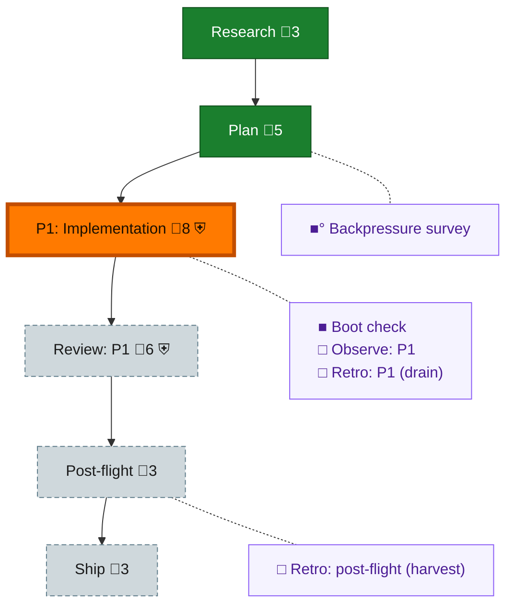

<!-- GENERATED by `harness flow render` — do not hand-edit; regenerate from the flow JSON. -->
# Flow · flow-reachability

**Kind**: flight-plan · **Now**: phase-1 · **Intent**: Phase 1: bundle flight-plan + red fixtures; boot chore next · **Nodes**: 11 · **Events**: 9

**Rail**: ◆─◆─[ ◇─◇─◇ ]─◇  ◆ Research · ◆ Plan · [ ◇ P1: Implementation · ◇ Review: P1 · ◇ Ship ] · ◇ Post-flight

**Legend** — colour = type/status: 🟩 done · 🟢 in-progress · 🟥 blocked · 🟦 known · ⬜ assumed · 🔶 decision · 🗣 user input · 🟪 harness chore (faded = not yet done) · 🤖 companion · 🛠 worker · 🟧 current (you are here). Badges: 💬 comments · 📄 artifacts · 📝 instructions · 🧰 chore (° optional / recommended / ‼ strongly-recommended; ✓ done · ✕ skipped) · ⛨ dd gate (terminal/total from the last evaluation; ✓ = open). ⛨✓/⛨✕ = a plan-validate check gate (green / not green).

## Node log

### backpressure · Backpressure survey
- `2026-08-09T02:38:01.569Z` · agent · validation — decision:done verdict:Partial counts:1RUN/1EXTEND/5BUILD/1ABSENT artifact:assets/backpressure-coverage.md dd:assets/backpressure.dd.json (8 rows, all ACs pressure-linked) time:2026-08-09T02:45Z basis_sha256:4df59d8e761cc40d772c8f58f361ca3998b7843ced8fcd56de680b24f1e6cc0a

### boot-1 · Boot check
- `2026-08-09T02:53:39.801Z` · agent · validation — decision:done verdict:HEALTHY boot:just-test-green-19s interact:doctor-envelope-ok(degraded advisory layers: sensor-watcher no heartbeat, capture-liveness undetermined) observe:checks-gate-present time:2026-08-09T02:58Z
