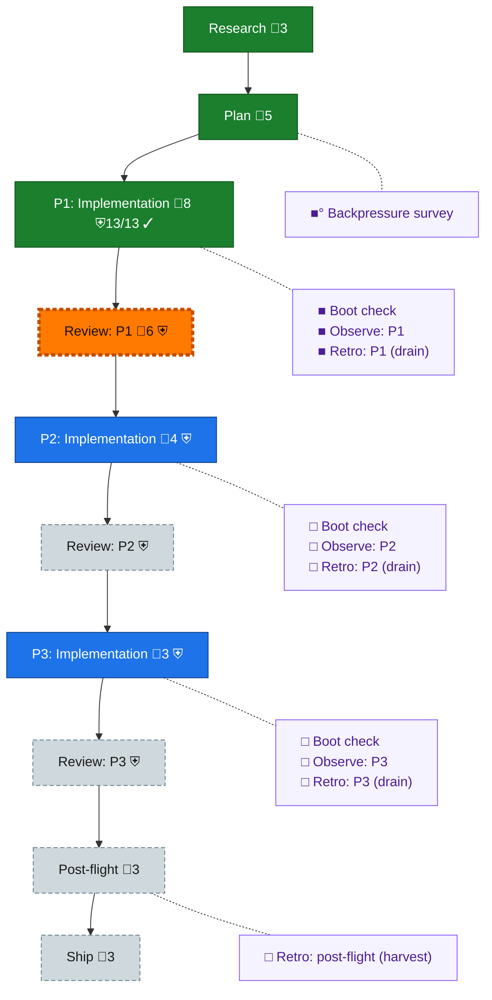

<!-- GENERATED by `harness flow render` — do not hand-edit; regenerate from the flow JSON. -->
# Flow · 082-harness-hooks

**Kind**: flight-plan · **Now**: review-1 · **Nodes**: 21 · **Events**: 25

**Rail**: ◆─◆─[ ◆─◇─◇─◇─◇─◇─◇ ]─◇  ◆ Research · ◆ Plan · [ ◆ P1: Implementation · ◇ Review: P1 · ◇ P2: Implementation · ◇ Review: P2 · ◇ P3: Implementation · ◇ Review: P3 · ◇ Ship ] · ◇ Post-flight

**Legend** — colour = type/status: 🟩 done · 🟢 in-progress · 🟥 blocked · 🟦 known · ⬜ assumed · 🔶 decision · 🗣 user input · 🟪 harness chore (faded = not yet done) · 🤖 companion · 🛠 worker · 🟧 current (you are here). Badges: 💬 comments · 📄 artifacts · 📝 instructions · 🧰 chore (° optional / recommended / ‼ strongly-recommended; ✓ done · ✕ skipped) · ⛨ dd gate (terminal/total from the last evaluation; ✓ = open). ⛨✓/⛨✕ = a plan-validate check gate (green / not green).

## Node log

### backpressure · Backpressure survey
- `2026-08-09T12:47:10.403Z` · agent · validation — decision:completed verdict:Partial reason:survey run at the pre-coding seam via the real /eng-harness-flow router; artifact written to assets/backpressure-coverage.md; counts 3 RUN / 2 EXTEND / 10 BUILD / 2 ABSENT; recommended move = build the two risk-linked sensors before feature code time:2026-08-09T12:45Z basis_sha256:4e83160f370327ef2b91c2c5cbe34c33313b7079b5534b977d54ebe67f178c6c

### boot-1 · Boot check
- `2026-08-09T13:26:23.242Z` · agent · validation — decision:done verdict:DEGRADED (warn-launch only, non-blocking) reason:real /eng-harness-flow --hook pre-flight invocation routed to boot; ran npx harness boot in the s077 worktree. boot=healthy bootMs=21885 ready='no services to start (CLI/library)' checks=degraded. Findings are all warn-launch and none block: arch-check 2 warn violations (services-ports-type-only), markdown-lint 211 findings (195 lint, 15 links/anchors, 1 mermaid), windows-check 7 cross-platform hazards in 3 rule classes (WIN002x1, WIN004x1, WIN007x5), first at .harness/extensions/checks/extension.ts:239 hard-coded /tmp. Substrate is healthy for Phase 1 work. time:2026-08-09T13:25:48Z

### observe-1 · Observe: P1
- `2026-08-09T14:35:28.018Z` · agent · validation — decision:satisfied reason:two real captures in the agent bucket, not a narrated one time:2026-08-09T14:35:01Z records: DL-001 fp bfd7a291aafe first_seen 2026-08-09T12:31:20Z (harness plan new scaffolds 6 of 20 schema-declared sections and neither dd set nor dd add can create a seventh, E450 section-unknown, so risks/key_findings/gate_matrix/execution_guardrails/testing_strategy have no CLI route into an existing plan); DL-002 fp 10230faea671 first_seen 2026-08-09T13:30:47Z (the live Cursor hook points at scratch/attrib-probe in the MAIN checkout, untracked working space, so a clean silently breaks every Cursor tool call - this is the argument for the installer writing an absolute quoted path to a stable installed binary and for hooks status to prove its target resolves). DL-002 is already carried into phase 2 as the status-must-stat-its-target task.

### retro-1 · Retro: P1 (drain)
- `2026-08-09T14:38:00.067Z` · agent · validation — decision:drained verdict:2 entries saved, buffer cleared time:2026-08-09T14:36:29Z Real invocation of /eng-harness-flow --hook post-coding via the Skill tool, routed to the retro verb module, drain surface. Record written at .harness/records/retro/2026-08-09/001-082-harness-hooks-phase-1.md; harness observe --clear reported cleared:2 malformed_skipped:0 and a follow-up --list confirmed the buffer empty. DL-001 disposition:task (harness plan new reaches 6 of 20 schema-declared sections; this IS the harness repo so it routes to a local source fix, never an upstream issue). DL-002 disposition:plan, resolved_by the phase-2 status-must-stat-its-target task. Win beat recorded: the observe buffer survived a context compaction intact, so neither entry was re-derived from memory.
