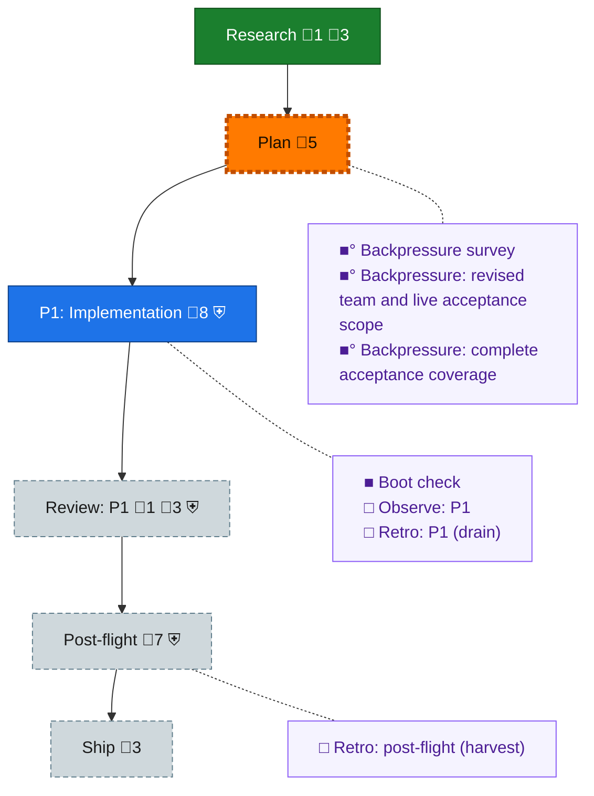

<!-- GENERATED by `harness flow render` — do not hand-edit; regenerate from the flow JSON. -->
# Flow · builder-team-lifecycle

**Kind**: flight-plan · **Now**: plan · **Intent**: Promote the accepted 12-step architecture-enabled team lifecycle into Builder and first-class harness builder commands; separate plan and implementation guide, dogfood manually with detailed plan-folder evidence, run both complete skill lifecycles, use isolated OMP github-copilot/gpt-6-astra coders and github-copilot/claude-opus-5 high reviewers. · **Nodes**: 13 · **Events**: 19

**Rail**: ◆─◇─[ ◇─◇─◇ ]─◇  ◆ Research · ◇ Plan · [ ◇ P1: Implementation · ◇ Review: P1 · ◇ Ship ] · ◇ Post-flight

**Legend** — colour = type/status: 🟩 done · 🟢 in-progress · 🟥 blocked · 🟦 known · ⬜ assumed · 🔶 decision · 🗣 user input · 🟪 harness chore (faded = not yet done) · 🤖 companion · 🛠 worker · 🟧 current (you are here). Badges: 💬 comments · 📄 artifacts · 📝 instructions · 🧰 chore (° optional / recommended / ‼ strongly-recommended; ✓ done · ✕ skipped) · ⛨ dd gate (terminal/total from the last evaluation; ✓ = open). ⛨✓/⛨✕ = a plan-validate check gate (green / not green).

## Node log

### research · Research
- `2026-09-04T23:44:44.502Z` · agent · validation — Research complete: assets/research-dossier.md records current plan/flow/ports reuse, source-skill ownership, architecture and preservation evidence, runtime model pins, and the allocation ownership decision requiring resolution before contract freeze.

### review-1 · Review: P1
- `2026-09-05T03:00:22.519Z` · agent · decision — Whole-plan completion includes post-flight/archive obligations. Source check in flow-dd-gate.ts confirms the current review exit runs complete:true and would require those future obligations before reaching them. Move that same complete-plan gate atomically to post-flight exit, preserving the phase task gate and required independent review. This is gate relocation, not a force override or a completion claim.

### backpressure · Backpressure survey
- `2026-09-05T00:54:06.056Z` · agent · validation — Ran /eng-harness-flow --hook pre-coding --json as the source-backed DD survey procedure, aligned with the fixed PR193 recipe (6186b2d0). Inventoried the single package and CLI/extension/test/schema/skill roots; selected 10 existing paved instruments and 18 criterion rows: 12 EXTEND, 5 BUILD, 1 ABSENT/human-judgement. All rows remain unchecked and certainty Partial. Canonical assets/backpressure.dd.json is linked from plan meta, every AC and phase assertions via ddocs; basis_sha is the post-link SHA-256 of plan bytes. Verdict: extend the existing suites and build the named smoke/example checks within approved scope; independent judgement and actual lifecycle evidence remain separate. Allocator ownership still awaits human ratification; the advisory survey does not change that decision. · refs: docs/plans/098-builder-team-lifecycle/assets/backpressure.dd.json, docs/plans/098-builder-team-lifecycle/assets/impl-guide.dd.json

### boot-1 · Boot check
- `2026-09-05T03:52:14.470Z` · agent · validation — Executed /eng-harness-flow --hook pre-flight --plan-dir docs/plans/098-builder-team-lifecycle --phase ph-d5d7 --json through the installed router and boot procedure. Self-briefing and live help returned ok; just test initially found the existing ErrorCodes exhaustive expectation, which was updated for the confirmed E470-E477 allocation. Repaired boot passed 342 files / 5302 tests with declared fast scope and coverage. Doctor returned degraded: missing globally resolved biome and an existing missing extension briefing, with 13 extensions loaded and zero failed; local biome and CLI execution work. Verdict UNHEALTHY on those declared health layers, not a fabricated healthy verdict or an adoption request. Advisory attempt completed. Captures: scratch/plan-098/implementation-preflight-boot-repaired.result.json and implementation-preflight-interact.json / implementation-preflight-observe.json. time:2026-09-05T03:52:14.154520+00:00

### backpressure-3ff1a41e89db · Backpressure: revised team and live acceptance scope
- `2026-09-05T03:50:10.165Z` · agent · validation — Executed /eng-harness-flow --hook pre-coding --json with the explicit DD plan and the source-backed DD recipe already adopted from PR193 (6186b2d0); no legacy Markdown-only coverage file. Reused the verified single-package sensor inventory and added the actual shared-contract test surface. Surveyed all 19 current criteria: 13 EXTEND, 5 BUILD, 1 ABSENT/independent judgement; certainty Partial, all acceptance rows remain unchecked. Recorded chosen commands, evaluator scope/unknowns and actual local ddocs validate/links/build --check proof. The initial extra allocator ratification requirement was withdrawn, not silently skipped. basis_sha256:3ff1a41e89db62df8617e330efbc0dfb8d135e532e1ffdc25cb6e4d1a71cfb02 time:2026-09-05T03:50:09.832069+00:00

### backpressure-fd1790c364a2 · Backpressure: complete acceptance coverage
- `2026-09-05T04:37:13.671Z` · agent · validation — decision:retain the verified source-backed DD proof strategy; verdict:Partial. Re-assessed the changed coverage/baseline seam using the canonical assets/backpressure.dd.json and the existing instrument inventory, not a new Markdown truth or a claimed separate skill process. All 19 ACs now have coverage-map entries; all remain unchecked. Pressure identities and 13 EXTEND/5 BUILD/1 ABSENT selections remain unchanged. The revised shared selector/capability source passed 42 focused tests and source typecheck; local ddocs validate, links and build --check each exited 0 after the coverage/link writes. Independent architectural approval remains outstanding. basis_sha256:fd1790c364a221a75260cf8480c1b4a69175a91ee84490b53944e00678d4bfe2 time:2026-09-05T04:37:13.324700+00:00
