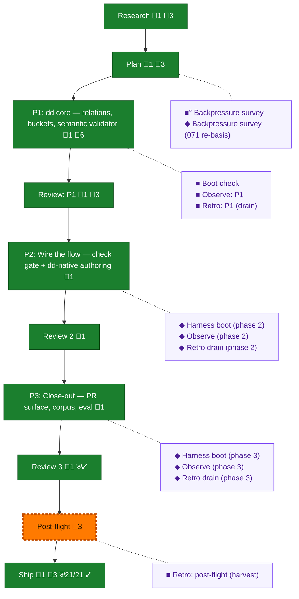

<!-- GENERATED by `harness flow render` — do not hand-edit; regenerate from the flow JSON. -->
# Flow · dd-native-builder

**Kind**: flight-plan · **Now**: post-flight · **Next**: review-1 · **Intent**: Make the builder pipeline dd-native: plans and task files as .dd.json, flow gates driven by document state, typed rels, semantic validate with strict-zero --complete, PR evidence surface — the flow that delivers this plan is the feature itself · **Nodes**: 22 · **Events**: 76

**Rail**: ◆─◆─[ ◆─◆─◆─◆─◆─◆─◆ ]─◇  ◆ Research · ◆ Plan · [ ◆ P1: dd core — relations, buckets, semantic validator · ◆ Review: P1 · ◆ P2: Wire the flow — check gate + dd-native authoring · ◆ Review 2 · ◆ P3: Close-out — PR surface, corpus, eval · ◆ Review 3 · ◆ Ship ] · ◇ Post-flight

**Legend** — colour = type/status: 🟩 done · 🟢 in-progress · 🟥 blocked · 🟦 known · ⬜ assumed · 🔶 decision · 🗣 user input · 🟪 harness chore (faded = not yet done) · 🤖 companion · 🛠 worker · 🟧 current (you are here). Badges: 💬 comments · 📄 artifacts · 📝 instructions · 🧰 chore (° optional / recommended / ‼ strongly-recommended; ✓ done · ✕ skipped) · ⛨ dd gate (terminal/total from the last evaluation; ✓ = open). ⛨✓/⛨✕ = a plan-validate check gate (green / not green).

## Node log

### research · Research
- `2026-08-04T08:19:02.981Z` · agent · validation — decision:done evidence: builder-tuning notes.md + structural-proof-graph.md (065) + assets/research-flow-eval-history.md — research artifacts exist and are cited by the plan; time:2026-08-04T08:18Z

### plan · Plan
- `2026-08-04T08:19:03.768Z` · agent · validation — decision:done evidence: plan.dd.json (dd-native, 18 ACs/35 tasks/3 phases, validates 0/0, Opus validation folded, zero open questions) at 987e9e76; time:2026-08-04T08:18Z

### phase-1 · P1: dd core — relations, buckets, semantic validator
- `2026-08-04T10:18:52.029Z` · agent · validation — verdict:complete reason:13/13 tasks, 29 dw assertions, 9 ACs checked via dd set (commit bf6fec64); coder commits 77e3ef3f..d8ae90f8 + fix ab37d55d; 4064 tests green; dd doctor 0/0. time:2026-08-04T10:19Z

### review-1 · Review: P1
- `2026-08-04T10:18:53.454Z` · agent · validation — verdict:APPROVE reason:cross-model review (pij-widespread-gore, gpt-5.6-terra high) — Dim-0 mutation gate 3 planted-bad classes FIRED (E402/E451/E454); fix round 1 (ab37d55d atomic sibling staging) independently reproduced: failure-path tests fire, sweep confirmed, 4064 tests, warn trio at baseline; fence amendment e2ebb908 accepted. time:2026-08-04T10:19Z

### ship · Ship
- `2026-08-04T17:05:15.918Z` · agent · validation — verdict:shipped reason:corpus archive-moved (#90) with gates re-pointed via CLI; PR #95 up with pr-body-rendered AC table pinned at b59b7c6f; click-through proven (lg-0010); --complete strict zero 148/148; gate refusal lg-0009 + pass lg-0011 both live; CI watch next time:2026-08-05T03:30Z

### backpressure · Backpressure survey
- `2026-08-04T08:42:11.719Z` · agent · validation — decision:done verdict:Partial counts:1-RUN/11-EXTEND/5-BUILD/1-ABSENT basis_sha256:b4814527f6326e385c902742039c830b4c112a3ef46d53bd4e4599b7f42aeb3f artifacts: backpressure.dd.json (18 rows bp-70xx, 7 sensors, validates 0/0) + assets/backpressure-coverage.md signpost; BUILD gaps are already plan tasks (tk-7046/7047/7065/7067/7068/7069) — no separate Phase 0; time:2026-08-04T08:31Z

### boot-1 · Boot check
- `2026-08-04T08:47:17.684Z` · agent · validation — decision:done verdict:HEALTHY boot:just test 3955/3955 green 29s (281 files, 91.8% lines); interact: harness checks exit 0 all hard gates ok (degraded=warn trio only); observe: buffer readable, 4 entries; time:2026-08-04T08:44Z

### observe-1 · Observe: P1
- `2026-08-04T10:17:54.166Z` · agent · validation — decision:satisfied reason:real captures exist across phase 1 — DL-001..DL-005 (orchestrator), DL-006..DL-008 (coder, buffer left undrained for the drain seam), CONF-001 (first live contradiction fire, captured 2026-08-04T10:17Z). Buffer: .harness/temp/agent/session-buffer.md. time:2026-08-04T10:18Z

### retro-1 · Retro: P1 (drain)
- `2026-08-04T10:18:51.303Z` · agent · validation — decision:drained reason:real /eng-harness-flow --hook post-coding invocation; 9 entries (DL-001..DL-008, CONF-001) drained via harness record retro to .harness/records/retro/2026-08-04/002-070-dd-native-builder-phase-1.md with per-entry dispositions (2 fixed-now, 5 task, 2 kept); buffer cleared (cleared:9, malformed:0). time:2026-08-04T10:18:30Z

### retro-harvest · Retro: post-flight (harvest)
- `2026-08-04T17:05:14.955Z` · agent · validation — decision:done reason:real post-flight harvest — harness retro insights: 48 records / 276 entries / 190 open; top cluster difficulty-tooling n=26 proof-gap; highest-leverage encode named = fence-row derivation from task texts (5 same-shape amendments this plan; tk-7171 shipped mechanism, authoring still manual) — offered to Jordan at closeout time:2026-08-05T03:30Z

### phase-2 · P2: Wire the flow — check gate + dd-native authoring
- `2026-08-04T12:18:01.160Z` · agent · validation — verdict:complete reason:13/13 tasks + 18 dw assertions checked via dd verbs; coder commits 5feaac54 d47b7680 17a40749 3d7fe351 bd66fc17 7316d350 d80ed0ed + fix 74a2c7f6; 4141 tests green; states flipped in 0285ff4a; plan validate 0 contradictions time:2026-08-04T12:20Z

### review-2 · Review 2
- `2026-08-04T12:18:02.079Z` · agent · validation — verdict:APPROVE reason:cross-model review (gpt-5.6-terra) — round 1 FIX (2 MAJORs: --plan-dir refusal, stage-5 sibling link), fix 74a2c7f6 re-reviewed with direct CLI controls (E108 exit 1 nothing written), no findings; packet docs/plans/071-dd-native-builder/assets/tasks/phase-2/review-packet.md time:2026-08-04T12:20Z

### phase-3 · P3: Close-out — PR surface, corpus, eval
- `2026-08-04T16:59:36.807Z` · agent · validation — verdict:complete reason:14/14 tasks (tk-7152 click-through held for ship), 18 commits 3f3db39d..0b18d74b, 302/4251 green, trio baseline-identical, review APPROVE after 4 rounds time:2026-08-05T03:06Z

### review-3 · Review 3
- `2026-08-04T17:04:24.855Z` · agent · validation — verdict:APPROVE reason:4-round cross-model review (FIX2/FIX1/FIX2/APPROVE, no findings); recorded as rows at review/round-3.dd.json with verdict deciding every finding; gate exercised BOTH ways at this node — E440 refusal pre-close (lg-0009) and green pass post-close time:2026-08-05T03:25Z

### boot-2 · Harness boot (phase 2)
- `2026-08-04T10:28:21.763Z` · agent · validation — decision:done verdict:HEALTHY boot:just test 4064/4064 green 30s (289 files); interact:harness checks exit 0 all hard gates ok, degraded=warn trio at baseline (arch 2, markdown 196, windows 6); observe:buffer readable, 2 entries (DL-001 flow root-meta setter gap, DL-002 section-birth gap). Real /eng-harness-flow --hook pre-flight invocation. time:2026-08-04T10:28Z

### observe-2 · Observe (phase 2)
- `2026-08-04T12:16:13.841Z` · agent · validation — decision:done reason:8 real captures in .harness/temp/agent/session-buffer.md (DL-001 root-meta setter gap, DL-002 section-birth gap, DL-003 id-less row addressing, DL-004 planted-bad good-twin lesson, DL-005 copilot focus-gated input drop, DL-006 compact-self --help footgun, INS-001 composition-proof value, COORD-001 shared-worktree writers) time:2026-08-04T12:16Z

### retro-2 · Retro drain (phase 2)
- `2026-08-04T12:17:48.414Z` · agent · validation — decision:done reason:real post-coding drain — 8 entries recorded with dispositions at .harness/records/retro/2026-08-04/003-071-dd-native-builder-phase-2.md (3 task-&gt;phase-3 candidates, 2 upstream pij defects, INS-001 headline), buffer cleared time:2026-08-04T12:19Z

### boot-3 · Harness boot (phase 3)
- `2026-08-04T12:19:36.686Z` · agent · validation — verdict:HEALTHY reason:real pre-flight — just checks exit 0 in 49s, all hard gates ok, warn trio at baseline arch2/md196/win6, dd doctor 0/0, observe buffer empty post-drain time:2026-08-04T12:21Z

### observe-3 · Observe (phase 3)
- `2026-08-04T16:59:35.171Z` · agent · validation — decision:done reason:11 real captures across 2 buckets (agent 4, pij-sole-snipe 7) — drained to .harness/records/retro/2026-08-04/004+005-071-*-phase-3-*.md time:2026-08-05T03:06Z

### retro-3 · Retro drain (phase 3)
- `2026-08-04T16:59:35.991Z` · agent · validation — decision:done reason:real post-coding drain — 11 entries, dispositions incl 2 fixed-now (runbook order 3fc4cd5f; gates retrofit bdfaf690) + 4 task-class (2 prime-ledgered), buffer cleared time:2026-08-05T03:06Z

### backpressure-1f1d8db67e6c · Backpressure survey (071 re-basis)
- `2026-08-04T10:22:14.387Z` · agent · validation — decision:done verdict:renumber-only-delta reason:070-&gt;071 rename sweep (ids 70xx-&gt;71xx, ordinal 71, path strings); coverage substance unchanged from the b4814527 survey — 18 bp rows renumbered bp-71xx, probes/sensors identical. basis_sha256:1f1d8db67e6c61217bc53dc2227a8dc38e9b757afa4fc53c215a0589642efa2a time:2026-08-04T10:22Z
