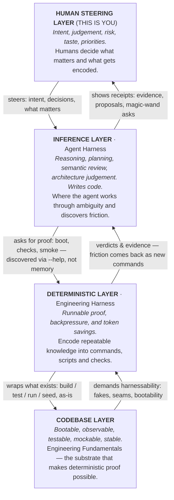

# The Engineering Harness — Complete Reference

This document is the single-hit orientation for the engineering-harness concept. It is written for agents and humans alike: read it once and you have everything you need to understand what a harness is, why it exists, how to operate one, and how to make it better. The other foundation documents ([first-principles](./first-principles.md), [patterns-that-work](./patterns-that-work.md), [directives](./directives.md), [rules-of-why](./rules-of-why.md), [simple-mode](./simple-mode.md)) go deeper on each area; nothing in them contradicts this one.

## 1. Definition

An **engineering harness** is the productisation of a project's engineering environment. It takes the environment that already exists in every repo — scripts, docs, makefiles, package commands, setup steps, tribal knowledge — and promotes it from a diffuse, unowned mess into a **first-class concept** with a name, a discoverable surface (usually a CLI), and a defined place in every plan.

Its job: move a human or agent from **intent to evidence**, then encode what was learned into the next run.

Key properties:

- It is a **layer, delivered through tooling**: conceptually a deterministic layer sitting between the agent and the codebase (§3), made concrete by the harness CLI (§8). Need to discover what the environment can do? Check the CLI. Hit friction, or have something to add or fix? The CLI is the place. One focal point for both directions.
- It is a **simple view over the complex**: an interface to the codebase's real complexity, not an attempt to eliminate it. It wraps what already exists (build, test, run, seed — as-is) rather than reimplementing it; its value is the focused façade that makes the supported path obvious.
- It is **repo-local and versioned**: commands, fixtures, checks, seed data, docs, state, workflows, and review paths that live with the code.
- It is **self-improving by design**: the improvement loop is part of the definition, not an optional extra. Every run is expected to leave the harness better than it found it — the compounding value loop: *every task sends a gift to its future self*. A harness without the Improve stage is only a test rig.
- It is an **observation instrument**: it makes hidden state portable — logs, traces, screenshots, database checks, responses, events, diagnostics — so behaviour is *inspected*, not guessed, and observations are turned into explicit verdicts (pass, fail, degraded, expected vs actual).
- It is **iterative**: the right harness emerges from repeated runs, observed failures, and encoded improvements — not from a finished playbook. It starts minimal and grows through use.
- It is **not a silver bullet**: it amplifies disciplined delivery (specs, design, review, spec-driven development); it does not replace engineering fundamentals.

## 2. The problem it solves

Two structural failures occur in agent-assisted engineering, regardless of model quality:

**Problem 1 — the loop closes too slowly.** The agent takes too long to get real feedback from the codebase, so it guesses, loops, or waits for a human. Typical symptoms: 25 minutes of looping just to boot the app and hit one endpoint; half the session spent working out how to run the thing; friction worked *around* rather than through, burning tokens the whole way.

**Problem 2 — the loop is hard to trust.** "Done" from an agent is a claim, not a fact. Tests are green, the agent is sincere, and the feature breaks on the first real user flow. "Looks good to me" from a model is inference, not proof. The human ends up as the only reliable sensor — "did you even try to run this?"

And underneath both, **the loss problem**: when a human corrects the agent, that correction — often years of codebase knowledge deployed in one burst of steering — evaporates with the chat session. The same friction waits, unchanged, for the next teammate or the next session. Multiplied across every person, every day, many times a day, this is tokens (real money) spent rediscovering the same facts, with the learning discarded each time. Best case, fragments land in an overflowing `agents.md`; usually the learnings are never recognised as learnings at all.

These reduce to two questions, both environment questions, not model questions:

1. **How does the agent know when it is done** — deterministically, without a human standing there?
2. **Where does human backpressure live** — so teammates, future sessions, and future selves inherit it automatically?

Both answers are the same: a layer of runnable, deterministic capability between the agent and the codebase.

## 3. The four-layer stack



| Layer | Owns | Flow down | Flow up |
|---|---|---|---|
| **Human** | Intent, judgement, risk, taste, priorities. Decides what matters and what gets encoded. | Steering | Receives receipts: evidence, proposals, magic-wand asks |
| **Inference** (agent harness) | Reasoning, planning, writing code, semantic review. Spec-driven development lives here. Discovers friction. | Asks for proof — discovered via `--help`, not memory | Receives verdicts and evidence |
| **Deterministic** (engineering harness) | Runnable proof, backpressure, token savings. Encoded repeatable knowledge. | Wraps the codebase as-is | Demands harnessability from the codebase |
| **Codebase** | The product, tests, build, scripts, configs, databases. Where the real complexity lives. | — | — |

Intent flows down; evidence — not claims — flows up. The deterministic layer is the one most repos do not have as a first-class thing.

**Deconfliction — agent harness vs engineering harness.** These are distinct layers and must not be conflated:

- **Agent harness** = the runtime driving the model: Copilot, Claude Code, Codex, Cursor, etc. — the agentic loop, tools, skills, MCP servers feeding the LLM. This is the inference layer.
- **Engineering harness** = the project-side loop the agent harness drives: boot the app, run the tests, seed a database, smoke-test a flow. This is the deterministic layer.

They are highly cohesive — a better engineering harness improves agent outcomes in *any* runtime — but improving prompts/skills/MCP is agent-harness work; improving the project's provable loop is engineering-harness work. Invest in the loop, not just the model.

## 4. First-class promotion and the focal point

The engineering environment in most repos already exists but is **diffuse**: nobody owns it as a thing, it has no name, no single surface, and no place in anyone's plan. It is the thing that builds the thing, and it is invisible.

The harness's core move is **promotion to first class**, and the promotion is made real by tooling: the harness CLI (§8) is the physical focal point. Being first class delivers three capabilities, which are one mechanism seen from three sides:

- **Discover** — one place to look to see everything the environment can do: check the CLI (`harness --help`). If the environment can seed a database and connect the product to it, that is one discoverable command.
- **Prove** — one place backpressure lives. Before work starts, the question "if we do this work, how will the system deterministically validate it?" has a concrete answer surface: the CLI's checks and sensors.
- **Improve** — one obvious home for every fix. Friction found, missing capability, weak or wrong check → the CLI is the place: add it or fix it there, in place.

The decisive consequence is the elimination of the question *"where does this fix go?"* When the environment is diffuse, every lesson dies in a judgement call about where to put it. When the harness exists as a clearly defined thing, there is no question — and improvement actually happens. This is what "focal point" means, and it is the property everything else depends on.

## 5. The second objective (agents have blinkers on)

Agents are trained to stay on target: they neurotically seek the state of "done" for the stated task and only that. This is correct behaviour and must not be broken — the task is why the session exists.

The consequence: **agents do not think about the environment or the future by default.** An agent will not spontaneously think "someone else will hit this friction tomorrow." It fixes friction for itself, once, works around it, and moves on. Left alone, an agent works through an environment for hours and leaves zero improvement behind.

Therefore the environment must be made an **explicit, standing part of every plan** — a second objective that never displaces the first:

> Complete the requested task, **and** notice what the run revealed about the environment it ran through.

Every run produces two outputs: the work, and evidence about the environment. The work delivers its value once; the environment shapes the value of every run after it. Operationally this means: capture friction as it happens, note missing sensors and weak evidence, and surface it all at the retro (§12). The harness gives this second objective a home; the workflow gives it a moment.

Supporting facts:

- **Agents are real users of the engineering environment** — often the majority user. Every session starts cold: the agent has never seen the repo before this minute, even if the team has worked on it for years.
- **Agent friction is usability research.** When an agent stumbles, ask which layer failed: unclear setup? missing command? useless error? absent seed data? validation too weak to catch the real failure mode? supported path harder than the shortcut? Each is a fixable harness defect, not "the agent being dumb."
- Humans adapt around friction and stop seeing it; agents expose it repeatedly because they inherit no tribal knowledge.

## 6. Backpressure

**Backpressure** is the signal that tells the agent how it is *truly* doing. Without it, the agent has had a crack at the work but has no way to know whether the crack is correct. The things implemented to create backpressure are called **sensors**.

Human backpressure is the baseline: the agent says "done", the human says "no it's not." It works, but it is tribal knowledge — unevenly spread, some people better at it than others — and it requires a human present.

The encodable kinds, least to most reliable:

1. **Inferred backpressure** — "do a code review." Worth doing, but non-deterministic: different every time, even with an advanced prompt.
2. **Deterministic backpressure** — the best kind. The inference of correctness is taken *out of the LLM* and put *into code*: build failures, type errors, tests, lint, architecture rules, schema checks, health probes, smoke flows, browser-driving commands that let the agent physically exercise what it built.

The governing analogy: **nobody writes a unit test as markdown and asks the agent to "run the md and make sure it passes."** The same logic applies everywhere: a 10,000-page architecture document the agent "reviews against" is inference; an architecture check (CodeQL, Roslyn, dependency rules) that returns pass/fail with direct fix instructions is proof. The agent does not need to know the rules — it gets a verdict. Keep the document (so the agent can build the right shape first time) *and* the check (so conformance is proved, not vibed).

Translation table:

| Instead of | Provide |
|---|---|
| "Remember to start the app this weird way" | `harness boot` |
| "Check this follows our architecture" | `harness check architecture` |
| "Manually open the app and see if the button works" | `harness smoke checkout-flow` |

**The unit-test property generalised:** a sensor encoded once defends the original intent forever — anyone who later breaks it gets told, with no human present and no tokens burned on inference. Fixed once, caught forever.

**When a sensor is wrong** (a checker passes something a human reviewer then catches): the fix target is not a judgement call. Fix the **check first**, re-run it so it points at the problem, then fix the code. The correction becomes a permanent sensor inherited by every teammate and every future session — instead of a PR comment that scrolls away. Sensors being wrong is expected and fine; humans stay in the loop. The significant part is that the *workflow itself* improves each time it happens.

**Backpressure Check** (distinct from backpressure itself): an advisory, LLM-assisted survey run before work starts, over the scoped work and the deterministic sensors the repo exposes. It asks: can this work be proved well enough, and what sensors are missing? The check is not the proof — proof comes from the sensors it inventories or recommends. Sometimes the right outcome is stopping to build backpressure *first*; side missions of a day building a sensor for a single task have measurably paid off.

**Completion rule:** the agent can report progress, but *done* is decided outside the agent's confidence. Where the completion contract is executable, the harness decides with checks. Where it is not executable, the harness routes the judgement to a human — with the evidence needed to decide.

## 7. Encode, don't document

The single highest-leverage rule in the system.

When a discovery is made — the app only starts after three obscure steps, a migration keeps being missed, an internal API keeps being misused — the instinct is to write it down as a memory: "we discovered this, here's how you solve it." That instinct is wrong. **Don't write the memory — solve it.** Put the fix where the problem lives:

| Discovery | Encoding |
|---|---|
| Obscure startup dance | A command that does the dance |
| Repeatedly missed migration step | A preflight check |
| Recurring need for the same data | A seed command |
| Misread architecture rule | An architecture check |
| Misused internal API | A lint rule or typed wrapper |
| "New services must look like this" doc | A template that generates the shape, tests included |
| Confusing failure | An error message that teaches the repair |

**The test of capture:** not "did we write it down?" but **"can the next run benefit without reading anything?"** A wiki note is weaker than a command, check, fixture, template, default, or error message that does the thing. Markdown explains the trap; code prevents falling into it. "Coding in markdown" — encoding procedures as prose for an LLM to re-infer every session — is the anti-pattern.

The payoff: encoded knowledge does not need to be remembered, read, searched, or loaded into context. It exists, and because it exists, *it is how the repo works now*. It is physical. This is the team's memory — every session's and every person's learnings — made executable. The whole practice is a team sport: the game is building an executable version of the team's collective learning.

Markdown still has a role: orientation, routing, and the judgement-heavy context a check cannot carry (see §8 on `agents.md` routing). Lean deterministic; document what cannot be encoded.

## 8. The CLI front door

The harness made physical is usually a CLI. Reasons this surface works:

- **Agents are highly trained on CLIs.** An agent that has never seen a repo can operate `git` expertly; a harness CLI is that same affordance for the project. Verbs, `--help`, stable arguments, exit codes, examples, non-interactive flags, parseable output. The agent asks instead of guessing, probes before acting, reads a clean error and knows the next action.
- **Cold-start onboarding.** Every agent session is a fresh developer onboarding. Months of team encoding shows up in `--help`, fetched on demand — not stuffed into context as skills. Think of harness commands as *deterministic skills*.
- **Context economy.** `agents.md` stays a short router — "this repo has an engineering harness; it can boot, seed, smoke-test, check architecture; run `harness --help`" — and the detail lives behind the front door. Well designed, pointing the agent at the CLI is nearly sufficient orientation on its own.

Contract for harness commands:

- Return **structured evidence, not logs to scrape**: clear status, stable exit codes, typed errors, remediation guidance, and a distinction between hard failure and degraded-but-usable.
- **Diagnostics prescribe the fix**: a `doctor` command checks layers in dependency order (prerequisites → env → deps → services → startup → health → seed → validation), stops at the most useful failing layer, and names the next action.
- **Wrap, don't reinvent**: the CLI fronts existing build scripts, test runners, seeds, and diagnostics. First versions are legitimately mundane — `harness build`, `harness test`, `harness lint`, `harness doctor`, `harness boot`, `harness seed`, `harness smoke-test` — and grow from use.
- **The paved path must beat the shortcut.** If raw shell commands or tribal workarounds are easier than the harness, the harness is not finished. Bypassing the harness burns tokens without paying discoveries forward — the frictions still get hit, but the fixes die in a prompt window.

The CLI is the front door, not the whole house: the harness also comprises fixtures, seed data, checks, docs, durable state, workflows, observability, and review paths behind it.

## 9. Extensions — how the harness grows

The shipped harness follows a **core + extensions** model:

- **Core** — installed via `npx`, centrally upgradeable. Ships the built-in command set (`help`, `doctor`, `instructions`, `new`, `docs`, `skills`, `record`) plus the core machinery that surfaces what extensions declare — such as the `sensors` command family (§10). New core capability can ship to every repo later.
- **Extensions** — per-repo, discovered at runtime from `.harness/extensions/`. Commands beyond the core come from extensions. Each is a little package: a folder containing a supported entry (`extension.ts` by default; `extension.js`, `index.*`, or a `package.json` `harness.extensions[]` manifest also resolve) and `instructions.md` (required), plus any free-form internals. An extension may contribute **verbs**, **record types**, or **sensors** (§10); each verb declaration becomes a top-level `harness <verb>` command with its own `--help`, options, structured output, and exit code.

This is why a fresh install is minimal — almost no features, just the will to take the shape the environment needs — and why no two harnesses end up identical while every repo shares the same concept and base skills.

**The intent of an extension** is captured in one split: **the verb brings the determinism, the agent brings the inference.** Each extension's `instructions.md` is a briefing for the *calling agent* (not a human README): second-person and operational, it states what the verb computes deterministically, what role the agent plays around that output, and what judgement is expected back. It is served verbatim by `harness instructions <verb>`, read from disk on every invocation — edit it any time, no rebuild. `harness doctor` complains about a missing briefing (degraded, still exit 0 — the harness never gates).

**When to add an extension** — the triggers are the improvement machinery of §6 and §12:

- The **Backpressure Check identifies missing sensors or proof** for the scoped work — the gap *is* the extension backlog.
- A friction recurs and its fix was selected at Improve (retro / magic-wand answer concrete enough to encode).
- The environment needs a capability (seed path, smoke flow, evidence capture) that currently lives as tribal steps.

**How to add one** — fast path:

```bash
harness new <name>                     # minimal stub, loadable immediately, honestly reports "unconfigured"
harness new <name> --wrap "<command>"  # wraps an existing repo command (build/test/seed) as-is
harness new <name> --sensor            # scaffolds a sensor (§10)
harness new <name> --sub reset,seed    # scaffolds a verb with nested subverbs
```

Record-type extensions have no scaffold flag — author `.harness/extensions/<name>/extension.ts` directly (§ records).

Every variant also writes a starter `instructions.md`. The guided path is the `add-extension` verb reached via the harness flow skill. Trust model: extensions are arbitrary code with full Node privileges — the same repo-trusted model as ESLint or Vite plugins; a broken extension is isolated rather than taking down the CLI, and `--no-extensions` / `HARNESS_NO_EXTENSIONS=1` skips them entirely. Deep reference: [`docs/how/extend-the-harness.md`](../docs/how/extend-the-harness.md).

## 10. Sensors and the sensor watcher

**Sensors** are cheap, deterministic measurements that report repository health — backpressure (§6) in its standing form, with readings that guide work while it happens. Watch-enabled sensors run ambiently: the watcher re-runs them whenever files matching their globs change. Sensors without watch globs, or declared `trigger: 'manual'`, run only on explicit invocation. They are declared inside extensions.

Contract essentials:

- Required: `summary` and a deterministic `run(ctx)` returning a reading. Optional: `watch` (repository-relative globs that trigger re-runs), `trigger: 'manual'`, `timeoutMs` (default 30s hard kill), `guidance` (static remediation fallback).
- Readings are `pass | warn | fail | skip`, optionally with `score` + `direction` (drives trend), `threshold`, one-line `details`, and a longer `report`. `skip` means the measurement wasn't meaningful — it never fails a check.
- **Whether the sensor ran is separate from what it found.** A crashed or timed-out sensor is mechanically distinct from a valid failing reading — a crash never masquerades as a failing measurement.
- Sensors are short-feedback instruments, not batch jobs: target seconds, tolerate 2–3 minutes at most. **If a sensor needs 20 minutes, it isn't a sensor** — that work belongs in CI or a verb.

**Advisory by default, gate only on request.** Readings guide the human or agent; nothing blocks. The single exception is explicit: `harness sensors check` runs every sensor once CI-style and exits non-zero for fail, error, or timeout outcomes (`warn` and `skip` never fail it). `run`, `watch`, and the viewers stay advisory always.

**The sensor watcher** — `harness sensors watch` — is the foreground watcher that keeps readings fresh (launch it detached via the environment's process capability when it should outlive the terminal): it watches each sensor's globs, re-runs the sensor when matching files change, isolates individual failures, and publishes a heartbeat. The watch set is read once at startup, so **restart the watcher after adding or changing a sensor**. If sensors are registered but no heartbeat is live, `harness doctor` surfaces a `sensor-watcher` layer as degraded (advisory, exit 0) and names the next actions.

**One truth, two views**: the same state files drive an interactive TUI for humans (`harness sensors` on a supported TTY with the optional Ink/React packages present — per-sensor detail, re-runs, history scrubbing; without them the same data is served as a degraded JSON envelope), and a compact JSON envelope (`harness sensors --json`, which always wins) for agents, pipes, and CI. `harness sensors run <name>` runs one sensor; `harness sensors snapshot` stores a working-session baseline so subsequent readings carry a trend (better / steady / worse). Deep reference: [`docs/how/harness-sensors.md`](../docs/how/harness-sensors.md).

## 11. Harnessability

**Harnessability is a property of the codebase**: how easily the codebase can be entered, operated, observed, proved, and adapted through a harness. The harness can only prove what the codebase lets it touch.

Signals: can the system run fully on a local machine or isolated CI run? Can upstream dependencies be faked at seams? Can the database and downstream services run locally, with tables editable and records seedable? Is the code composed for injection and substitution? The peak state: an agent pulls a PR and everything just works, with the full deterministic backpressure of a local machine.

The operative measure: **how adaptable is the codebase to creating the backpressure a given task needs?** If the environment is stretched thin by the codebase, the codebase itself is a legitimate improvement target — brownfield systems in particular may need modification (seams, fakes, bootability) before a harness can serve them well. A harnessability assessment exists as a skill that scores exactly this.

## 12. The operating loop (the self-improvement engine)

The harness has a small loop that lives *inside* the team's existing workflow (spec-driven development flows fit best). It adapts to the team's process; the process should only need to adapt a little. This loop is what makes the harness *self-improving*: it both promotes improvement and provides the home for it — an obvious, standardised shift-left target, so when a suggestion is raised there is no question where it goes, and when a new session starts there is no question where to look.

**Boot → Backpressure Check → Do work and observe → Retro & magic wand → Improve → repeat**

| Stage | What happens | Why |
|---|---|---|
| **Boot** | Prove the environment works from a known state: build/install, start, readiness, health or smoke probe. Also re-orients the agent on how the repo wants to be operated. | If the environment isn't working before the work starts, it certainly won't be working after the work starts changing it. Boot is the first proof. |
| **Backpressure Check** | Advisory LLM-assisted survey: scoped work vs available deterministic sensors; gaps highlighted; risk noted. | Establishes *how done-ness will be proved* before work begins. May legitimately trigger a sensor-building side mission first. |
| **Do work and observe** | Work through supported surfaces; capture real evidence (logs, health, responses, screenshots, DB state); log friction, workarounds, and thin-confidence moments as they happen. | Evidence over claims; friction captured fresh (the second objective, §5). Light evidence is itself a finding: the environment needs improving. |
| **Retro & magic wand** | Retro: what was hard, easy, could be better. Magic wand: *"what one command, flag, fixture, sensor, check, or workflow change would make the next run easier, safer, or better proven?"* Companion question: *"what did you have to infer that the harness should have proved?"* | Converts usage into concrete, encodable improvement candidates. Answers must be concrete enough to encode. |
| **Improve** | A human reviews, selects, and encodes the chosen fix into the harness. Declining is legitimate and leaves a trace. | Without Improve, the harness is only a test rig. With it, every run makes subsequent runs faster, clearer, or better proved — the compounding step. |

Friction lifecycle behind the loop: **capture → bubble → harvest → prioritise (recurrence, severity, age) → encode → validate.** Ledgers are improvement backlogs, not diaries — the metric that matters is recurring frictions that became encoded fixes, not retro volume.

## 13. Measured results

The concept has been proved end-to-end on a hostile target: a ~20-year-old legacy .NET codebase, hundreds of authors, heterogeneous patterns, so hard to run that experienced team members needed a day-plus to stand it up. Run as a tracked experiment (times, tool usage, difficulties all logged):

- **Iteration 1: 16 hours** for an agent to get it built and running on a fresh machine.
- **Iteration 2: ~6 hours** — exposed the forgetting problem (re-discovering solved issues, retrying rejected approaches).
- **Iteration 3: ~3 hours** — the harness now handled setup, build, deploy, seed, and verification automatically.
- **Iteration 4: 30 minutes.** **Iteration 5: 15 minutes** — zero new difficulties, zero debugging, every tool worked first try.

Same class of change throughout: **16 hours → 15 minutes across five iterations (~64×)**, with the difference living entirely in the harness and the knowledge it carried forward. The experiment's conclusion, proved with data: an engineering harness coupled with a self-improving loop can unlock a legacy platform for agentic engineering work — effectively democratising it and re-opening it for business. Along the way: ~100 feedback items collected and patched in about a week; a difficulty ledger of 36 catalogued frictions with 29 fully encoded as automation; database seeders, architectural validators, service runners, health checks — and codebase modifications (a middleware seam) made specifically to improve harnessability. The difficulty-handling discipline throughout: **catalogue → encode → verify → gift** to every future session.

Expected cost shape for adopting teams: tokens *spike* initially (the harness is being built), then compound down. Track harness effects in existing delivery metrics (DORA-style: change failure rate, lead time, plus token usage) rather than inventing harness-specific productivity theatre. Measure the loop, not the person: ease of entry, safety of change, speed of proof, and compounding.

## 14. Operating rules

1. **Don't apologise — fix.** When the environment made work harder, slower, or less certain, that is not something to route around; it is the next unit of work, or at minimum a captured observation. The workaround solves it once for one session; the fix solves it forever for everyone.
2. **"Us" means agents and humans together.** The environment is not the human's property that agents borrow. A fix that helps only one of them is half a fix.
3. **Every run produces two things**: the work, and evidence about the environment (§5). Neither displaces the other.
4. **Every difficulty is a gift — if it is encoded.** Hit once, it is friction. Catalogued, encoded, and verified, it is a gift to every future session.
5. **Small things compound at team scale.** A three-turn friction × every developer × every session × every day is real money. Nothing recurring is beneath encoding; break-even on encoding is usually a handful of future runs.
6. **Tokens are a friction like any other.** Doctrine restated in multiple places, chatty command output, premium models doing cheap work — all recurring costs. Shift proof left, out of inference into deterministic code, wherever possible.
7. **Backpressure must have somewhere to live.** Human corrections are the most valuable artefact of a session; the harness is their standardised home. When a sensor is wrong, fix the sensor first (§6).
8. **Discriminate — this is not a mandate for neurosis.** The test: *would a reasonable next person or agent hit this same thing?* Yes → capture it, and encode when the fix is small or recurrence is costly. No → let it go. Capture is cheap; encoding is a judgement call; fix-everything zeal burns tokens, derails tasks, and buries real signals.
9. **Humans decide what matters.** The improvement loop never gates, scores, or blocks: the Backpressure Check is advisory, and humans choose what gets encoded, deferred, or declined (declining leaves a trace so recurrence stays visible). The paved path wins by being easier, not enforced. The CLI is the separate case: it is the agent's required operating path where the capability exists — an instruction, not a gate.
10. **Engineering fundamentals still apply.** The harness amplifies good specification, design, review, and prioritisation; it does not replace them. Keep the harness outside the business domain unless deliberately promoted; garbage-collect stale checks, rules, and fixtures so the harness compounds value, not clutter.

## 15. Minimal adoption (the nucleus)

The concept can be started in minutes, in any repo:

1. Create a tiny CLI (any stack; node works well with agent tooling). Wrap what already exists: build, test, lint, boot, seed.
2. Instruct the agent — via `agents.md`, skills, or equivalent — that this CLI is the project's **engineering harness**, and it must use it wherever possible rather than guessing around it.
3. Instruct the agent to keep a record of friction, discoveries, and missing signals as it works. Do real work.
4. At the end of the run ask: (a) a retro of its experience with the codebase and harness; (b) the magic-wand question; (c) "what did you have to infer that the harness should have proved?"
5. Human reviews; encode the best answers into the harness — preferring executable checks, sensors, smoke flows, and evidence capture over markdown instructions.
6. Repeat.

**\[CLI focal point + required agent use\] + \[deterministic sensors\] + \[advisory Backpressure Check\] + \[friction capture\] + \[human-selected encoding\] = engineering harness nucleus.**

Early improvements will look mundane — a clearer doctor check, a seed command, a smoke test, a better error. The compounding arrives quietly: sessions start faster, validation gets more deterministic, known frictions get caught by the harness before a human sees them, and every session — human or agent — starts on top of everything the team has ever learned.

## 16. Summary

Humans and agents are temporary occupants of an engineering environment that outlives every session. The engineering harness makes that environment a first-class, named thing with one front door; makes improving it a standing second objective of every piece of work; proves done-ness with deterministic backpressure instead of confidence; encodes every recurring lesson as something runnable; and thereby hands each next occupant a strictly better place to work than the one before it found.
