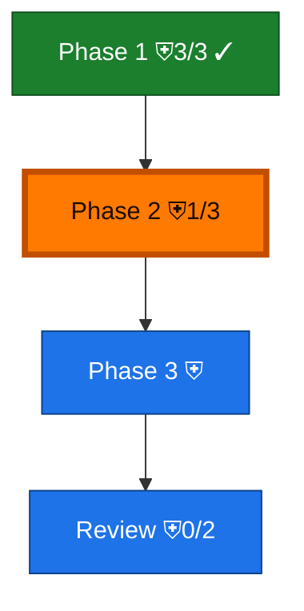

<!-- GENERATED by `harness flow render` — do not hand-edit; regenerate from the flow JSON. -->
# Flow · dd-gate

**Kind**: flight-plan · **Now**: p2 · **Next**: p3 · **Intent**: demo the dd-gate badge + rail callout · **Nodes**: 4 · **Events**: 1

**Rail**: [ ◆─◐─◇ ]─◇  [ ◆ Phase 1 · ◐ Phase 2 · ◇ Phase 3 ] · ◇ Review

**Legend** — colour = type/status: 🟩 done · 🟢 in-progress · 🟥 blocked · 🟦 known · ⬜ assumed · 🔶 decision · 🗣 user input · 🟪 harness chore (faded = not yet done) · 🤖 companion · 🛠 worker · 🟧 current (you are here). Badges: 💬 comments · 📄 artifacts · 📝 instructions · 🧰 chore (° optional / recommended / ‼ strongly-recommended; ✓ done · ✕ skipped) · ⛨ dd gate (terminal/total from the last evaluation; ✓ = open).
