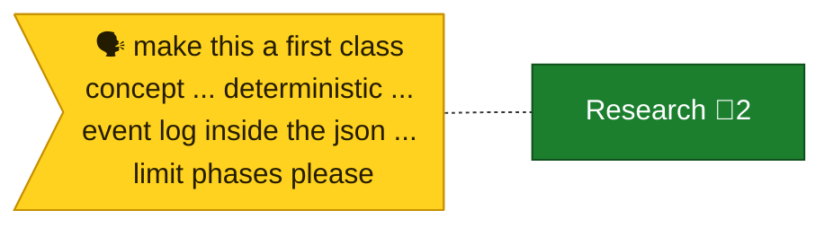
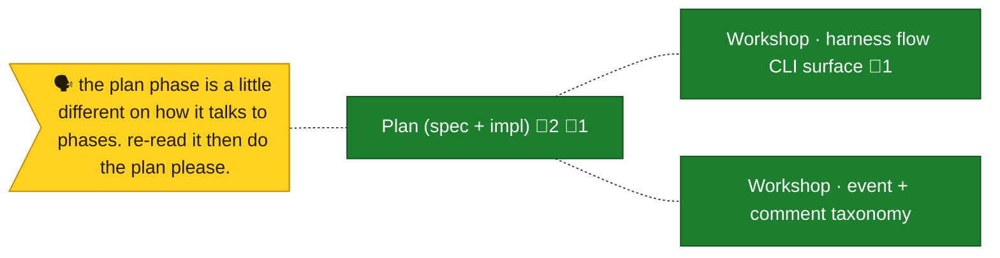
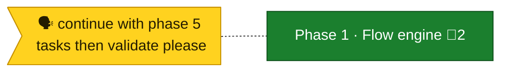
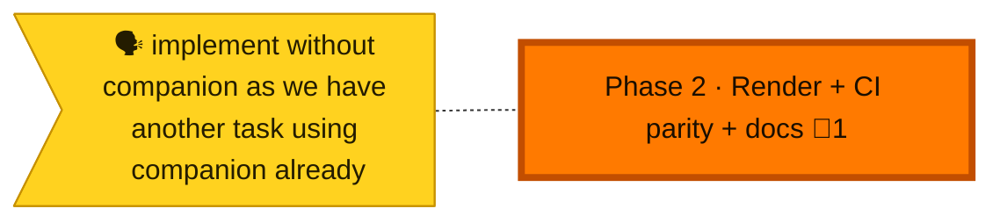

<!-- GENERATED by `harness flow render` — do not hand-edit; regenerate from the flow JSON. -->
# Flow · first-class-flow-system

**Kind**: flight-plan · **Now**: p2 · **Next**: p2 · **Intent**: render + CI parity + docs · **Nodes**: 8 · **Events**: 2

**Rail**: ◆─◆─[ ◆─◐ ]─◇─◇  ◆ Research · ◆ Plan (spec + impl) · [ ◆ Phase 1 · Flow engine · ◐ Phase 2 · Render + CI parity + docs ] · ◇ Review · ◇ Merge

### ◆ Research · _done_

↓

### ◆ Plan (spec + impl) · _done_

↓

### ◆ Phase 1 · Flow engine · _done_

↓

### ◐ Phase 2 · Render + CI parity + docs · _in progress_

↓

### ◇ Review · _known_

↓

### ◇ Merge · _known_

**Legend** — colour = type/status: 🟩 done · 🟢 in-progress · 🟥 blocked · 🟦 known · ⬜ assumed · 🔶 decision · 🗣 user input · 🟪 harness chore (faded = not yet done) · 🤖 companion · 🛠 worker · 🟧 current (you are here). Badges: 💬 comments · 📄 artifacts · 📝 instructions · 🧰 chore (° optional / recommended / ‼ strongly-recommended; ✓ done · ✕ skipped).

## Node log

### research · Research
- 📄 artifacts: research-dossier.md, original-ask.md

### plan · Plan (spec + impl)
- 📄 artifacts: first-class-flow-system-plan.md
- `2026-06-17T21:38:46Z` · agent · validation — validate-v2 broad (4 agents) = VALIDATED WITH FIXES. · refs: first-class-flow-system-plan.md
- `2026-06-18T01:25:00Z` · agent · validation — v1.2.0 amendment = VALIDATED WITH FIXES; body-log is render-only. · refs: first-class-flow-system-plan.md

### p1 · Phase 1 · Flow engine
- 📄 artifacts: tasks/phase-1-flow-engine/tasks.md, tasks/phase-1-flow-engine/execution.log.md

### p2 · Phase 2 · Render + CI parity + docs
- `2026-06-18T02:05:00Z` · agent · validation — Phase 2 dossier = VALIDATED WITH FIXES, 0 HIGH. · refs: tasks/phase-2-deterministic-render-ci-parity-docs/tasks.md

### ws-cli · Workshop · harness flow CLI surface
- `2026-06-17T21:48:08Z` · agent · decision — 4 CLI questions resolved; single act + subcommand group.
