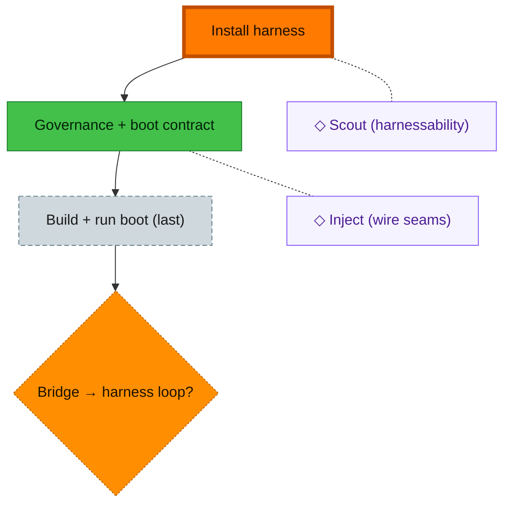

<!-- GENERATED by `harness flow render` — do not hand-edit; regenerate from the flow JSON. -->
# Flow · harness-adopt

**Kind**: harness-adopt · **Now**: install · **Next**: governance · **Intent**: adopt the harness in this repo · **Nodes**: 6 · **Events**: 1

**Rail**: ◆─[ ◐ ]─◇─◇  ◆ Install harness · [ ◐ Governance + boot contract ] · ◇ Build + run boot (last) · ◇ Bridge → harness loop?

**Legend** — colour = type/status: 🟩 done · 🟢 in-progress · 🟥 blocked · 🟦 known · ⬜ assumed · 🔶 decision · 🗣 user input · 🟪 harness chore (faded = not yet done) · 🤖 companion · 🛠 worker · 🟧 current (you are here). Badges: 💬 comments · 📄 artifacts · 📝 instructions · 🧰 chore (° optional / recommended / ‼ strongly-recommended; ✓ done · ✕ skipped).
