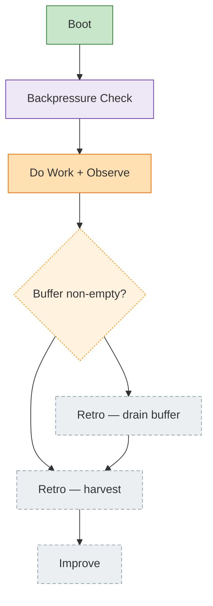

<!-- GENERATED by `harness flow render` — do not hand-edit; regenerate from the flow JSON. -->
# Flow · harness-loop

**Kind**: harness-loop · **Now**: observe · **Next**: drain-gate · **Intent**: the standalone engineering loop · **Nodes**: 7 · **Events**: 1

**Rail**: ◆─◆─[ ◐─◇ ]─◇─◇─◇  ◆ Boot · ◆ Backpressure Check · [ ◐ Do Work + Observe · ◇ Buffer non-empty? ] · ◇ Retro — drain buffer · ◇ Retro — harvest · ◇ Improve

**Legend** — colour = type/status: 🟩 done · 🟧 in-progress · 🟥 blocked · 🟦 known · ⬜ assumed · 🔶 decision · 🗣 user input · 🟪 harness · 🤖 companion · 🛠 worker. Badges: 💬 comments · 📄 artifacts · 📝 instructions · 🧰 chore (° optional / recommended / ‼ strongly-recommended).
