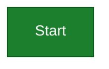
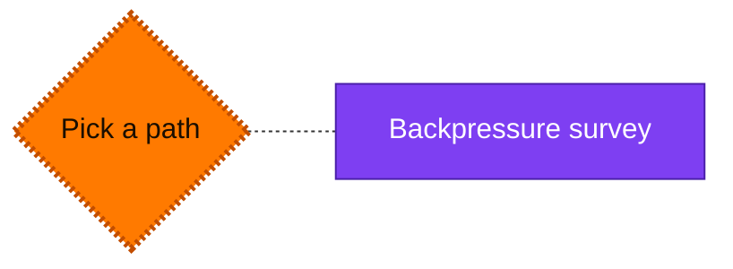
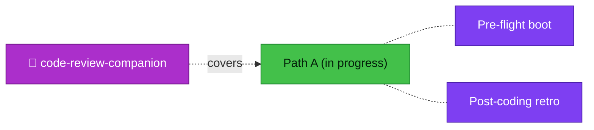
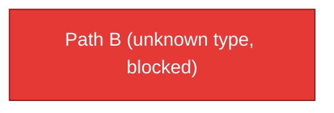
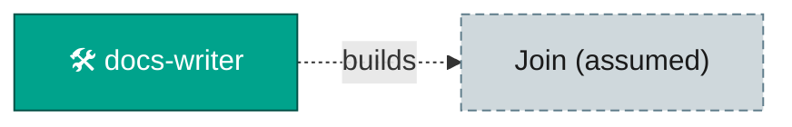
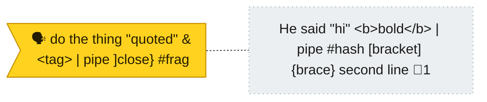
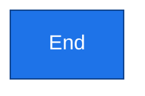

<!-- GENERATED by `harness flow render` — do not hand-edit; regenerate from the flow JSON. -->
# Flow · kitchen-sink

**Kind**: kitchen-sink · **Now**: dec · **Next**: a · **Intent**: demo every render rule · **Nodes**: 10 · **Events**: 1

**Rail**: ◆─[ ◇─◐─✗─◇─◇ ]─◇  ◆ Start · [ ◇ Pick a path · ◐ Path A (in progress) · ✗ Path B (unknown type, blocked) · ◇ Join (assumed) · ◇ He said "hi" &lt;b&gt;bold&lt;/b&gt; \| pipe #hash [bracket] {brace} second line ] · ◇ End

### ◆ Start · _done_

↓

### ◇ Pick a path · _known_

↓

### ◐ Path A (in progress) · _in progress_

↓

### ✗ Path B (unknown type, blocked) · _blocked_

↓

### ◇ Join (assumed) · _assumed_

↓

### ◇ He said "hi" &lt;b&gt;bold&lt;/b&gt; \| pipe #hash [bracket] {brace} second line · _mystery-status_

↓

### ◇ End · _known_

**Legend** — colour = type/status: 🟩 done · 🟢 in-progress · 🟥 blocked · 🟦 known · ⬜ assumed · 🔶 decision · 🗣 user input · 🟪 harness chore (faded = not yet done) · 🤖 companion · 🛠 worker · 🟧 current (you are here). Badges: 💬 comments · 📄 artifacts · 📝 instructions · 🧰 chore (° optional / recommended / ‼ strongly-recommended; ✓ done · ✕ skipped).

## Node log

### adv · He said "hi" &lt;b&gt;bold&lt;/b&gt; \| pipe #hash [bracket] {brace} second line
- `2026-01-01T00:10:00Z` · user · note — line one line two \| piped \`code\` and ]bracket} &lt;tag&gt; #frag · refs: a\|b, c&lt;d&gt;
