# Orchestrator runbook — md-to-pdf

How the **orchestrator** drives one evaluation run of the `md-to-pdf` scenario:
spawn a blind subject, steer it through the-flow over **pij**, then score the
finished session with `harness flow-eval`. Every step below is a real command —
follow it top to bottom.

> **The evaluator never drives pij.** `harness flow-eval score` only *reads* a
> finished session's telemetry + worktree. The driving in this runbook is done
> by **you, the orchestrator**, in the shell — not by the `flow-eval` verb.

## Inputs

- Scenario bundle: `live-testing/scenarios/md-to-pdf/`
  (`scenario.json`, `assertions.json`, `prompts/subject.md`).
- Subject matrix knob (from `scenario.json` → `subject`): `harness=claude`,
  `model=opus`, `effort=high`. Override per run to compare models/harnesses.
- Pinned base: `scenario.json` → `base.ref = v0.6.0` (the subject worktree must
  start from this checkpoint so runs are comparable).

## Step-list

1. **Spawn the subject.** Launch the matrix-knob harness in its own pane:

   ```
   pij spawn --harness claude --model opus --effort high
   ```

   Capture the new session id it prints — call it `$SUBJECT`. (Do **not** pass
   `--task` here; the task is delivered blind in step 3.)

2. **Canary-verify the model.** Before trusting the run, confirm the pane is
   actually the requested model — a mis-spawn invalidates the comparison:

   ```
   pij send  $SUBJECT "Canary: reply with the exact model id you are running, nothing else."
   pij tail  $SUBJECT --type assistant --lines 5
   pij state $SUBJECT --json
   ```

   Confirm the reply names the expected model (`opus`). The post-run telemetry
   `harness` field (step 8) is the second, deterministic check.

3. **Deliver the BLIND packet.** Send the subject **only** the above-the-divider
   content of `prompts/subject.md` (strip the reviewer-only section):

   ```
   pij send $SUBJECT "$(sed '/REVIEWER-ONLY/,$d' live-testing/scenarios/md-to-pdf/prompts/subject.md | sed '/<!--/,/-->/d')"
   ```

   The first `sed` drops the reviewer gate (from the `REVIEWER-ONLY` marker to
   EOF); the second strips the self-documenting HTML comments — what remains is
   the blind packet only.

   The subject now knows the task and the report contract — and nothing about how
   to do it. Do not answer "how" questions; answer only task-scope questions.

4. **Drive the-flow (Simple mode).** Steer the subject through the SDD journey
   over pij. Planning **must select Simple**, and you **compact before
   implement**. The stages, in order:

   1. `explore`
   2. `plan --simple`   ← Simple flow, per the scenario
   3. `validate`        ← validate the plan before any code
   4. `compact`         ← **compact the subject here, before implement**
   5. `implement`
   6. `review`
   7. `fix`
   8. `validate`        ← re-validate after the fixes

   Nudge each transition with `pij send $SUBJECT "<next-stage instruction>"` and
   watch progress with `pij tail $SUBJECT --follow`. Keep nudges about *cadence*
   (move to the next stage), never about *method* — the method is what's scored.

5. **Field questions over pij.** If the subject asks a task-scope question, answer
   it; if it asks a "how" question, decline (the blind contract). During the
   review/backpressure step the subject may *offer* options (e.g. a PDF
   backpressure checker) — record what it offered; that feeds the judged field
   (A11) in step 9.

6. **Collect the run coordinates.** When the subject reports `DONE`, capture:

   - `$SUBJECT` — the pij session id (telemetry join key);
   - `$WORKTREE` — the subject's worktree path (from its completion report, or
     `pij path $SUBJECT --dir`). This is the `--worktree` for scoring.

7. **Resolve subject-specific assertions.** Two assertions are authored as
   placeholders because only the subject knows its own verb name and validator.
   Open `assertions.json` and replace both `cmd` tokens with the real commands the
   subject reported (each runs relative to the worktree); leave every other
   assertion untouched:

   - `A7` → **`SUBJECT_EXTENSION_HELP`**: replace with
     `node harness/cli/dist/index.js <new-verb> --help`, using the verb the
     subject registered. Commander exits **nonzero** if that verb never loaded, so
     this is a *failure-sensitive* proof the extension is really wired in — unlike
     `doctor`, which exits 0 even when an extension is degraded, so it can never
     fail this check.
   - `A8` → **`SUBJECT_PDF_VALIDATOR`**: replace with the real command the subject
     reported for validating its PDF output.

8. **Score the finished session.** Run the evaluator (it fetches the session's
   telemetry once, resolves every assertion, and writes the report):

   ```
   harness flow-eval score --scenario md-to-pdf --session $SUBJECT --worktree $WORKTREE
   ```

   Output lands in `.harness/live-testing/md-to-pdf/<run-id>/report.{json,md}`.
   Check `data.telemetry.available` — if `false`, the telemetry lane resolved
   `unknown` (a capability gap, not a subject failure); confirm the join key and
   worktree before reading the verdict.

9. **Fill the judged field(s).** The report surfaces `A11`
   (`backpressure_quality`) under `judged[]` with `verdict: null`. Answer its
   prompt against the evidence + worktree (did the subject build a *proper*
   deterministic PDF backpressure checker, or a token gesture?), then write
   `verdict` / `rationale` / `by` into `report.json`.

10. **Read the report.** `report.md` is the human rendering: a deterministic
    results table (✓/✗/? per row), the judged section, and the one-line verdict
    (`PASS` / `PASS_WITH_NOTES` / `FAIL`). Archive the run; to compare a second
    model, repeat from step 1 with a different `--model`/`--harness`.

11. **Tear down.** Close the subject pane when the run is archived:

    ```
    pij close $SUBJECT
    ```

## Choreography at a glance

```mermaid
flowchart LR
    spawn["pij spawn<br/>claude · opus"] --> canary["canary-verify<br/>model"]
    canary --> blind["deliver BLIND<br/>subject.md"]
    blind --> explore --> plan["plan --simple"]
    plan --> validate1["validate"]
    validate1 --> compact["compact<br/>(before implement)"]
    compact --> implement --> review --> fix --> validate2["validate"]
    validate2 --> collect["collect session id<br/>+ worktree"]
    collect --> resolve["resolve A7+A8<br/>placeholder cmds"]
    resolve --> score["harness flow-eval score"]
    score --> judged["fill judged<br/>backpressure_quality"]
    judged --> report["read report.md"]
```



## Notes for a comparable run

- **Keep the packet blind.** Only step-3 content reaches the subject; never paste
  stage names or method hints into a `pij send`.
- **Simple, and compact-before-implement, are load-bearing** — they are explicit
  scenario choreography (`scenario.json` → `flow`), and assertions `A2`/`A5`
  check for them in the telemetry.
- **One knob at a time.** To compare Opus vs another model, change only
  `--model`/`--harness` in step 1; everything else stays fixed.
