# Orchestrator runbook — md-to-pdf

How the **orchestrator** drives one evaluation run of the `md-to-pdf` scenario:
spawn a blind subject, steer it through the-flow over **pij**, then score the
finished session with `harness flow-eval`. Every step below is a real command —
follow it top to bottom.

> **The evaluator never drives pij.** `harness flow-eval score` only *reads* a
> finished session's telemetry + worktree. The driving in this runbook is done
> by **you, the orchestrator**, in the shell — not by the `flow-eval` verb.

## Inputs

- Scenario bundle: `live-testing/scenarios/md-to-pdf/`
  (`scenario.json`, `assertions.json`, `prompts/subject.md`).
- Subject matrix knob (from `scenario.json` → `subject`): `harness=claude`,
  `model=opus`, `effort=high`. Override per run to compare models/harnesses.
- Pinned base: `scenario.json` → `base.ref = v0.6.0` (the subject worktree must
  start from this checkpoint so runs are comparable).

## Step-list

0. **Pre-create the subject worktree at the pinned base ref.** So the run is
   comparable, the **orchestrator** — not the subject — cuts the worktree from
   `base.ref`. A blind packet can't pin a ref, and a fully autonomous subject won't
   branch from `v0.6.0` on its own, so pinning `base_ref` is the orchestrator's job:

   ```
   REPO="$(git rev-parse --show-toplevel)"
   WORKTREE="$REPO/.worktrees/md-to-pdf-$(date +%Y%m%d-%H%M%S)"
   git worktree add "$WORKTREE" v0.6.0
   ```

   Capture `$WORKTREE` — it is the subject's working directory AND the `--worktree`
   for scoring. Telling the subject *where* to work is task-scope, not method
   leakage (you never say *how*). If the subject's own HEAD later disagrees with
   `base.ref`, `score` surfaces a visible drift warning.

1. **Spawn the subject.** Launch the matrix-knob harness in its own pane:

   ```
   pij spawn --harness claude --model opus --effort high
   ```

   Capture the new session id it prints — call it `$SUBJECT`. (Do **not** pass
   `--task` here; the task is delivered blind in step 3.)

2. **Canary-verify the model.** Before trusting the run, confirm the pane is
   actually the requested model — a mis-spawn invalidates the comparison:

   ```
   pij send  $SUBJECT "Canary: reply with the exact model id you are running, nothing else."
   pij tail  $SUBJECT --type assistant --lines 5
   pij state $SUBJECT --json
   ```

   Confirm the reply names the expected model (`opus`). The post-run telemetry
   `harness` field (step 8) is the second, deterministic check.

3. **Deliver the BLIND packet.** Send the subject **only** the above-the-divider
   content of `prompts/subject.md` (strip the reviewer-only section):

   ```
   pij send $SUBJECT "$(sed '/REVIEWER-ONLY/,$d' live-testing/scenarios/md-to-pdf/prompts/subject.md | sed '/<!--/,/-->/d')"
   ```

   The first `sed` drops the reviewer gate (from the `REVIEWER-ONLY` marker to
   EOF); the second strips the self-documenting HTML comments — what remains is
   the blind packet only.

   Then hand the subject its worktree path (task-scope — WHERE, not HOW):

   ```
   pij send $SUBJECT "Your worktree is $WORKTREE (already checked out at the pinned base ref). Do all of your work there."
   ```

   The subject now knows the task, the report contract, and its worktree — and
   nothing about how to do it. Do not answer "how" questions; answer only
   task-scope questions.

4. **Drive the-flow (Simple mode).** Steer the subject through the SDD journey
   over pij. Planning **must select Simple**, and you **compact before
   implement**. The stages, in order:

   1. `explore`
   2. `plan --simple`   ← Simple flow, per the scenario
   3. `validate`        ← validate the plan before any code
   4. `compact`         ← **compact the subject here, before implement**
   5. `implement`
   6. `review`
   7. `fix`
   8. `validate`        ← re-validate after the fixes

   Nudge each transition with `pij send $SUBJECT "<next-stage instruction>"` and
   watch progress with `pij tail $SUBJECT --follow`. Keep nudges about *cadence*
   (move to the next stage), never about *method* — the method is what's scored.

5. **Field questions over pij.** If the subject asks a task-scope question, answer
   it; if it asks a "how" question, decline (the blind contract). During the
   review/backpressure step the subject may *offer* options (e.g. a PDF
   backpressure checker) — record what it offered; that feeds the judged field
   (A11) in step 9.

6. **Collect the run coordinates.** When the subject reports `DONE`, you already
   hold both join keys:

   - `$SUBJECT` — the pij session id (telemetry join key);
   - `$WORKTREE` — the worktree you pre-created in step 0 (the `--worktree` for
     scoring). Confirm the subject actually worked there.

7. **Resolve subject-specific assertions per-run — never edit the bundle.** Two
   assertions are authored as placeholders because only the subject knows its own
   verb name and validator. Resolve them at score time with repeatable
   `--resolve <id>=<command>` flags (step 8); do **not** edit `assertions.json`
   (mutating the committed fixture dirties a shared file and breaks the core e2e).
   Each command runs relative to the worktree:

   - `A7` → **`SUBJECT_EXTENSION_HELP`**: resolve with
     `--resolve A7='node harness/cli/dist/index.js <new-verb> --help'`, using the
     verb the subject registered. Commander exits **nonzero** if that verb never
     loaded, so this is a *failure-sensitive* proof the extension is really wired
     in — unlike `doctor`, which exits 0 even when an extension is degraded.
   - `A8` → **`SUBJECT_PDF_VALIDATOR`**: resolve with
     `--resolve A8='<the real PDF-validator command the subject reported>'`.

   ⚠ This legacy scenario has **no** `placeholder_policy` (raw-exec, to keep the
   frozen e2e stable), so a forgotten `--resolve` executes the bare token and
   **false-fails** the required `A7` lane (worse than an `unknown`). Always pass
   BOTH `--resolve` flags here.

8. **Score the finished session.** Run the evaluator (it fetches the session's
   telemetry once, resolves every assertion, and writes the report):

   ```
   harness flow-eval score --scenario md-to-pdf --session $SUBJECT --worktree $WORKTREE --resolve A7='node harness/cli/dist/index.js <new-verb> --help' --resolve A8='<pdf-validator-cmd>'
   ```

   Output lands in `.harness/live-testing/md-to-pdf/<run-id>/report.{json,md}`; the
   resolved commands are recorded in `report.json` + the ledger provenance. Check
   `data.telemetry.available` — if `false`, the telemetry lane resolved `unknown`
   (a capability gap, not a subject failure); confirm the join key and worktree
   before reading the verdict.

9. **Fill the judged field(s), then re-render.** The report surfaces `A11`
   (`backpressure_quality`) under `judged[]` with `verdict: null`. Answer its
   prompt against the evidence + worktree (did the subject build a *proper*
   deterministic PDF backpressure checker, or a token gesture?), write
   `verdict` / `rationale` / `by` into `report.json`, then re-render so the fills
   show in the human report:

   ```
   harness flow-eval render --scenario md-to-pdf --run <run-id>
   ```

10. **Read the report; supersede a stale re-score.** `report.md` is the human
    rendering: a deterministic results table (✓/✗/? per row), the judged section,
    and the one-line verdict (`PASS` / `PASS_WITH_NOTES` / `FAIL`). If you had to
    RE-SCORE this session (e.g. a wrong subject/base-ref on the first pass), mark
    the stale run superseded so `--compare` ignores it — the ledger is append-only,
    so nothing is rewritten:

    ```
    harness flow-eval supersede --scenario md-to-pdf --run <stale-run-id> --by <corrected-run-id>
    ```

    Archive the run; to compare a second model, repeat from step 0 with a
    different `--model`/`--harness`.

11. **Tear down.** Close the subject pane when the run is archived:

    ```
    pij close $SUBJECT
    ```

## Choreography at a glance

```mermaid
flowchart LR
    worktree["git worktree add<br/>@ v0.6.0 (step 0)"] --> spawn["pij spawn<br/>claude · opus"]
    spawn --> canary["canary-verify<br/>model"]
    canary --> blind["deliver BLIND<br/>subject.md + worktree"]
    blind --> explore --> plan["plan --simple"]
    plan --> validate1["validate"]
    validate1 --> compact["compact<br/>(before implement)"]
    compact --> implement --> review --> fix --> validate2["validate"]
    validate2 --> collect["collect session id<br/>+ worktree"]
    collect --> score["flow-eval score<br/>--resolve A7 + A8"]
    score --> judged["fill judged<br/>+ render"]
    judged --> report["read report.md<br/>(supersede if re-scored)"]
```



## Notes for a comparable run

- **Keep the packet blind.** Only step-3 content reaches the subject; never paste
  stage names or method hints into a `pij send`.
- **Simple, and compact-before-implement, are load-bearing** — they are explicit
  scenario choreography (`scenario.json` → `flow`), and assertions `A2`/`A5`
  check for them in the telemetry.
- **Autonomous-subject honesty (A2/A5).** `A2` (explore→plan→implement order) and
  `A5` (compact-before-implement) are *orchestrator-driven* choreography. A fully
  autonomous subject may never pause for your cadence nudges, so these can be
  **unobservable** in a single run — the telemetry lane then reports honest
  `unknown`, NOT a subject failure. Read an `unknown` on A2/A5 as "the choreography
  wasn't enforceable here," and weigh whether A2/A5 belong in an autonomous run.
- **One knob at a time.** To compare Opus vs another model, change only
  `--model`/`--harness` in step 1; everything else stays fixed.
