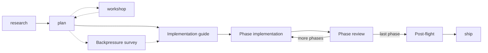

# Getting started with Builder

Builder is one progressive-disclosure skill around one canonical SDD lifecycle. It delivers the requested software and evidence about the environment used to build it. The engineering harness supplies deterministic checks; the agent harness supplies reasoning/tools. Neither replaces the other.

## Journey



The diagram's repeated phase relation describes successive phase nodes, not a cycle in persisted flow state. The stored DAG is `research → plan → impl-guide → (phase-N → review-N)* → post-flight → ship`. Workshops, ADRs, backpressure, fix-loops and optional upstream reconciliation are excursions, not extra mandatory milestones. Baseline, work-packet dispatch and composition are implementation substeps, never another team lifecycle.

## Entry

- `/builder` resolves fresh/resume/adopt from durable artifacts; `/the-flow` remains a compatibility entry.
- `/builder <id> <verb>` directly runs one stage. Id or verb resolves alone, but printed commands carry both.
- `/builder sync` reconciles structure without advancing the cursor.
- `harness builder` is the deterministic CLI, not the skill command. It checks records and permissions; `harness flow` remains the canonical state writer.

| Command | Artifact / purpose |
|---|---|
| `/builder 1a explore "<intent>"` | grounded research dossier |
| `/builder 1b plan "<intent>"` | product `plan.dd.json`: WHAT/WHY, scope and observable ACs |
| `/builder 2c workshop <plan> "<topic>"` | authoritative decision, product or implementation |
| `/builder 3a adr "<decision>"` | durable architectural decision |
| `/builder 4 guide --plan <path>` | separate `assets/impl-guide.dd.json`: contracts, owners, waves, composition and proof |
| `/builder 5 tasks --plan <path> --phase "Phase N: Title"` | bare-ordinal phase task DD and assertion pressure links |
| `/builder 6 implement --plan <path>` | committed units and actually verified composition |
| `/builder 6a progress --plan <path> --task <id> --status <state>` | factual task/proof updates by the authorized owner |
| `/builder 7 review --plan <path>` | scoped independent review, never fabricated cross-model execution |
| `/builder 7b post-flight --plan <path>` | closeout, whole-plan completion at EXIT, archive and preservation |
| `/builder 8 ship --plan <archived path>` | separate push/PR confirmations and observed CI; merge requires typed PROCEED |
| `/builder 8c reconcile --plan <path>` | conditional base reconciliation, never implicit merge |

Simple mode reduces phases, not rigor: it still has product intent, an implementation guide, proof and the required review. Solo execution is correct when the architecture is not separable; it never stands in for unavailable requested review.

## Architecture earns parallelism

Good: parser and renderer consume a committed shared document DTO, have injected collaborators/fakes, own disjoint implementation paths and can be tested without sibling source. The PM composes them only after deliveries. Bad: two file-based assignments share mutable globals, import each other's unfinished implementations or both edit the same dispatcher. Splitting files did not split responsibility.

The guide captures that judgement; the deterministic checker checks dependencies/links and surfaces ownership-only warnings without a veto. A structural green is not architectural approval. Read `team-lifecycle.md` for the exact new/adopt/guide/ready/contracts/settings/dispatch/self-check/on-track/advance/compose/review/close/tidy grammar and envelopes.

Run the real worked example:

```bash
node skills/builder/examples/verify.mjs
node skills/builder/examples/proof-recipe.mjs scratch/builder-proof-example
```

The first exercises injected parser/renderer services, explicit composition, a justified solo transaction and detectable bad independence. The second uses local `node_modules/.bin/ddocs` to write and validate actual survey/proof links in a new private corpus. Example results are not a claim that your feature or a real model session passed.

## Evidence travels with work

One canonical survey is `assets/backpressure.dd.json`, schema `builder/backpressure`. Its generated `.dd.md` is only a view. Select RUN/EXTEND/BUILD/ABSENT from actual repo tooling, link each AC and task assertion through `pressure`, and after execution link the AC through `proven_by` to its observed execution-log entry. Certainty is `Partial|Confident|Proven`; selection is not execution. `backpressure-recipe.md` is the shared recipe used by both skills.

The parent fires `/eng-harness-flow` at work seams: pre-flight boot, pre-coding survey, mid-work observation, post-coding drain and post-flight harvest/improvement offer. Chores are mandatory for the agent and human-declinable; only a real invocation/detection receipt or explicit human decline satisfies one. No hand-authored success envelopes.

## Files and ownership

```text
docs/plans/<ordinal>-<slug>/
  plan.dd.json + plan.dd.md
  the-flow.json + the-flow.md
  original-ask.md
  assets/
    impl-guide.dd.json + impl-guide.dd.md
    backpressure.dd.json + backpressure.dd.md
    execution-log.dd.json + execution-log.dd.md
    research-dossier.md
    workshops/
    tasks/phase-N/tasks.dd.json + tasks.dd.md
    team/
    reviews/
    post-flight.md
    ship/
```

PM owns canonical state; coder and PM write/read maps guide work rather than fence source access. Each briefing starts with owned paths, read paths/owners, the job/interface and observable done conditions, followed by the exact packet pointer/digest. For a new dispatch, receiving the `builder/work-packet` starts the unit without a separate release. Optional `harness builder self-check <packet> --sha256 <digest>` compares bytes, checkout root and source SHA with warning-only guidance and no writes. Import checks the real tree/branch/commit, current immutable bindings, distinct peers and sealed ancestry, not startup receipts or transport outcome. See [team operations](./team-lifecycle.md) for cause/fix guidance and user authorization boundaries. Historical receipts stay unchanged; import is not composition proof. Close preserves artifacts, WIP, reports, observations, telemetry and refs outside every retiring root; tidy separately re-verifies ownership and runtime release. Idle does not mean closed.

Already-running worker? `dispatch --adopt-peer <id>` binds its existing workspace and actual `--parent`, preserving adopted ownership, source, progressed HEAD and WIP without spawning, replaying or granting new work. Already integrated? `compose --import <path> --already-integrated` proves every supplied unit's frozen mapped tree equals current committed PM HEAD, with delivery-touched fallback for an empty concrete map, preserving original worker SHAs without reapplying changes. Missing evidence, empty proof and digest/tree mismatches still fail; map deviations warn. The modifier requires import, cannot accompany verify, and never replaces `compose --verify` or independent review. No flag or receipt alone proves the product works.

Later PM refinements already landed? Add `--integration-sha <ref>` to already-integrated import. Builder checks the sealed-source-to-HEAD ancestry and matches delivery trees at that commit without moving the checkout; `--verify` handles the later PM changes.

Use `harness builder on-track <plan> [--unit <id>] [--from <ref>] [--to <ref>] [--untracked]` at any time without readiness, a seal, review or receipts. It writes nothing and exits 0; read `compared`, selected basis, warnings and actionable issues. Default includes tracked staged/unstaged work, `--untracked` explicitly adds new paths, and explicit `--to` is committed-only. A named unit selects its delivery comparison; otherwise inspect the PM maps. Out-of-map edits need no approval or justification. Keep `file`/`owning_unit` warnings visible in independent review; real integrity and product-check failures still fail.

Completed historical Markdown/DD plans remain readable without conversion, retroactive guide gates or node resurrection. Existing archive paths resume only when explicitly named, never automatically as active work. New writes use DD and the separate guide; do not establish a second convention beside them.
