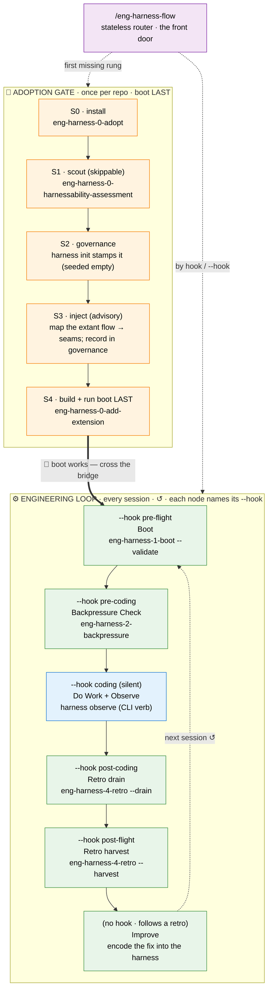
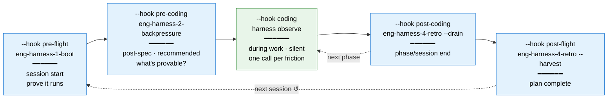
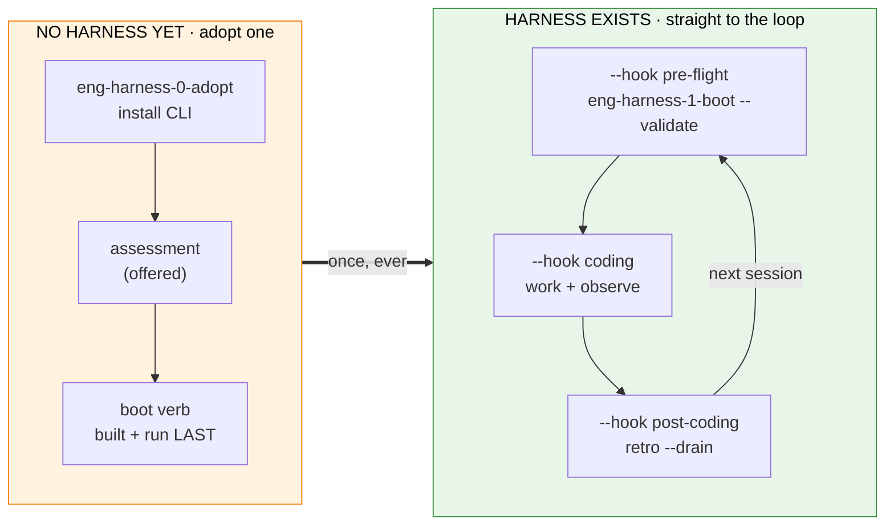

# The Harness Loop — Getting Started

A visual guide to the **engineering-harness skills** and the loop they operate. The entry point is almost always **`/eng-harness-flow`** — the stateless front-door router that works out where your repo sits and hands back the one right next command. Everything else chains from there.

> Repo reference: the adoption-side skills live at `skills/eng-harness-setup/` and the loop skills at `skills/eng-harness-loop/` in [`AI-Substrate/harness-engineering`](https://github.com/AI-Substrate/harness-engineering). Full skill matrix: `skills/README.md`. Zero-context consumer-agent onboarding: `AGENTS_README.md`. CLI details: `harness/cli/README.md` (or in-CLI via `harness docs`).

---

## The Big Picture

Two zones, one bridge:

- **🧰 Adoption gate** (once per repo) — the repo *adopts* the harness: install the CLI, scout the repo, governance, an injection point into the flow you already run, and a **working boot command — built LAST**, deliberately, so the moment it works you run it and flow straight into real work.
- **⚙️ Engineering loop** (every session, forever) — the cycle that *runs* the substrate: `Boot → Backpressure Check → Do Work and Observe → Retro and Magic Wand → Improve`, then back to Boot. It never "completes" — it compounds.

The router (`/eng-harness-flow`) sits *beside* both zones, not inside either: on every call it re-reads the repo's deterministic signals and routes you to the first missing adoption rung, or — once the gate holds — to the right loop stage for where your work is.

A parent flow that already knows where it is doesn't have to let the router guess — it **names the moment** with one of **five neutral lifecycle hooks** (`--hook pre-flight | pre-coding | coding | post-coding | post-flight`). That five-hook vocabulary is the stable, host-facing surface the rest of this guide keeps returning to (full contract: [§ The hook contract](#the-hook-contract-for-parent-flows)).



**Legend**: 🟠 orange = adoption gate · 🟢 green = loop skills · 🔵 blue = a CLI verb, not a skill · 🟣 purple = the router. Solid = the establishing order, dashed = routing / the cycle re-entering. Each **loop** node also names the `--hook` a host uses to reach it — that's the host-facing vocabulary (the **adoption rungs are not hooks**; `coding` is *silent* and `Improve` has none — see [§ The hook contract](#the-hook-contract-for-parent-flows)).

---

## How the two zones fit

The adoption gate produces the **substrate** (CLI → report → governance → injection point → a proven boot). The engineering loop produces **compounding value** — it proves the system runs before you touch it, catches friction while you work, and turns that friction into encoded improvements, so the next session is smoother than this one.

Three rungs are **required** before the router will route into the loop — without them the loop skills honestly report `UNAVAILABLE` / no-op:

| Rung | What must hold | Required? |
|---|---|---|
| **S0 · Install** | harness CLI present, `harness doctor` healthy | **required** |
| **S1 · Scout** | a harnessability report exists | skippable |
| **S2 · Governance** | `.harness/engineering-harness.md` (the BIO contract) | **required** — *stamped by `harness init` (seeded empty); body fills at the Improve beat* |
| **S3 · Inject** | the governance doc's `## Injection map` — which seams your extant dev/SDD flow fires, from where (so the harness gets *used*, not just installed) | advisory |
| **S4 · Boot** | a working boot verb, authored **and run once** | **required** |

```
Boot ──────────────────────────────────────────────────────────────► Retro
  │                         Do Work                                     │
  │  ┌────────────────────────────────────────────────────────────┐    │
  └─►│   your normal dev flow (specs, plans, tasks, commits…)      │◄───┘
     │   (harness observe fires one-liner captures throughout)  │
     └────────────────────────────────────────────────────────────┘
```

---

## Where the loop plugs in — and who pulls the trigger

Each loop stage below carries the **lifecycle hook** a host flow names to reach it (`--hook <name>`, shown inline); the router maps the hook to the skill/verb. Two rows carry no hook — the **front door** and **Improve** — because neither is a seam a host fires: the router *is* the front door, and Improve simply follows whatever a retro decides. Full map + `--event` aliases: [§ The hook contract](#the-hook-contract-for-parent-flows).

| Loop stage · hook | Skill / verb | Who calls it | When |
|---|---|---|---|
| **Front door** | `/eng-harness-flow` | **You**, or a parent flow, anytime | Whenever you're unsure where you are. Stateless — safe to call repeatedly; it re-derives position from repo signals every call and routes exactly one next step. |
| **Boot** · `--hook pre-flight` | `eng-harness-1-boot --validate` | **You** (or the router) at session start | Re-runs the boot that adoption built — proves the system is healthy *before* any code is written. Reports `UNAVAILABLE` (not an error) when no governance doc exists → routes back to adoption. |
| **Backpressure Check** · `--hook pre-coding` | `eng-harness-2-backpressure` | **You**, recommended, post-spec | After scoped work is defined, before you architect/build it. Surveys whether the work is *provable by deterministic sensors* (build/type/test/lint/smoke/boot/architecture/schema) vs inference; writes `backpressure-coverage.md`; may recommend an optional "Phase 0: Establish Backpressure". Advisory — the sensors prove, never the LLM. Never blocks. |
| **Observe** · `--hook coding` | `harness observe "<what>" --kind <kind>` | **You/your agent, the moment friction happens** | A CLI verb, not a skill — one silent call per noticing (confusing failure, retry, backtrack, slow command, "if only there were…"). Lands in the gitignored buffer `.harness/temp/`. Capture judgment lives in `eng-harness-4-retro` § in-flight capture. |
| **Retro (drain)** · `--hook post-coding` | `eng-harness-4-retro --drain` | **You** at phase/session end, buffer non-empty | The one normal user-facing retro prompt: triage `[s/t/p/e/d/a]`, materialize kept entries into a committed record via `harness record retro`, then clear the buffer. |
| **Retro (harvest)** · `--hook post-flight` | `eng-harness-4-retro --harvest` | **You**, at plan completion / periodically | Read-only curation across `.harness/records/retro/**` — what recurs, what's stale, what to encode next. Recurrence is framed as token cost. Drain first if the buffer is non-empty. |
| **Improve** | retro `[e]ncode` / `eng-harness-0-add-extension` | **You**, when a retro names a fix | The beat where the loop compounds: ship the fix as a command, sensor, fixture, or doc — then a `harness-change` record is written. Most loop runs encode nothing, and that's fine. |

**Opt-out is conversational.** There is no `.disabled` sentinel for the loop — if you don't want it, say so and the agent stops calling the loop skills. Nothing gates, scores, or blocks.



---

## Two on-ramps: fresh repo vs existing harness

The router tells these apart from signals alone (a `.harness/` directory, project-local skills, a governance doc) — you never have to know which path you're on.



**Fresh repo** — the router stays on the 🧰 adoption track and routes the first missing required rung. **Existing harness** — S0 + S2 + S4 hold, so every call dispatches into the ⚙️ loop by **lifecycle hook**: `pre-flight` → boot, `pre-coding` → backpressure, `coding` → observe, `post-coding` → drain, `post-flight` → harvest. (Hosts that still emit the older `--event` seams — `session-start`/`pre-implement`, `post-spec`, `task-pause`, `phase-end`, `plan-complete` — alias straight onto those same five hooks.)

---

## Example Walkthrough

> **Scenario**: you point an agent at a repo that has never seen a harness. (This is the journey the `validate-harness-flow` extension replays end-to-end as a self-test — it's proven, not aspirational.)

```
0.  /eng-harness-flow
    → Router reads signals: no CLI, no .harness/ → routes S0.
      "🧰 Looks like this repo hasn't adopted a harness yet — rung 0 of 5:
       install first; boot comes last."

1.  eng-harness-0-adopt        (S0 · install)
    → npm install -g @ai-substrate/engineering-harness   ← global, public npm, no auth
    → harness instructions   ← the agent briefing (AGENTS START HERE)
    → harness doctor --json  ← envelope healthy, exit 0

2.  eng-harness-0-harnessability-assessment   (S1 · scout, offered)
    → Writes .harness/reports/harnessability/latest.{md,json}
      — Operate-Today + Adaptability grades, proof ceilings, back-pressure surfaces.
      An honest "this repo isn't workable" here is a valid outcome.

3.  Governance (S2) — harness init
    → stamps .harness/engineering-harness.md (BIO skeleton, maturity L0, every
      other field a TODO). Idempotent never-clobber. The doc now exists but is empty;
      boot stays UNAVAILABLE until S4 builds the boot command. Nothing errors.

4.  eng-harness-0-add-extension               (S4 · boot, built LAST)
    → harness new boot --wrap "npm test"
    → Verify independently — never trust your own scaffold:
      harness doctor --json · harness instructions boot · harness boot --json
    → 🎉 boot's working — that's the harness alive. Cross the bridge.

5.  Work normally, loop around you:
    → eng-harness-1-boot --validate at each session start (re-RUN, never re-build)
    → eng-harness-2-backpressure once scoped work is specced, before building
    → harness observe "doctor's E143 message pointed at the
      wrong dir" --kind difficulty --severity degrading     ← the moment it happens

6.  eng-harness-4-retro --drain               (session end)
    → [s/t/p/e/d/a] triage → harness record retro → committed record in
      .harness/records/retro/ → buffer cleared.

7.  eng-harness-4-retro --harvest             (later, across sessions)
    → "this friction recurred 3× — encode it" → eng-harness-0-add-extension
    → the Improve beat ships a fix; a harness-change record is written. ↺
```

You can drive every step by hand, but you never have to *route* by hand — `/eng-harness-flow` at any point answers "where am I and what's next?" from the repo itself.

---

## Quick Reference

| Command | What it does | Produces |
|---|---|---|
| `/eng-harness-flow` | **Front door** — stateless router; host flows pin a lifecycle hook (`--hook pre-flight\|pre-coding\|coding\|post-coding\|post-flight`, with `--event` as an accepted alias); re-derives position from signals A–J and routes one next step | nothing of its own (a routing decision; `--json` envelope for machine callers) |
| `eng-harness-0-adopt` | The adoption flow: install CLI → scout → inject → stand up `boot` | installed CLI; orchestrates the rungs |
| `eng-harness-0-harnessability-assessment` | Size up the repo — evidence vs inference vs unknowns | `.harness/reports/harnessability/latest.{md,json}` |
| `eng-harness-0-add-extension` | Guided authoring of a new `harness <verb>` (incl. `boot` at S4) | `.harness/extensions/<name>/` (entry + `instructions.md`) |
| `eng-harness-1-boot` | Re-run the boot adoption built; readiness verdict + maturity read | terminal report (healthy / SLOW / UNHEALTHY / UNAVAILABLE) |
| `eng-harness-2-backpressure` | Deterministic-sensor coverage survey for scoped work | `docs/plans/<ordinal>-<slug>/backpressure-coverage.md` |
| `harness observe "<what>" --kind <kind>` | Capture one friction entry (CLI verb, not a skill) | one buffer entry in gitignored `.harness/temp/` |
| `eng-harness-4-retro --drain` | Soft-prompt triage of the buffer (`[s/t/p/e/d/a]`) | committed record via `harness record retro` |
| `eng-harness-4-retro --harvest` | Curated cross-plan friction view (read-only) | terminal print (`--json` for tooling) |
| `harness doctor --json` | What's configured + which extensions loaded/failed | JSON envelope, every complaint has a `next_action` |
| `harness instructions [verb]` | The agent briefing — AGENTS START HERE | terminal print |

> **Never run bare `npx harness`** — that fetches an unrelated npm package. The CLI is an **ambient global tool**, so after install just call `harness …` directly (it's on PATH). A no-global-write alternative is `npx @ai-substrate/engineering-harness …` (the scoped package, run from the npm cache).

---

## Directory Structure

```
<your-repo>/
├── .harness/
│   ├── engineering-harness.md      ← governance doc (BIO contract) — canonical, only location
│   │                                  (stamped by `harness init`, seeded empty; see references/governance-doc.md)
│   ├── extensions/
│   │   └── boot/
│   │       ├── extension.ts        ← the verb (default-exports a HarnessVerb)
│   │       └── instructions.md     ← agent briefing (`harness instructions boot`)
│   ├── reports/
│   │   └── harnessability/
│   │       └── latest.{md,json}    ← the scout's graded report
│   ├── records/
│   │   ├── retro/                  ← COMMITTED team memory (drain materializes here)
│   │   └── harness-change/         ← the harness changelog: one record per ENCODED improvement
│   └── temp/                       ← GITIGNORED session scratch (the observe buffer)
└── AGENTS.md                       ← routes future agents to the harness at session start
```

The `harness` CLI itself is **not** in this tree — it's an **ambient tool** (installed globally, like `git`/`node`), never committed. Adoption leaves only `.harness/` substrate and the `AGENTS.md` cue in the repo.

Two storage classes, one rule: `.harness/records/` is **committed team memory**; `.harness/temp/` is **gitignored session scratch** (the CLI self-heals that protection; `doctor` checks it).

---

## Key Concepts

### The router is stateless — and that's the feature

`/eng-harness-flow` writes no state file and owns no artifacts. It re-derives position on every call from deterministic substrate (`harness doctor`, the governance doc, the harnessability report, plan artifacts, the observe buffer) — so it survives `/compact`, serves any caller (a human, a parent flow like the SDD pipeline's `/the-flow`, a CI agent), and never drifts from reality. The only durable "done" signal is a **child skill's artifact**, never the router's memory. If the router ever seems to need memory, that state belongs in substrate a child skill owns.

### The hook contract (for parent flows)

A host running its own flow doesn't make the router guess where it is — it **names the moment** with a `--hook <name>`. There are exactly **five neutral lifecycle hooks**: the set is **fixed at five** (never grown per-repo) and **stateless** (re-derived every call, never stored). Each hook names a moment in *your* lifecycle — never a child-skill slug — so the harness vocabulary stays stable even as the child skills behind it are renamed or moved.

#### The five hooks

| Hook | The moment it names | Kind | Resolves to | Produces |
|---|---|---|---|---|
| `pre-flight` | boot / session start, before any code | **fire** | `eng-harness-1-boot --validate` | a boot verdict (healthy / SLOW / UNHEALTHY / UNAVAILABLE) |
| `pre-coding` | spec written, before you build | **fire** | `eng-harness-2-backpressure` | `backpressure-coverage.md` |
| `coding` | mid-build, the moment friction bites | **silent** | `harness observe "<what>" --kind <kind>` | one entry in the gitignored buffer (`.harness/temp/`) |
| `post-coding` | phase / session end | **fire** | `eng-harness-4-retro --drain` | buffer drained → committed retro record |
| `post-flight` | plan / journey end | **fire** | `eng-harness-4-retro --harvest` | terminal close-out: curated cross-plan view → present + encode improvements |

Optional pins narrow a hook to the right target: `pre-flight` takes `[--phase <id>] [--plan-dir <p>]`; `pre-coding` takes `--spec <path>`; `post-coding` takes `--plan-dir <path>`.

#### Two kinds: **fire** vs **silent**

- A **fire** hook *routes a child verb* — the host calls `/eng-harness-flow --hook <name>` and runs what the router hands back. Four of the five are fire hooks.
- The lone **silent** hook, `coding`, has **no `/eng-harness-flow --hook coding` to run**. The router only *describes* it; the actual capture is the `harness observe` CLI verb the host **hand-wires** into its flow — one quiet call per noticing (a confusing failure, a retry, a backtrack, "if only there were…"). This is why the `--hooks` discovery manifest carries `coding`'s `invoke` as the literal `harness observe "<what>" --kind <kind>` string, not a router command — a host must wire it from that string, not infer a fire.

#### `--event` is a permanent alias

`the-flow` and other hosts emit `--event <seam>`, and nothing that does will ever break — `--event` is a **permanent, transparent alias** for `--hook`. Six host seams fold onto the five hooks (`session-start` and `pre-implement` both open onto `pre-flight`):

| `--event` seam | → `--hook` |
|---|---|
| `session-start`, `pre-implement` | `pre-flight` |
| `post-spec` | `pre-coding` |
| `task-pause` | `coding` |
| `phase-end` | `post-coding` |
| `plan-complete` | `post-flight` |

#### Call discipline

- **One hook per call.** The router routes exactly one next step; the host calls again for the next moment.
- **A hook is a hint, not a command.** It's validated against the repo's signals and **redirected** when it can't hold — `--hook pre-flight` (alias `at=boot`) on a repo with no governance politely routes to adoption and says why; it never blindly runs the named stage.
- **Machine callers** add `--json` for the routing envelope (it carries the resolved `hook` field), and `--hooks --json` returns the full discovery manifest a host reads once to learn the contract.

Full vocabulary + the nine-field discovery manifest: the router's [`SKILL.md` § Lifecycle hooks](../SKILL.md).

### Maturity (L0–L4)

The ladder runs from L0 (no harness — tribal knowledge) to L4 (self-improving — the harness regularly produces improvements during normal work). Boot *reads* the current level from the governance doc; the trajectory lives in the `harness-change` record ledger. Report the level that's actually working, never the aspirational one. Full ladder + assessment guide: [`maturity-assessment.md`](./maturity-assessment.md).

### The harness loop in one sentence

> Boot proves the system runs, Backpressure asks what's provable before you build, Observe catches friction while you work, Retro turns that friction into encoded improvements — so the harness *is* the product, and every difficulty catalogued is a gift to your future self.
