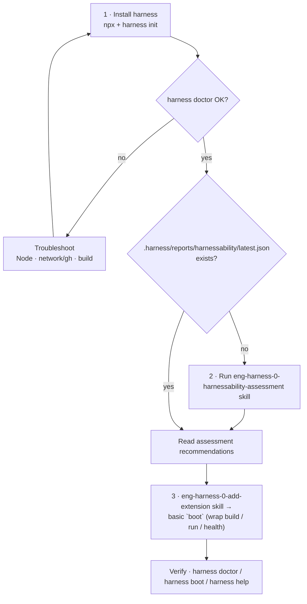
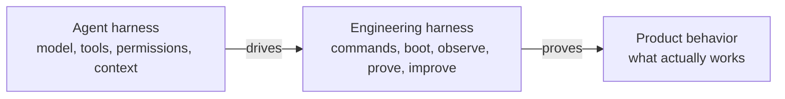

# eng-harness-0-adopt

Install a repo's **engineering harness** from npx and guide the user to a working basic `boot` — the command every engineering task starts from.

This skill is a **flow**, not a generator. It installs the harness CLI, then orchestrates two sibling skills — `eng-harness-0-harnessability-assessment` (size up the repo) and `eng-harness-0-add-extension` (author the first extension). It **creates no files of its own**: the deterministic substrate (the `.harness/` nucleus, retros, known-difficulties, back-pressure surfaces) is owned by the harness CLI as real code, with `harness init` stamping the governance doc.

> **The agent harness drives. The engineering harness proves.**

## The flow



## When to use

Run this when a repo has no working `harness boot` (or no harness front door at all) and you want an agent-operable engineering loop started quickly. Safe to re-run — it detects what already exists and only fills the gap.

## What it does

1. **Install the harness** via `npx github:AI-Substrate/harness-engineering`, make it resolve locally (`npm install github:AI-Substrate/harness-engineering`), stamp the governance doc with `npx harness init` (seeds it empty — L0, `TODO` fields; idempotent; older CLIs that predate it fall back gracefully), and sanity-check with `npx harness doctor` (a fresh consumer repo can still report `degraded` on individual layers — the signal is that the CLI runs and returns an envelope, exit 0).
2. **Assess harnessability** — only if no report exists at `.harness/reports/harnessability/latest.json` (or any file under `.harness/reports/harnessability/`). Runs the `eng-harness-0-harnessability-assessment` skill and reads its recommendations.
3. **Stand up a basic `boot`** — via the `eng-harness-0-add-extension` skill, wrapping the repo's real readiness command (build / run / health) chosen from the assessment. Boot returns a ready/degraded/error verdict and re-orients the agent.

## Why `boot`

"Boot is the first proof." Before coding, an agent runs `harness boot` to prove the environment is ready **and** to be reminded how the harness works. The deliverable here is a **working boot, even if basic** — a thin wrapper over existing commands. Don't boil the ocean; the harness is self-improving, so boot grows by use.

## What it does **not** do

- No governance doc, `AGENTS.md` block, `docs/harness/` scaffold, placeholder CLI, or retro/known-difficulties files — those are `harness init` / CLI concerns.
- No reimplementation of `eng-harness-0-harnessability-assessment` or `eng-harness-0-add-extension` — it calls them.
- No comprehensive boot — basic nucleus only.

## Where it fits

```text
eng-harness-0-adopt  ->  eng-harness-0-harnessability-assessment  ->  eng-harness-0-add-extension (boot)  ->  runtime loop
   install + drive the CLI       report-only readiness         author the nucleus       boot · work · observe · retro · improve
```

Use **setup** to install and bootstrap. Use **eng-harness-0-harnessability-assessment** to get a target-aware readiness picture (it writes `.harness/reports/harnessability/`). Use **eng-harness-0-add-extension** to author `boot` (and later extensions). Use the runtime harness-loop skills to operate day to day.

## Agent harness vs engineering harness

The agent harness is adjacent to the engineering harness; it does not replace it.



The boundary sentence is load-bearing: **The agent harness drives. The engineering harness proves.**
