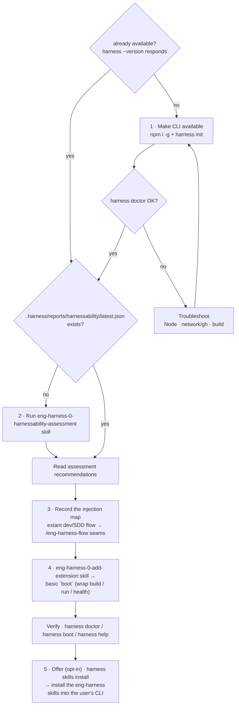

# eng-harness-0-adopt

Walk a repo through **adopting** the engineering harness — the moment it decides to make its **deterministic layer** a first-class thing. Adoption wraps what already exists (build / test / run, as-is), weaves the loop into the repo's extant dev flow, and leaves behind the one thing every engineering task starts from: a **basic `boot`**. This is hand-held, not silent: every step that touches the user's repo is proposed first.

This skill is a **flow**, not a generator. It makes the harness CLI available (an ambient tool, installed **globally** — never a repo dependency), then **orchestrates other skills** — `eng-harness-0-harnessability-assessment` to size up the repo, and `eng-harness-0-add-extension` to author the first extension. It **creates no files of its own**: the deterministic substrate (the `.harness/` nucleus, retros, known-difficulties, back-pressure surfaces) is owned by the harness CLI as real code (`harness init` stamps the governance doc), not re-generated here.

> **The agent harness drives. The engineering harness proves.**

## The flow



Four steps to a working boot, plus an opt-in fifth that offers to install the harness's own skills. Each box is a CLI call, a hand-off to another skill, or a recorded decision. The goal is **a working boot, even if basic** — the nucleus a team self-improves from — already wired into the flow the repo actually runs.

## When to use

Run this when a repo hasn't adopted a harness yet — no working `harness boot`, or no harness front door at all — and you want to get an agent-operable engineering loop started quickly. It is safe to re-run: it detects what already exists and only fills the gap.

## Why `boot` is the deliverable

"Boot is the first proof." Before any engineering work, an agent runs `harness boot`, which:

- **proves the environment is ready** — builds / installs if needed, starts the product (directly or via `docker compose up`), and confirms readiness with a health, smoke, or "tests pass" signal; and
- **re-orients the agent** — a boot (like `doctor`) is orientation, not just diagnostics: it reminds the agent how this project wants to be operated and what to do next.

Keep it a **basic nucleus**. Do **not** boil the ocean — a thin wrapper over the repo's existing commands is the whole job here; the harness is self-improving, so boot grows by use. (The CLI may later flag a missing `boot`, reinforcing it as the expected entry point.)

---

## Step 1 — Make the harness CLI available

The harness CLI is an **ambient tool** — like `git`, `node`, or `gh` — **not** a repo dependency. The job here is *check it's available*, and only install (globally) if it's missing. **Nothing about the CLI is committed into the user's repo**: no `package.json` entry, no `.npmrc`, no `node_modules`, no lockfile. The only things this flow leaves in the repo are `.harness/` substrate and (with consent) `AGENTS.md` edits. The CLI is published to the **public npm registry** as `@ai-substrate/engineering-harness`, so a global install needs **no token or `.npmrc`** (Node `>= 22`).

1. **Check whether the CLI is already available — never blindly (re)install:**

   ```bash
   harness --version 2>/dev/null || echo "NO_HARNESS"
   ```

   A version back means `harness` is on PATH: **skip the install (step 2)** and jump to the nucleus + sanity-check (steps 3–4). A `.harness/` directory is the same signal the repo is already adopted. Only `NO_HARNESS` (or command-not-found) proceeds with the install below.

2. **Install the CLI globally** (only if missing) — public npm, zero auth:

   ```bash
   npm install -g @ai-substrate/engineering-harness
   # pin a release if you want reproducibility:
   # npm install -g @ai-substrate/engineering-harness@vX.Y.Z
   ```

   This writes to your **global** npm prefix (the user's machine), **never the repo** — no `package.json`, lockfile, or `node_modules` is added to the project. Afterwards `harness` resolves on PATH, so every example below calls `harness <command>` directly. (Once any copy is available, `harness self-install` does the same global bootstrap from the registry.)

   > **Never run bare `npx harness`** — that fetches an unrelated `harness` package from the npm registry. Use the globally-installed `harness`. (Inside the engineering-harness *source* repo itself, invoke `node harness/cli/bin/harness.js …`.) A no-global-write alternative is `npx @ai-substrate/engineering-harness <command>` — the scoped package, run from the npm cache.

   > **`EACCES` writing the global prefix?** That's a permissions problem, not auth: set a user-writable prefix (`npm config set prefix ~/.npm-global`, then add its `bin` to PATH) and re-run, or use a Node version manager (nvm/Volta).

3. **Initialise the nucleus** — run the deterministic bootstrap:

   ```bash
   harness init
   ```

   > **What `init` does (and the rare miss).** `harness init` stamps `.harness/engineering-harness.md` deterministically — the BIO skeleton, seeded maturity **L0**, every other field a `TODO`; it is idempotent (an existing doc is left untouched, `created:false`). On a current CLI this just works. If an **older** installed CLI doesn't recognise it (unknown-command error), **do not fail** — continue; `.harness/extensions/` is still created lazily by `harness new` (Step 3). Upgrade the CLI to get the governance doc stamped.

   `.harness/temp/` is transient agent scratch — never committed; the CLI self-heals its nested `.gitignore` and `harness doctor` checks the convention.

4. **Sanity-check** with the CLI's own front door:

   ```bash
   harness doctor          # human-readable
   harness doctor --json    # envelope: status / data / error / next_action
   ```

   On a fresh consumer repo, the `cli-build` layer reports **ok (n/a)** — it only runs a real build check inside the CLI's own repo (FX001) — and `.harness/extensions/` is **empty**; both are expected, not failures. `doctor` can still go `status: degraded` for other reasons (a missing tool, a failed extension), so the signal you need is that the CLI **runs and returns an envelope** (exit 0); read `data.layers` / `data.extensions` rather than gating on a top-level `ok`.

### Troubleshooting

| Symptom | Likely cause | Fix |
|---------|-------------|-----|
| `command not found: npm` / `node` / very old Node | Node toolchain missing/old | Install a current Node LTS (>= 22); re-run. |
| `npm install -g …` → `EACCES` | Global prefix not writable | Set a user-writable prefix (`npm config set prefix ~/.npm-global`, add its `bin` to PATH), or use nvm/Volta; re-run. |
| `npm install -g …` 404 / registry rejects | Wrong registry, or offline | Confirm `npm config get registry` is `https://registry.npmjs.org`; the package is public, so no token is needed. |
| `harness init` → unknown command | CLI older than `init` (FX001) | Rare — upgrade the CLI (`npm install -g @ai-substrate/engineering-harness@latest`); meanwhile skip per the note above, `harness new` still creates `.harness/`. |
| `harness doctor` non-zero with a real error | Genuine config problem | Follow the envelope's `next_action`; it prescribes the fix. |

**Read only the envelope.** When parsing CLI output programmatically, use `--json` (the `status` / `data` / `error` / `next_action` fields) and exit codes — never scrape human prose. This keeps the flow forward-compatible with a future MCP server over the same surfaces.

---

## Step 2 — Assess harnessability (only if not already done)

Check for an existing assessment report. The canonical sentinel is `latest.json`; treat **any** file under the report directory as an existing report (the AC4 fallback):

```bash
# reuse if the sentinel exists, OR any report file is present in the dir:
test -f .harness/reports/harnessability/latest.json \
  || ls .harness/reports/harnessability/* >/dev/null 2>&1
```

- **Report exists** (sentinel `latest.json`, or any file under `.harness/reports/harnessability/`) → reuse it. Read its recommendations (highest-leverage improvements / remediations) — they tell you what `boot` should prove first for *this* repo. (The producer keeps the root `latest.json` current on every run and stores per-run history under `.harness/reports/harnessability/<ordinal>-<slug>/`; reading the root `latest.json` always gives the newest run.)
- **No report** → run the **`eng-harness-0-harnessability-assessment`** skill (read-only by default). It scores Operate-Today and Adaptability and emits the recommendations that drive Step 3.

> The assessment is a separate skill — invoke it, don't reimplement it. The flow only needs its **recommendations** to choose the first `boot`.

---

## Step 3 — Record the injection map (so the harness gets *used*)

An installed harness that nothing calls **disappears on the next cold agent start** — a fresh agent only runs what's in the surfaces it already loads. This step makes usage structural instead of memorial: identify the repo's *extant* development flow, map its natural moments onto the harness's five lifecycle hooks, weave the calls into surfaces a cold agent loads anyway, and record the result. It runs **before** boot deliberately (the router's adoption gate orders S3 · Inject before S4 · Boot) so the instant boot works, the harness is already plugged into real work.

1. **Identify the extant flow.** Read `engineering_flows[]` from the harnessability report (Step 2) — the assessment already inventories SDD-like pipelines (a `plans/` directory, `/plan-*` or `task-*` skills, RFC/ADR conventions) alongside build/test/release/review flows. No report or no entry → take a quick look yourself (skills directories, `docs/plans/`, CI workflow names, CONTRIBUTING).

2. **Map flow moments → hooks.** The router exposes its loop as five neutral lifecycle hooks: `pre-flight | pre-coding | coding | post-coding | post-flight` (the six `--event` seams — `session-start`/`pre-implement`→`pre-flight`, `post-spec`→`pre-coding`, `task-pause`→`coding`, `phase-end`→`post-coding`, `plan-complete`→`post-flight` — are the permanent alias). Whatever the host flow calls its stages, find where those moments fall. Not every flow has every hook — map what exists, skip the rest.

3. **Propose the map to the user before touching anything.** This is *their* flow — the step is a hand-held conversation, never a silent batch edit. Show the proposed map as a small table (flow moment → hook → the surface that would carry the call), with one line per hook on why it earns its place. Invite pruning: the user reshapes or declines hooks freely, and "none, thanks" is a perfectly good answer.

4. **Weave the accepted calls** into surfaces a cold agent already loads — **per surface**: show the exact edit (which file, what gets inserted, where) and get an explicit go-ahead for *each* file before applying it. Never bundle the edits into one approval, and never present the weave as already done:

   | Repo shape | Where the hooks go |
   |------------|--------------------|
   | Flow is already harness-aware (its skills/guides fire `/eng-harness-flow --hook …` — or the `--event` alias — themselves) | Nothing to weave — record "host flow self-fires" and which hooks it covers |
   | Flow skills / instructions live **in this repo** | Add `/eng-harness-flow --hook <name>` calls at the mapped moments in those files |
   | No formal flow (plain branch/PR work) | The agent-context surface (`AGENTS.md` or equivalent) carries the cues: `--hook pre-flight` when work begins, `--hook post-coding` before a PR/handoff |

   A declined weave is a fine outcome — record what was decided either way (a map row can say `declined` or `manual`).

5. **Record the injection map** in the governance doc (`.harness/engineering-harness.md`) under a `## Injection map` heading — one row per lifecycle hook: the hook, where it fires from, and what fires it. This is the durable artifact the router's S3 rung reads; without it, the stateless router re-offers this step on every call. `harness init` stamps the `## Injection map` section as an empty table; this step fills its rows. **If the governance doc isn't present yet** (`harness init` wasn't run, or an older CLI predates it), propose the map in conversation, note it as pending, and move on; never hand-create the governance doc here — run `harness init` to stamp it first. See [`../../eng-harness-loop/eng-harness-flow/references/governance-doc.md`](../../eng-harness-loop/eng-harness-flow/references/governance-doc.md).

**Ask first, always.** The weave edits the user's own files; nothing in this step is applied without the user having seen the specific change and said yes to it. Keep descriptions of the host flow generic and public-safe (name the flow's *shape*, never private tooling identifiers the repo doesn't already commit).

---

## Step 4 — Stand up a basic `boot`

Use the assessment's recommendations to pick the **cheapest, most valuable** readiness proof for this repo, then author it with the **`eng-harness-0-add-extension`** skill (which drives `harness new` under the hood — never hand-write the file).

Pick the boot shape from what the repo actually has:

| Repo shape | A reasonable *basic* boot wraps… |
|------------|----------------------------------|
| Dockerised service | `docker compose up -d` + a health poll |
| Web app / API with a dev server | start the server + hit a health/smoke route |
| Library / CLI (no running service) | `build` then `test`, with a printed "ready" note |

Author it via the skill, e.g.:

```bash
# the eng-harness-0-add-extension skill runs, under the hood, something like:
harness new boot --wrap "<the readiness command for this repo>"
```

Then **fill the handler only as much as needed** to:

- return a clear **verdict** — ready / degraded / error (the `--json` envelope + exit code an agent can branch on); and
- print short **orientation** — what the harness is and what to do next.

Keep it minimal. Resist adding seed/reset/observe/sensors now — capture those as harness friction for later; the loop will encode them when they earn their place.

### Verify

```bash
harness doctor      # boot now shows as a loaded extension
harness help        # the `boot` verb appears in the command surface
harness boot        # runs it — inspect the envelope/exit code for the verdict
```

When `harness boot` returns a usable verdict and re-orients the agent, the nucleus is in place. Stop here — the rest compounds through normal use.

---

## Step 5 — Offer to install the harness skills (opt-in)

The harness ships its own **skills** — the `eng-harness-*` adopt + loop suite (`boot` / `backpressure` / `observe` / `retro`). Once the nucleus is in place, **offer** — never force — to install them into the user's CLI so they can run the loop directly.

1. **Ask** which CLI target(s) and scope:
   - Targets: `claude-code`, `codex`, `cursor`, `github-copilot`, `opencode`, `pi`.
   - Scope: `--global` (available everywhere) or project-local (omit `--global`).
2. **Only with the user's explicit go-ahead**, run the first-class command — a transparent pass-through to the Vercel `npx skills` installer. It **prints the exact `npx` line before running** and always passes `-y`, so nothing blocks on an interactive picker:

   ```bash
   harness skills install --target <cli> [--global]
   # e.g.  harness skills install --target github-copilot --global
   ```

3. **If the user declines, do not install.** Tell them how to do it later:

   > To install the harness skills later, run: `harness skills install --target <cli> [--global]`

More about the underlying installer: <https://github.com/vercel-labs/skills>.

> **Offer, don't force.** This step never runs the install unprompted. The CLI command takes explicit `--target`/`--global` flags and never blocks on a prompt — *this skill* is what asks the user, then runs the command with their answers.

---

## What this skill does **not** do

- It does **not** generate a governance doc, an `AGENTS.md` block, a `docs/harness/` scaffold, a placeholder CLI, or known-difficulties/retro/back-pressure files. Those are deterministic CLI concerns (`harness init` + the CLI), not this skill's output. The governance doc is therefore **stamped by `harness init`, not hand-written by this flow**: this skill runs `harness init` (which seeds the doc empty — L0, `TODO` fields) and, on an older CLI that predates it, the governance rung stays unprovisioned and downstream readers degrade to `UNAVAILABLE` rather than erroring. See [`../../eng-harness-loop/eng-harness-flow/references/governance-doc.md`](../../eng-harness-loop/eng-harness-flow/references/governance-doc.md) for what the doc contains and when it is written. (Step 3 is the one narrow exception: with the user's go-ahead it **updates** the `## Injection map` section of an *existing* governance doc and weaves seam calls into the user's own flow surfaces — it still never *creates* the doc.)
- It does **not** reimplement `eng-harness-0-harnessability-assessment` or `eng-harness-0-add-extension` — it calls them.
- It does **not** build a comprehensive boot. Basic nucleus only.

## Guardrails

- **Orchestrate, don't generate.** Install and drive the harness; hand off judgement to the sibling skills.
- **Wrap, don't rebuild.** `boot` wraps existing repo commands.
- **Don't boil the ocean.** A working basic boot is success.
- **Public-safe.** This skill ships in a public repo — never bake in a private repo name, path, person, or internal codeword. Describe boot shapes generically.
- **Envelope-only.** Depend on `--json` envelope fields + exit codes, not scraped prose — so a future MCP server reuses the same surfaces.
