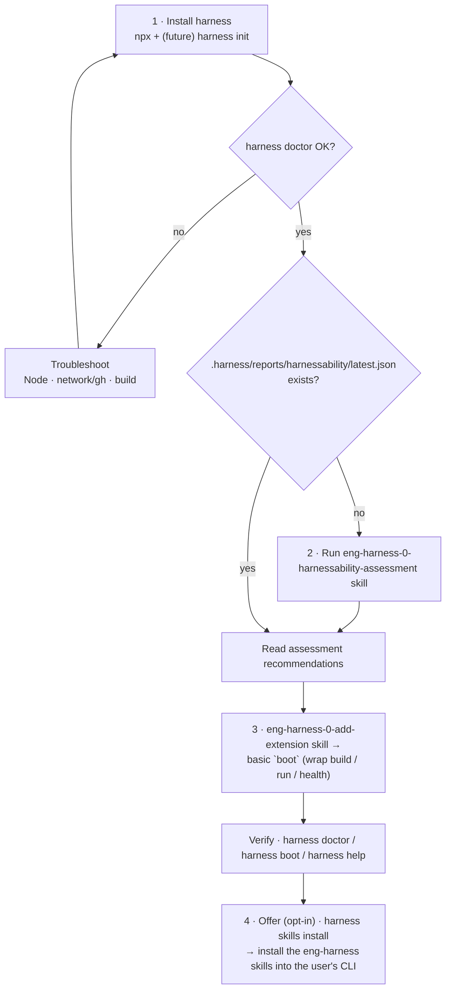

# eng-harness-0-setup

Get a repo's **engineering harness** installed and working, then leave behind the one thing every engineering task starts from: a **basic `boot`**.

This skill is a **flow**, not a generator. It installs the harness CLI from npx, then **orchestrates other skills** — `eng-harness-0-harnessability-assessment` to size up the repo, and `eng-harness-0-add-extension` to author the first extension. It **creates no files of its own**: the deterministic substrate (the `.harness/` nucleus, retros, known-difficulties, back-pressure surfaces) is owned by the harness CLI as real code (and by a future `harness init`), not re-generated here.

> **The agent harness drives. The engineering harness proves.**

## The flow



Three steps to a working boot, plus an opt-in fourth that offers to install the harness's own skills. Each box is a CLI call or a hand-off to another skill. The goal is **a working boot, even if basic** — the nucleus a team self-improves from.

## When to use

Run this when a repo does not yet have a working `harness boot` (or has no harness front door at all), and you want to get an agent-operable engineering loop started quickly. It is safe to re-run: it detects what already exists and only fills the gap.

## Why `boot` is the deliverable

"Boot is the first proof." Before any engineering work, an agent runs `harness boot`, which:

- **proves the environment is ready** — builds / installs if needed, starts the product (directly or via `docker compose up`), and confirms readiness with a health, smoke, or "tests pass" signal; and
- **re-orients the agent** — a boot (like `doctor`) is orientation, not just diagnostics: it reminds the agent how this project wants to be operated and what to do next.

Keep it a **basic nucleus**. Do **not** boil the ocean — a thin wrapper over the repo's existing commands is the whole job here; the harness is self-improving, so boot grows by use. (The CLI may later flag a missing `boot`, reinforcing it as the expected entry point.)

---

## Step 1 — Install the harness

The harness CLI ships from its GitHub repo and runs via `npx` (there is intentionally no npm-published package).

1. **Prove it runs** (checks Node + network + the CLI itself):

   ```bash
   npx github:AI-Substrate/harness-engineering help
   ```

2. **Make `harness` resolve locally** for repeated use — install it into the target repo (its `prepare` step builds the CLI):

   ```bash
   npm install github:AI-Substrate/harness-engineering
   # pin a release if you want reproducibility:
   # npm install github:AI-Substrate/harness-engineering#vX.Y.Z
   ```

   Afterwards use `npx harness <command>` (it resolves the locally-installed CLI whether or not `harness` is on PATH). **All examples below use `npx harness …`; drop the `npx` prefix only if `harness` is already on your PATH.**

3. **Initialise the nucleus** — run the deterministic bootstrap:

   ```bash
   npx harness init
   ```

   > **Graceful fallback (important).** `harness init` is the planned bootstrap that creates the `.harness/` nucleus deterministically. If your installed CLI does **not** recognise it yet (unknown-command error), **do not fail** — continue. `.harness/extensions/` is created lazily by `harness new` (Step 3), so the flow still works today. Note the gap so it's encoded once `init` ships.

4. **Sanity-check** with the CLI's own front door:

   ```bash
   npx harness doctor          # human-readable
   npx harness doctor --json    # envelope: status / data / error / next_action
   ```

   On a fresh consumer repo, `doctor` may report top-level `status: degraded` (e.g. a `cli-build` layer that only applies inside the CLI's own repo) and an **empty** `.harness/extensions/` — both are expected, not failures. The signal you need is that the CLI **runs and returns an envelope** (exit 0); read `data.layers` / `data.extensions` rather than gating on a top-level `ok`.

### Troubleshooting

| Symptom | Likely cause | Fix |
|---------|-------------|-----|
| `command not found: npx` / very old Node | Node toolchain missing/old | Install a current Node LTS; re-run. |
| `npx` hangs or 404 on the GitHub spec | No network / no GitHub access | Check connectivity and `gh auth status`; retry, or pin a `#vX.Y.Z` tag. |
| Install errors during `prepare`/build | Build toolchain issue | Read the build error; ensure devDeps can install; re-run `npm install`. |
| `harness init` → unknown command | CLI predates `init` | Expected today — skip per the graceful fallback above; `harness new` still creates `.harness/`. |
| `harness doctor` non-zero with a real error | Genuine config problem | Follow the envelope's `next_action`; it prescribes the fix. |

**Read only the envelope.** When parsing CLI output programmatically, use `--json` (the `status` / `data` / `error` / `next_action` fields) and exit codes — never scrape human prose. This keeps the flow forward-compatible with a future MCP server over the same surfaces.

---

## Step 2 — Assess harnessability (only if not already done)

Check for an existing assessment report. The canonical sentinel is `latest.json`; treat **any** file under the report directory as an existing report (the AC4 fallback):

```bash
# reuse if the sentinel exists, OR any report file is present in the dir:
test -f .harness/reports/harnessability/latest.json \
  || ls .harness/reports/harnessability/* >/dev/null 2>&1
```

- **Report exists** (sentinel `latest.json`, or any file under `.harness/reports/harnessability/`) → reuse it. Read its recommendations (highest-leverage improvements / remediations) — they tell you what `boot` should prove first for *this* repo. (The producer keeps the root `latest.json` current on every run and stores per-run history under `.harness/reports/harnessability/<ordinal>-<slug>/`; reading the root `latest.json` always gives the newest run.)
- **No report** → run the **`eng-harness-0-harnessability-assessment`** skill (read-only by default). It scores Operate-Today and Adaptability and emits the recommendations that drive Step 3.

> The assessment is a separate skill — invoke it, don't reimplement it. The flow only needs its **recommendations** to choose the first `boot`.

---

## Step 3 — Stand up a basic `boot`

Use the assessment's recommendations to pick the **cheapest, most valuable** readiness proof for this repo, then author it with the **`eng-harness-0-add-extension`** skill (which drives `harness new` under the hood — never hand-write the file).

Pick the boot shape from what the repo actually has:

| Repo shape | A reasonable *basic* boot wraps… |
|------------|----------------------------------|
| Dockerised service | `docker compose up -d` + a health poll |
| Web app / API with a dev server | start the server + hit a health/smoke route |
| Library / CLI (no running service) | `build` then `test`, with a printed "ready" note |

Author it via the skill, e.g.:

```bash
# the eng-harness-0-add-extension skill runs, under the hood, something like:
npx harness new boot --wrap "<the readiness command for this repo>"
```

Then **fill the handler only as much as needed** to:

- return a clear **verdict** — ready / degraded / error (the `--json` envelope + exit code an agent can branch on); and
- print short **orientation** — what the harness is and what to do next.

Keep it minimal. Resist adding seed/reset/observe/sensors now — capture those as harness friction for later; the loop will encode them when they earn their place.

### Verify

```bash
npx harness doctor      # boot now shows as a loaded extension
npx harness help        # the `boot` verb appears in the command surface
npx harness boot        # runs it — inspect the envelope/exit code for the verdict
```

When `harness boot` returns a usable verdict and re-orients the agent, the nucleus is in place. Stop here — the rest compounds through normal use.

---

## Step 4 — Offer to install the harness skills (opt-in)

The harness ships its own **skills** — the `eng-harness-*` setup + loop suite (`boot` / `backpressure` / `observe` / `retro`). Once the nucleus is in place, **offer** — never force — to install them into the user's CLI so they can run the loop directly.

1. **Ask** which CLI target(s) and scope:
   - Targets: `claude-code`, `codex`, `cursor`, `github-copilot`, `opencode`, `pi`.
   - Scope: `--global` (available everywhere) or project-local (omit `--global`).
2. **Only with the user's explicit go-ahead**, run the first-class command — a transparent pass-through to the Vercel `npx skills` installer. It **prints the exact `npx` line before running** and always passes `-y`, so nothing blocks on an interactive picker:

   ```bash
   npx harness skills install --target <cli> [--global]
   # e.g.  npx harness skills install --target github-copilot --global
   ```

3. **If the user declines, do not install.** Tell them how to do it later:

   > To install the harness skills later, run: `npx harness skills install --target <cli> [--global]`

More about the underlying installer: <https://github.com/vercel-labs/skills>.

> **Offer, don't force.** This step never runs the install unprompted. The CLI command takes explicit `--target`/`--global` flags and never blocks on a prompt — *this skill* is what asks the user, then runs the command with their answers.

---

## What this skill does **not** do

- It does **not** generate a governance doc, an `AGENTS.md` block, a `docs/harness/` scaffold, a placeholder CLI, or known-difficulties/retro/back-pressure files. Those are deterministic CLI concerns (`harness init` + the CLI), not this skill's output. The governance doc is therefore **owed, not provisioned** by this flow until `harness init` ships: this skill attempts `npx harness init` (with the graceful fallback above) and, when it isn't available yet, the governance rung stays owed and downstream readers degrade to `UNAVAILABLE` rather than erroring. See [`../../eng-harness-loop/eng-harness-flow/references/governance-doc.md`](../../eng-harness-loop/eng-harness-flow/references/governance-doc.md) for what the doc contains and when it is written.
- It does **not** reimplement `eng-harness-0-harnessability-assessment` or `eng-harness-0-add-extension` — it calls them.
- It does **not** build a comprehensive boot. Basic nucleus only.

## Guardrails

- **Orchestrate, don't generate.** Install and drive the harness; hand off judgement to the sibling skills.
- **Wrap, don't rebuild.** `boot` wraps existing repo commands.
- **Don't boil the ocean.** A working basic boot is success.
- **Public-safe.** This skill ships in a public repo — never bake in a private repo name, path, person, or internal codeword. Describe boot shapes generically.
- **Envelope-only.** Depend on `--json` envelope fields + exit codes, not scraped prose — so a future MCP server reuses the same surfaces.
