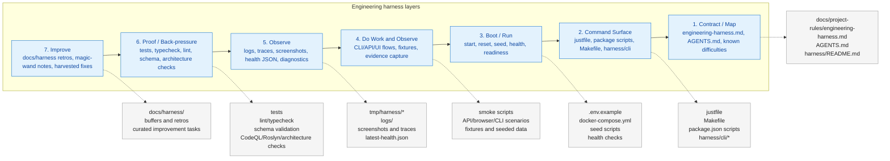
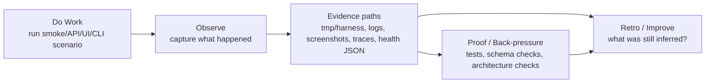
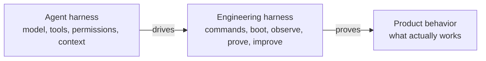

# engineering-harness-setup

Creates or validates the repo-local engineering harness nucleus.

An engineering harness is the project-side loop that helps a human or agent move from intent to evidence and improvement. It gives the repo a clear front door and a focal point for improvement. The harness does not replace the product or reimplement the toolchain; it wraps existing commands first, exposes deterministic sensors, then fills real gaps with better commands, fixtures, checks, diagnostics, and evidence paths. Its job is to reduce guesswork, turn repeated friction into harness feedback, and encode new knowledge deterministically wherever possible so future runs are faster, safer, higher quality, and better proven.

## When to use

Run this when a target repo does not yet have a clear engineering-harness entry point, or when you need to refresh/validate the existing harness contract.

Use it before feature work if the repo is missing:

- `docs/project-rules/engineering-harness.md`;
- a starter command surface under `harness/cli/`;
- a clear boot command;
- a health check;
- an interaction/observe path;
- a runtime, smoke, architecture, static-analysis, security, schema, or evidence signal;
- an `AGENTS.md` signpost that tells future agents where the harness lives.

## What it does

- Detects the project type and likely boot/health surfaces.
- Creates or validates `docs/project-rules/engineering-harness.md`.
- Asks whether the starter CLI should use Python stdlib, Node stdlib, or an existing/other tool.
- Creates `harness/cli/` with a starter command map and either a tiny Python/Node CLI or instructions for the chosen existing tool.
- Treats the harness as a focal point over existing commands: wrap before inventing, and implement original behavior only where the repo has a real gap.
- Requires the starter CLI to have agent-friendly `--help` and actionable errors with clear next actions.
- Records the canonical loop: Boot -> Backpressure Check -> Do Work and Observe -> Retro and Magic Wand -> Improve.
- Records deterministic sensors and back pressure: what the harness can prove, and what the agent still has to infer.
- Seeds Known Difficulties from `docs/harness/` if harness retros exist, with `docs/compound/` as legacy/back-compat input only.
- Patches `AGENTS.md` with a pointer to the engineering harness.
- Reports when the Improve ledger is missing so the upstream runtime loop can no-op gracefully until provisioned.

## Where it fits

This is the **setup** step in the broader loop:

```text
engineering-harness-setup -> harnessability-assessment -> harness-1-boot -> Backpressure Check -> work+observe -> harness-3-retro --drain/--harvest -> encode fixes
```

Use setup to establish the harness nucleus. Use `harnessability-assessment` when the front door exists but the repo needs a target-aware harnessability assessment before feature work. Use the runtime loop skills from `jakkaj/tools` to start day-to-day sessions through that harness.

## Recommended workflow

A harness works best when paired with a spec-driven delivery flow: write down the intent and acceptance criteria, research unknowns, design the plan, implement against the plan, validate with the harness, and feed anything painful back into Improve. The harness gives that flow deterministic support at each seam: boot before work, observe during work, prove behavior with checks and evidence, and harvest repeated friction into better commands, fixtures, sensors, and docs.

One example of this style is the `the-flow` guide in `jakkaj/tools`, which walks a user through a spec-driven pipeline with optional harness and Backpressure Check support: <https://github.com/jakkaj/tools/blob/025-backpressure-survey/skills/SDD/the-flow/references/getting-started.md>.

## Engineering harness layers

An engineering harness is not one script. It is a layered project surface that makes the repo operable, observable, provable, and improvable.



| Layer | Capability | Typical artifacts |
|---|---|---|
| **1. Contract / Map** | Explain the harness, entry points, ownership, and known hazards. | `docs/project-rules/engineering-harness.md`, `AGENTS.md`, `harness/README.md`, known difficulties |
| **2. Command Surface** | Provide one discoverable front door over existing repo commands. | `justfile`, `Makefile`, `package.json` scripts, `harness/cli/*` |
| **3. Boot / Run** | Start or reset the product from a known state. | boot command, `.env.example`, seed scripts, local services, readiness checks |
| **4. Do Work and Observe** | Exercise real product behavior through supported surfaces and capture evidence. | smoke scripts, API calls, browser routes, CLI workflows, fixture scenarios, evidence files |
| **5. Observe** | Leave inspectable evidence about what happened. | `tmp/harness/*`, `logs/`, `test-results/`, `playwright-report/`, screenshots, traces, health JSON |
| **6. Proof / Back-pressure** | Turn important failure modes into deterministic signals. | tests, lint, typecheck, schema validation, dependency rules, CodeQL/Roslyn, architecture checks |
| **7. Improve** | Convert friction and weak signals into harness improvements. | `docs/harness/`, buffers, retros, magic-wand notes, harvested improvement tasks |

Lower layers make the repo operable. Middle layers make behavior exercisable and observable. Upper layers make correctness provable and the harness self-improving.

## Observe writes to evidence

Observe should not mean "the agent looks at the terminal and remembers it." Observe means the harness writes durable or semi-durable evidence that another human or agent can inspect without rerunning the whole workflow.



Good observe targets are explicit paths, for example:

```text
tmp/harness/
  latest-health.json
  latest-smoke.json
  screenshots/
  traces/
  logs/
  diagnostics/
```

or, for a docs-first or lightweight repo:

```text
docs/harness/
  _buffers/
  agents/
  known-difficulties/
  friction/
```

If an observation disappears when the terminal scrollback is gone, it is weak observe. The setup skill should therefore ask: **where will this repo write evidence, and what still requires inference?**

## Agent harness vs engineering harness

The agent harness is adjacent to the engineering harness; it is not a replacement for it.



The boundary sentence is load-bearing: **The agent harness drives. The engineering harness proves.**
